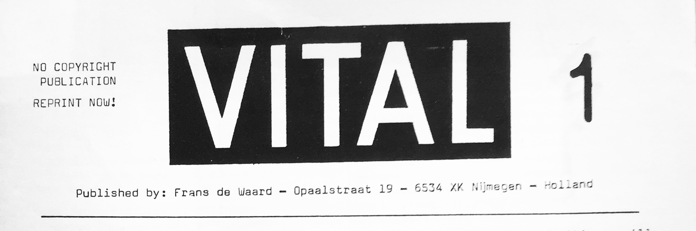

# VITAL magazine transcoding

- [VITAL magazine transcoding](#vital-magazine-transcoding)
- [What is VITAL](#what-is-vital)
    + [Metadata](#metadata)
- [Research](#research)
- [Transcoding](#transcoding)
    + [TOOL One](#tool-one)
      - [Description](#description)
      - [Methods](#methods)
      - [Results](#results)
    + [TOOL Two](#tool-two)
      - [Description](#description-1)
      - [Methods](#methods-1)
      - [Results](#results-1)
- [Mastercopy and distribution](#mastercopy-and-distribution)
- [Outcomes](#outcomes)
      - [Outcome links](#outcome-links)
- [Bibliography and References](#bibliography-and-references)
- [Questions and problems](#questions-and-problems)

# What is VITAL

Vital is a magazine focused on experimental electronic music. It started in 1987 as magazine on paper. It's simple xeroxed form ensured a free copyright and everybody was encouraged to make copies and distribute them freely. Up until 1995 44 issues were made and with the arrival of the Internet, Vital changed into a pure e-mail review newsletter and since then it appears weekly. Still as a free service and still without copyright. [Here](http://vitalweekly.net/) is the current vital website. Some of the issues are also archived in [IISG Amsterdam](https://hdl.handle.net/10622/B243EE91-F43C-4C88-9B1D-9E346CA715BA).

### Metadata

| Tag                           | Data                                                         |
| :---------------------------- | ------------------------------------------------------------ |
| **IISG Call Number**          | CSD ZO 44301                                                 |
| **Physical Description**      | Cardboard folder with magazines                              |
| **Type**                      | Magazine                                                     |
| **Medium**                    | Printed matter                                               |
| **Materials**                 | Paper                                                        |
| **Date**                      | 1987–1992                                                    |
|  | The artefact consists of 25 printed issues of Vital magazine. The individual issues are arranged according to the issue number in a cardboard packaging which is made of two sheets of cardboard held together by two fabric ribbons. On the cardboard cover is the artefact number ZO 44301 and also text that says: VITAL 1988–1992 : 1–25 + special (1989). |

# Research

Main part of our research is interview with author of VITAL Frans De Waard recorded on 11th March 2020 in Nijmegen. In the interview he talks about background of the magazine, his life and many other things regarding the magazije itself. You can find the transcribed interview here: [interview](https://www.notion.so/interview-transcribe-6b2df57bd7154ccfa9b2070784b82857).

 
  
 INTERVIEW with Frans De Waard 

02:22 So well oh... I will just... I like to talk so don't worry 02:27

02:28 Ok haha I am not worried 02:28 ***Y\***

02:28 Uhm... Before this thing... Before Vital... I did this other magazine called null-null, which is... In dutch means zero-zero. It has nothing to do with the dutch art movement called zero. Or club null I think it was called in the 60s. And uhm... this was, this one is from 1986. And I made this with a friend of mine - Christian uhm... long dead now. And is very simple typed with a typewriter. One sided 03:19

03:17 So when did u start doing this. 03:19**D**

03:19 In 1986. 03:22

03:21 And how old were you at that time?03:23 **D**

03:23 Uhm... 21.03:28

03:28 Oh, sweet! Like my age 03:28 **Y**

03:27 Yeah.. yeah.. And uh so then.. And this was also connected to the world of mail art.03:43

03:43 Oh thats what we also thought 03:43 **D**

03:45 And stuff like this... Every issue had its own piece of mail art. But it was also a magazine that in those days people will send in stuff. Already typed out and with an image

and stuff like that. You can see where the fonts changes this is my typewriter and this is my dad's typewriter. Uhm... This is my dad typewrite but then somebody else gave me this article about industrial music in Belgium. So as you is a different typewriter. So I was collecting this stuff and then I did this one... I wanted to do more magazines I realised was a bit difficult, but I really wanted to do this James bond thing. So 007. Which is actually issue #3. And this is stensil print which is the ancestor of risoprint.04:42

04:43 Ah yess we have riso print at school also.04:43

04:44 The previous version is a stensil print. This is the first time I worked with this people (the place where the workshop will take place) I think also in 1986. It was may 86 I guess. Still smudging. And uhm so I know this people since those days so 24 years now. And then I realised... then the last one was 00 #10. With the old dutch banknote for 1000 gildas.05:23

05:23 So is this like a master-copy?05:26 **D**

05:26 No no this is the finished copy05:28

05:28 This is the finished copies... So you just glued it on top the...05:30 **D**

05:30 This whole magazine...05:32 **F**

05:33 Because this the way you produce this things 05:35 **D**

05:35 Xerox...05:35 **F**

05:36 You just glue things together and then copy them05:39 **D**

05:39 Yes... in one of these boxes I can show you the original. But yeah... This were printed. My dad used to run a company where they had a printing press. And for the money... Actually the first book that I made. Was when I was 18. It was this booklet. 06:12

06:13 So where does it come from your interest in the music in general I mean. 06:14 **D**

06:17 Well ah dkhsd is not my... Oh is not my copy... Is from somebody else. Uhm... The interest well... you know when I was even younger like 15 years old. So 1980-81 I got interested in punk music and it was all about oh you can do it yourself and stuff like that but then I realised if you want to be in a band you need to find people who you want to do music with. Some damn awkward place to rehearse ten stupid songs and so the whole punk think I only found interesting for maybe one year and then quickly I moved on to getting more interested in electronic music. Because of the electronic music I realised also that there was this other whole other world of mail art. And of cassettes releases, people doing cassettes. And uhm and if you do a casette you can make one copy. If you want to do an addition... a record you have to do 500 copies but a casette you can do only one copy.07:54

48:53 Alright so, lets talk about how the design evolved. The first one is a paper I just started typing and as you can see I was already into recycling cause I used old photocopies that I did not use. And I did the typewriter thing on my desk typewriter for 3 issues but my father was already... my father was a sort of amateur historian... amateur write of books about music, classical music. So pretty early on we had a computer with a matrix, .matrix printer and my father allowed me when he was working that I can use it. So i printed out this long stripes of text and i printed them out, cut them and stick them on the piece of paper. Which of course was a bit of gamble where to make this stripes but I was also in university at that time, studying history, and there was a small desktop computer room, and all the students had the possibilities to make their own magazines about their own field of interests. They had really this old very first apple macintosh computers. And it was a nightmare, a nightmare because of course my dad did not have an apple macintosh he had whatever a 186 dx or whatever it was called IBM clone thing. So I would type out the text at home and I was already working with somebody. So I would mail it to a big floppy disk to a friend of mine for a little bit correction of the text. The old very first macintosh they could handle the floppy disk but it was not always possible to convert straight one on one. So you open it up and then there is all this weird stuff in it. But the whole idea was it was a really sort off punkick do it yourself thing. So somebody said I will learn you how to do it. This program was called page maker. I will learn you how to do page maker but you have to do it yourself. Which of course sometimes it worked out well because if you have a template you can stick it in. 52:02

52:02 But you have kind of a template.52:02 **D**

52:02 Yeah... 52:06

52:07 In some places but it didn't always work because... 52:09

52:09 You have two columns and the I don't know... you have kind of a layout. 52:12 **D**

52:12 Yes. But as you can see in... It worked well for these issues but then I don't know what happened. Well, maybe I do know but turns out that is not possible to do proper translation. I would hurry. I think you would have to pay for the hour to use it or two hours or whatever so it was not entirely free. You will have to sign up for specific times to do it. I went back to you know what i will print out this little stripes of paper and I will do it in the old way. So that's all laser printing already but still cut on paste. In some issues and in some issues they were not cut and paste... Anyways total nightmare... And now we have to go to the mystery of why the rest is not here.

53:38 Is the same issues as in the archive. 53:40 **Y**

53:40 Yeah? And then what I did lets go back to that issue... So when I was done doing this 8 pages I would go to the coffee shop reduce this to a4 and then I had my master. Now what people did if they got it from me. So this is how would you say it - generation 0, then generation 1... the reduced version is number 2. Then I would use the tpex to make all the papers look really good if its fine and then I will make xerox out of it. So that's the second generation people got. So they would put on the yellow thing that was to indicate at home this is my original - I copy from that,. The yellow, you cant copy the yellow. The xerox don't see it. So it let's you know - this is my original. So that's why I think this is from V2. I am pretty sure V2 that is.55:01

55:01 So they markdown their mastercopies 55:01 **D 55:04 to know that is theirs55:04**

55:02 Yes.. Also if it gets lost... They had a small store that would be open on concerts and stuff... Ah that if one of the other issues was lost they could go back to the store and make one of the generation #3 the original. That's why the yellow is still there. And then of course I started to work for Stalplaat. Which was more or less sort of professional label company... without the xerox. But with the benefit of having a lot of professional designers working. And designers with access to /my archive i not really like a organised/ but this designers had laser printers. So the girlfriend of my boss she had a laser printer I would do this design and then leave her this space and she would copy that in. But still would be... this is two sheets... I glued them together to know what is back and front. And then of course... So these are the very old mine generations #1 of the first issues. You can see because they are all discoloured. And you can also see I used tpax here to smooth whatever. Stuff like this... Apparently here I was still doing the printout but without doing copy and paste. Also cause I worked with Stalplaat they hired me to do initially to buy and sell stuff for the store and mail order and distribution. They didn't mind that I am doing this stuff. Cause I worked sometimes in the evening etc. But on the other hand it must not take up too much time from other people. So i could not have said to my boss ey Can you ask his girlfriend. His girlfriend is right now actually a very famous dutch artist. Fiona Tan? Have you ever heard of her.57:57

57:57 A actually yeah I like the work a lot. 57:57 **Y**

58:01 She was the girlfriend in the early 90s of my boss in Stalplaat. And she would say why are you doing this stuff for this guy? She didn't like me obviously. So yes this are the first issues. As a first generation I guess. 58:28

58:29 That big one is generation 0, this is one. And apparently... the other thing with xerox machines technically they should always do the same thing. Make a proper xerox. But there are differences, sometimes the toner is not right and you can still see these sort of lines in between. But is not in any way of form organised.... Sometimes I would just go to a proper place and printed out for my own expense. You see i didn't mark these with yellow. Let me see. Oh yes there is also... So there have been 3 issues of vital in the USA. Ah the first one is the one with the 7inch with the sort of label design. The second one is part of another magazine called report. And the third one is a very small one. I think this is it. 1:00:15

1:00:15 Like a small format. 1:00:15

1:00:15 Yes this is for a tour that I did with my band and we played with a person from Kapottie Musik. But he also wrote for vital back then and we toured together in Europe so we made this small booklet to give away. Not sure what this was supposed to mean as if there is something missing. Oh no there is more pages.1:00:48

1:00:48 The layout is different.1:00:48

1:00:48 Yes that was done by guy who was living in new yourk and he was helping us out. This is a different format as you can see is a b-51:01:13

1:01:16 And why did u call it vital is there any reason for it1:01:17 **y**

1:01:16 Yes actually there is. Yes because the reason i stopped doing this null thing is I made this magazine and I printed a hundred copies, xerox them or print them. And I went to stalplaat because this is way before I worked in stalplaat. And I went to stalplalt, v2 couple of shops and I gave them couple of copies. They made a note oh we have 5 copies of your magazine and if they are sold we have to pay you. But if the next month you come back and ask if the magazines are sold the people told you ughh we don't know. Have a look yourself. I dont see any so they must be sold. Ugh we dont know. I say you owe me five gildas for a magazine and its like we don't have five gildas. And I thought this is insane. Why would you want to do a magazine. I wanna do a magazine to promote stuff but I dont want to loose money on it and then I thought i should have a format that is really cheaply made does not involve any car. You can send out a single envelope for the lowest amount of postage and how many pages is that - apparently two a4 pages folded. You pack it up with information. And it is a more dynamic way of publishing this why the word VITAL. Had I known if in 2020 I would receive tons and tons of spam with the word Vital in them I think I would not have chosen VITAL. But yes that is the reason I thought yea you know I can use this. That was a mistake.1:03:23

1:03:23 Yes it changes meaning with the time but i think the name is good. Is also about this love for music. 1:03:30 y

1:03:30 Well that is of course something that i still have because now I a doing this vital weekly thing. And that is really an expansion of the whole magazine. Cause at one point two things happened. Ah you know my boss did not like that i was spending time and resources on making this. Although it was not too much. I had to ask a designer, I had to ask for printout, I had to print the copies out. And then somebody comes into the store and he says ughh I see I have copies 1 2 3 4 5 6 but not 7 can u make me one. Ah I don't know what to do. And then i felt why am i doing this. And one day in stalplaat an email arrives. The first time I heard the word email was in 1993. We are touring in america and we are staying with peole in their homes. Eventually we arrived in pitsburg with some guy and he says I have to go to check my e-mail. And I thought what the fuck are you talking about. But 2 years later my boss and guy who produced stuff. said they will install this tel net thing. 5 mins later they were sating we are in we are in. I was wondering what the fuck is this. We are supposed to be selling CDs, what are you doing here. And then we had email. And the first emails were newsletters attached with all these adresses. And then with copy paste I could send my own newsletter. Copy paste and spam everybody else. It was a time when you did not know what is a spam. Of course quickly on I understood that people don't like it. Yes fuck off with your bullshit. I dont want your shitty reviews and then later on of course it was all more formalized. You had to sign up with an IP adress, you had to confirm adress. If you say add me to your mailing list i can't do it for you you have to do it yourself. 1:06:26

1:06:27 And do you have any idea? Do you see everyone that subscribed to the online magazine? 1:06:30

1:06:29 Yes. I can also unsubscribe people if you want to. I can go to the system and put you email in the unsubscribed section. If people are very shitty I do that. 1:06:51

1:06:51 Is there a lot of shitty people/1:06:54

1:06:54 There are lots of shitty people1:06:54

1:06:53 Like they want you to review your music or?1:07:01

1:07:01 Lots of reasons that is also when people don't like what you do. I don't know that many people... I don't know that many... I know many people inside this music. I dont know many people outside this music. But I do know one and he is Steven Willson and he is a wild known rock artist. This year he is going to play in Amsterdam once in Aphas, he fills up is sold out already. He is that big but he is also really into that kind of music. But he said I know a lot of people in a lot different music genres rock, hard rock etc. but also experimental musicians. The worst people who are the most easily offended people are the experimental music people. Say something like your latest record is meh and they wont speak to you for two years. And he is right that happens. Oh yes you wrote a review about my EP but you dont understand what i am doing.1:08:26

1:08:26 I also remember that i was reading something on the website that you say that is not your fault if you don't write a good review and the artist does not like it.1:08:32

1:08:34 Yes but you know if you can't take the criticism you should not be doing music. You should be doing music but you should not be releasing records. Also not to mail the to people.1:08:48

1:08:48 So how did it work in the beginning when you started VITAL you were already receiving music from people or? 1:08:55

1:08:55 Oh yes yes I was.. That is interesting cause one thing that is a, also should be mentioned is that i did this blue booklet. A cassette catalogue. I was 16 when I became interested in this whole cassette thing and started collecting information. So that is a paper form of discogs. The stupid thing of course is that it does not say anything. Some tape names adress some more names. Bahama tapes no information. It should have said Bed alaskam - it is only pop music or noise or whatever. That it should say. I was doing I did this magazine or a booklet or whatever is called in 1000 copies. It costed 1000 gildas. My dad loaned them to me and he never got them back. Uhm a copy of this landed in germany a guy called krauhvaen. And he said oh wow you seem to know a lot about all of these people. I want to do a casette compilation with dutch noise music. can you organise this for me. And then I said oh yes sure. So i wrote to all these people that i like saying give me a track. And this was in a time when I was already in a contact with all this people. I already corresponded with them. I would say oh well you know this is for a compilation of a german guy blabla. Soon i had a 60minute tape compilation. And then I thought you know I can also start my own cassette label. So that happened in 1984 at the same time I started doing my own music. So all of this is connected. I did the casete catalogue for a few more years. Keep of collecting information I did the null null, the vital and at the same time I did my own casette label. So all this people will send me casettes for trades and i would write about them. Send them back a vital issue. And they would say oh interesting next time i get it you get a record for free. So uhm thats how i got eventually all of this promos that people would send out to me. I like what you do ah have a record. 1:12:13

1:12:13 So you still do it like that? In the site I think I read that you only review physical copies.1:12:18

1:12:19 Yes because I sell this. That is what I live from. My side interest is not selling on stuff is more like a thing of survival. So yes what you see here is stuff from this month and then every issue two tree issues respond oh I want that and that can u reserve this for me. sometimes more than one person kind of like the same thing1:12:55

1:12:54 So you kind of distribute the music.1:12:56

1:12:57 Well i sell it. In the end of the month I make a list. I have a separate list for people that want to buy stuff.1:13:06

1:13:06 And people can contact you through discogs or thorugh the magazine?1:13:06

1:13:05 Sometimes. Also now I am more and more selling for people on discogs.1:13:26

1:13:27 So your collection is always like shifting kind of. You don't keep the stuff 1:13:34

1:13:34 sometimes if i really like something I would keep it. Sometimes the real physical object. There are maybe 4-5 artists that i really like to keep the stuff off. And sometimes I make mp3 and keep the mp3. 1:13:49

1:13:50 And back then when you started do you think that the people had an access to the music somehow?1:13:56

1:13:58 It was like really small releases/1:14:03

------

1:14:03 The idea of doing ,magazines in general was to do what the internet does now to make sure there is contact. You do music, and I do magazine, and you want to get some publicity is not just for selling but also to that you know there is something out there and you want to contact these people. After a while a magazine has certain certain net – a group of followers.

1:14:41 you know what it is about, something you can trust. That's interesting, you have to trust a magazine to write about you. So if you read my magazine and you think uhm out of 5 times 4 times he was right it was an interesting contact to make. You'll also do it for a sixth time. If you think about a magazine that its bullshit. If you think 2–3 times its not the right people, what am i doing here, than its not your magazine.

1:15:18 the whole idea of this magazine is to establish the link between musicians and also the consumers in sense that most people who want stuff are also doing stuff. They do magazine, mail art, or music themselves or have a label. Quite a few people who want to have a label put out music themselves. Especially people who like design, yeah oddly enough. I think theres 2 types of people who want a label – fanatics who like the music and designers. Beacause even if you cant do music but you like music, i mean everybody can do music or design but not everybody is good at it, but yeah..

1:16:36 Uk label touch, quite well known label, started in the 80s doing cassetes and lots of cds these days. Its basically run by a very clever guy whos now doing music himself, but John Mosercroft who worked with Nevill Brody for a long time. So the slogan was quality meets design. So this is a thing and if you know how to press a record or make a casette or whatever and you have good visual imagination you can make a beautiful cover.

1:17:29 Yeah definetely theres some really beautiful covers. Yeah absoulutely. On the other hand you see from labels that are run by people who really like music they usually dont have that nice covers. which is also.. who cares?

1:17:45 the thing with staalplaats was that staalplaats was also very visul based label they did lots of strange packaging. But i also always say honestly I dont care that much. I like the music way more than a strange package.

1:18:16 so now Im preparing a book which Im gonna publish myself. I dont know if you noticed but I did write a book about staalplaats and it was published few yours ago in france.

Yeah I've seen it on google.

1:18:54 There is also some book in russian with your face about classical music I think.

Oh yeah its a magazine. This one. You can read this? Yeah because Im bulgarian. oh okay. One day if you have a lot of time in your hands you can translate. hahah

Its a pretty long article based on sort of workshop/lecture thing i did in moscow. Broken music yeah. Kapotte muziek is my band. Nice.

1:20:01 this book was published in france and it sold out already 3 years ago.

Is taht old picture of you? Yeah haha i was 18. Sweet. And it was in bedroom in my parents house and im holding a bunch of casettes. This was from an article that got a lot of publicity from leftwing media because you know young people doing your own stuff, do it yourself culture..

1:20:41 How was the situation back then in this area like politically? What was the context.. How was it a the times, you know.. Im wondering if this do it yourself attitude was also a response to something. Because you are also saying in some issues that you need to like.. spread the virus about the magazine?

Oh yeah that was just an expression not like to day haha (covid-19). No the idea was that it should be.. everybody should do their own stuff and of course in 80s, atleast in Netherlands alot of unemployment for young people and the idea was if you are doing your own music, your own cassetes and magazines you can escape all of that.

It wasnt necesarily political, but it was a punk spirit but for a different kind of music.

1:21:57 So last year I did a reissue softcover, i did some more copies they are coming on friday. But this book was also properly published somewhere,? Yes. But yeah since i published this i thought yea you know this very easy i know how to do this now.

1:22:35 Im gonna open this up so you can see the difference. this is way thinner paper.

(opening the book etc..)

1:24:30 but when i see the cost of production of doing this i though i can do the vital book myself. So you want to include the issues 1 to 44? 44 yeah, they are all scanned. And i made an index for so you can easily find the right page or article. Why i think is really helpful.

1:25:24 Do you include links in the digital version to the music bandcamps and stuff?

Yea i Do. If you go to the online version there are also links now.

1:25:46 I had an interesting discussion yesterday with a guy who is actually designing my vital book, about how it looks. Couple of years ago somebody said, your lines are too long you dont use any sort of breaks in the lines. So since then i have been doing this but now it looks like this (shows on computer). Its horrible! It reads better though i think. But if you go to telephone version something else happens.

1:27:29 Well as you can see im not a designer, i break these lines by hand.

1:28:30 i still use thi really free thing composer to this website..

Ye but i think its nice to do this like that diy. Yeah thats what my friend said it looks basic but you know nobody else has this so maybe thats the idea. why would i bother with it?

We like your website. Also our teacher said that its pretty nice that its only text.

Oh okay.

1:29:13 Lot of people say that i should move towards something like wordpress and i could include images and hyperlinks.

To be honest i kind of like this. Its not super practical but it has certain character. Same feeling like the magazine.

1:30:23 also nobody pays for this. I have 4500 subscribers but in donations this yer i got 100 euros hahah. So I have been giving out for 25 years for free so its a bit wierd to start charging money for it. if all subscribers give me 1 euro. I would not have to sell the stuff, the records. I would just give it away. 1 euro a month? i would have an income..

1:31:17 but i read somewhere that the printed ones you very sending for like 5 euros? I'm not sure. It should written be on there. A some point people started asking can i subscribe? 5 guilders old dutch currency hehe. Old money. 6 issues a year 12 guilders.

1:32:07 i had 6 issues a year. After number 21 is a bigger issue. But we thought no this doesnt work lets go back to 2 sheets and a supplement. The supplement was more like theoretical stuff, book reviews discussion, more of insight into the whole musical debate. So people could say oh i want to subscribe only to these 2 sheets or the supplements.

1:33:14 yeah so im not sure how i organised these subscriptions if i had a list..

There must have been a lot of work involved in the distribution right? Putting into envelopes going to post and stuff?

Yeah but i already worked at staalplaats and we had post everyday. we went to post office everyday to mail stuff. And later on we hired the post to come to us so it was even easier.

Like i said my boss and other people they didnt always like that I devoted time to it and their resources in printing. Theres one interview that came via email, but we had 1 email adress. Your email is now always somewhere in the cloud, back then If you checked email on one computer then next days the email is not on the other computer, because i already retrieved it here. So somebody retrieved the interview that i needed and it was gone from everywhere and i kept emailing this guy hey idiot wheres the interview? Then i realised it was on somebodys home computer from staalplaats.

1:35:19 I did find it eventually. That didnt add up to the fact that staalplaats didnt like me doing it. The reviews i could do that at home, take the floppy disk back to work and mail it out. there was not so much work involved anymore, however what i did is for the first 100 issues i made these booklets. They were properly corrected in english but at the same time i did my book. And that was for staalplaats more interesting cos this was more of a commercial thing. I went to the copyshop and had 100 copies made and we would sell them for a proper price. There was some money coming back to staalplaats. I didnt make any money out of it.

but you did all the reviews so it was your intellectual property.

yea i would be delighted if somebody would say you know im gonna correct all these text from all the issues and eventually have a massive amount of reviews.

Who did this artwork? I did it. Nice! This is actually something i still do xeroxes. I distort stuff in xerox or scanners. In staalplaats we had a very slow photocopier. If you would be in staalplaats today i would be going to my copier and keep on talking. And the suddenly pick up something put on the mashine and keep on talking.

1:38:44 Many of this is just envelopes. I even dated them. I still use them for my music projects.

1:39:35 These are some of my original covers from casette label. Again same typewriter.

1:40:09 Like i said my archiving is not really good.

1:40:49 how do you feel about making vital digital these days? Its nice to have something physical in your hands right? its much more easier now in terms of printing and distribution..

Uhm well, you know this sort of thing vital weekly its okay if its online because more people can see it. For my own music I dont know... i still like to do casettes. I like casettes still after all these years. Sometimes I make music that has more rhythm so i think this should be on vinyl or i do something thats very quiet that should be on cd. Its usually very quick i put it on bandcamp for free.. who cares

1:42:06 So you also connect different media to different kind of genres?

Oh yeah yeah, definitely.

1:42:20 You think it makes it more serious if you put it on vinyl compared to cassete.

No thats not it, for me the difference is technical. If you do techno music you can put it on cd without any problem, but on vinyl it will sound better. Good quiet ambient music sounds way better on properly mastered cd. On vinyl you immediately have this hiss and static. fuzzy noisy lo-fi ambient music you can put on cassette. And anything else you can always put it online. So thats the difference for me.

1:43:21 for me also if i make music that takes me really long time to make, I do sometimes that kind of music i dont want to give it away for free because i spent so much time on it. If you have quick idea and i go my back room sit down and record it and it takes me 20 minutes and i think nice its i might aswell give it out for free.

1:43:48 how do you record these days? do you record digitally or do you use like tape deck or something? like a reel to reel or something.

Noo haha. I wish i had a reel to reel. Actually i mainly record on my laptop. but since a month or two my 4track recorder is repaired so i can use that. But i forgot how it worked.

I had to download a manual to remind me how it works because i hadnt used it for so long.

So its like a tascam?

Its a fostex 4 track yeah.

1:44:33 But these machines are good people still use them

Yeah, im gonna do a music trade project with a guy who repaired it, he also has the same machine. we exchanged cassetes where two channels are his and two channels are mine.

And if they are full then we both do a mix of the material.

1:45:00 But the mix itself we recorded on harddisk or a computer like the recorded that you have you use for live recordings or outside for field recordings. Also in that respect I don't have anything against digital or analog recordings. For me its not really an issue. I rather think of what I want to do and what to use and how to use it than oh i must have a modular synth or I must have a laptop or I must have this and this and that. With the exclusion of anything else but its also because i do lot of different kinds of music. I do more techno-ish music and also very ambient music. The techno music i do on my ipad for example.

1:46:22

There's a video on youtube where you have a really strange setup of random objects that you use for making sounds.

Yeah that's kapotte music project probably. It's a trio. I'm not sure that we even exist anymore, we only play live. We dont do studio recordings. And we use junk that we found on the streets to play with. When we arrive in the afternoon we go to the street and we just pick up anything that makes a sound. And if its something small that we like to take home and to use later on. Like this thing full of dust. and i would use this in concerts.

1:47:26

I didn't keep that many things over the years. Some broken toys. Just to investigate the sound that it makes. Not like what people do when they start hitting on things. Why would you want to hit on junk. Use the junk it has dirt on it and you can rub it together and you amplify the surface thats totally different sound.

1:48:26

But like I said last concert was 3 years ago with Kapotte muziek and nobody asks.. I'm not that kind of person to go out and ask for concerts anymore. If people find me they know where I am and can contact me and I'll come but I'm not gonna write to everybody ugh can I play can I play, you know. For years I tried to play at rewire in Den Haag. They don't want me, they don't even respond. I have no idea. I don't know what they want. They want young transgenders I guess and not old grumpy white man. Haha.

1:49:25

Honestly this is probably true. I'm gonna be 55 this year and 15 years, right when i left staalplaat in 2003 if you would ask me what will you be doing after you are 50. I would have said yeah you know I hope to get rid of the vital weekly stuff and that I'll be rcognized for the music I'm doing and have some interesting projects going in whatever field. So now I'm 55 and i'm apparently still doing vital weekly and nothing much else. So some people would say Oh Frans he is the pioneer in electronic music, which is definetely not true. I'm not a pioneer. It's also not recognized by a lot of people – Oh yeah that's the guys from Nijmegen he does music but don't book him not many people will show up. Yeah that's true haha.

1:50:48

Last couple of years i palyed with a guy from Norway and we did small tours for a week or so. In germany and Liuthania and Helsinky and so on. And we only played in places that were not bigger than this room.

1:51:07

But this is cozy. Yeah but when 5 people show up you can't even pay for the train to next city. Unless of course you treat is as a holiday. And i realized that that's not what i want. Also because i want to focus on trying to learn new stuff in technology that i find interesting. Which is not modular synths. How to use for instance 4 ipads in a concert and have them control sound together so you have one control surface and make interesting music with just that. That's what i want to try and find out.

1:52:22

So what are you going to do with this stuff?

We have to figure it out, we still have to put together a concept but it's generally a bit comlicated this assigment. This idea of transcoding. What does transcoding mean? It's like putting it into different mediums. You have certain content and then you transform it into different mediums. Lets say you have all these printed things and you design an app that allows you to browse through all the different content or something. To put it in a very simple way i guess.

Allright but its not like something to use on website?

Yea sure it could be website also.

1:54:03

We are thinking of something that would combine all these different elements, aspects of the thing like the reviews, the music itself, the text, graphics and images and then make a tool that would allow you to browse it more intuitively. That's what we have to figure out.

1:54:26

So lets suppose i wasn't doing a book with the vital stuff. How would you do it?

All the 44 issues. I mean book is nice because you have them all together in one collection. That's nice but the main topic is music so it would great to have access to it at the same time you know.

1:55:04

Lets say you have this issu, its 10 i think, so you would read this review you could click it and it would bring you to the music. Yeah for example, and then you would have the graphics connected to it like the album covers that you could browse through. Could be nice.

So thats a lot of work. I suppose you would have to do it manually.

We also have a class where we are supposed to design a tool that would maybe collect these things for us. It's all connected to tho topic of archiving.

1:56:34

The distribution itself is also interesting and the mail art also, it's not so common anymore.

1:57:08

I have a box of my mail art, It's a small box beacause I quickly realised that mail art is not my thing. People would send out a blank page and you would have to fill it up and the you get it back in the end. I made this mail art magazine myself.

1:59:53

It was also quite expensive, lot of these projects required you to make a lot of copies..

2:01:24

I like the idea of downloading something randomly and then getting something else. We can send you the link to that..

2:02:25

Ye also somebody put a usb stick somewhere in wall so you can go there with your computer and get the files.

2:02:42

Would you like to have all the 44 scans?

Amazing, thanks..

2:03:12

When do you think you'll be finished with the book?

That depends on the designer really.

2:04:55

I want to also print another book at the same time because over the years i wrote a bunch of stuff for people like notes on records, aplications for grants for musicians, tour diaries and stuff like that. So there's gonna be a collection, a small page-bundle but there's gonna be no interest in that I think. So I'm thinking if i do the Vital book so people would say oh you know you have a second book for sale it's only like 5 euros I'll take that.

2:06:45

You also reviewed some people from Bulgaria.

Yeap "?Imactives?". Yea theres small comunity. You know these people? Yeah i know some of the people that release for them.

Actually I wrote to him cos I never played in Bulgaria. I'm not somebody that wants to play in Berlin every 2 months.

The scene in Bulgaria is quite nice.

I've never been to Bulgaria at all.. I've been to Greece and Slovenia to play concerts.

2:08:13

I have played in most of European countries.

Did you ever play in Czech republic? Yes along time ago in Prague in Archa theatre in year 1995. Really? I used to work there. But i was born in 1994 so...

2:08:46 it was really wierd. We had 4 concerts in Italy and 1 in Prague. And we had to drive from Sicily to Prague and we thought we would drive to Udin and next day from Udin to Prague. Unfortunately we got stuck in Bologna in snow for 8 hours. We arrived in Prague 9.30 in the evening. We tried to phone them, but we couldn't reach anybody.

We arrived and the dutch ambassador came because he paid for the concert. But we were like zombies. But we did the concert and next day we left and that was the last time I was in Prague. And one time before in 1970 when i was 4 years old and my father used to live in Prague.

2:10:27

Do you know something about czech classical music? Antonín Dvořák? Yes of course he's the man. My father used to live with his daughter in law, not as a couple. But when my father was 20 he had this idea to write a book about Dvořák. And he wrote her a letter – oh can i stay with you? My father had a bit of autism I think.. SO he wrote her can I stay with you cos I want to study Antonín Dvořák. And she said Oh come over. Hahah.

So he stayed there for 6 months. But then my granddad wrote to him, son you are in communist country I want you to come home and get a job. Of course he didn't say Fuck off old man, he said Yeah I'm coming home.

2:11:15

If you turn your head behind you the grey bundles are the original scripts of the book from 60s. It's not complete. There are even original pictures, he got them for free.

2:12:28

Did you ever review any czech music in Vital?

Yea, oddly enough a guy called Tomáš Dvořák. But I think Dvořák is a common name right? Yea it is.

This is the real book it came out in 1990. My father went out to buy books about Mozart, Beethoven and whatever every week. I wrote the first chapter about czech history, I made a research.

2:14:34 Oh I have to go soon. What are you doing are you going to this place tonight? The riso cafe?

Yea I think we have to go home, we live quite far away in Den Haag,

I used to live there.

Do you know Bunker records? I used to live right around the corner from Guy Tavares. Oh nice is he still around? Yea I saw him talk somewhere not so long ago..

2:16:10

When I was married my wife when she was still studying in Arnheim the councelman from Den Haag came to the school and said ladies if you want a job in Den Haag sign here. My girlfriend signed. She graduated on Monday and on Tuesday morning she had a job.

I was working at staalplaat at the time in Amsterdam so we had to move to Den Haag, which was.. I didn't like that.

2:17:02 We left 4 years later cos we were really fed up with Den Haag. There was a lot of noise in the night in our area. People shouting. But now the city is super quiet. But Yeah Guy from Bunker records lived around the corner.. There was also an interesting scene in the Hague I think, all the squats..

2:17:41

If I had nothing to do there's a bunch of things that are worth documenting. The whole bunker scene is one of them. It's really intense period. There's not much information online but some of the guys are still around like Guy, IF, Rude 66 and so on.

2:18:23

It was good music but they had all such intense lives, it was so filled with depression and drugs and suicide and parties that lasted way too long. I was never part of it, I never saw any of it. I met some of those guys and they talked about it and I always thought this something, somebody should make a documentary about this.

2:18:59

i know that they still release music. Also clone records are making reprints. So it still exists but I don't know what they are doing. At staalplaat we used to help Guy out doing the cd versions of the records. He is partly from Brazil and Indonesia I think at one point he came in and had a cd and wanted to do a little bootleg with indonesian rock bands. I was like Guy 500 copies why? And he said I'll sell them in a weekend.. Indo-rock its called. He knows about this sort of stuff also..

2:20:13

Well Den Haag.. It has also been a while since I played in Den Haag. I don't miss though I have to say...

# Transcoding

We decided to concentrate on the **first 10 issues** which are published in the time span of almost **3 years – 1987–1989**. We want to create a digital alternative containing the magazine itself + all other contents that were difficult to access at the time for the readers – mainly the reviewed music.

- We want to create an environment which allows you to browse the content and understand its origins.

- The digital tool we would like to create allows us to transcode the 3 main contents of the magazine into a new type of master copy – one that you can browse online. And experience the music itself.

- By making this environment we want to connect the viewer/listener more closely to the person who is committing his life to creating this magazine. We want to expose the nature of the magazine which is consequently the nature of Frans De Waard.

  

This environment will be accesible via website that will consist of three main parts:

### TOOL One

#### Description

Printing tool for the viewers of the website to be able to reproduce the physical magazine at home, and spread it further to other potential viewers. Here is [link](https://www.notion.so/VITAL-ISSUES-b97881dc1241496485d10541d3aacde2) to pictures of physical magazine, which will be used for the printing tool.

#### Methods

First we took images of the artefact simply with a Smartphone. Later we used the scanning machines in the IISG archive to get better scans. And later we got cleaned up scans from Frans de Waard himself. We used the text recognition within Adobe Acrobat to extract raw text from the scans. Then we pasted this text into Notion software. We created a printing tool in Atom coding software by using html, python, javascript, css and less languages.

#### Results

Here will be a link to the finished website.

### TOOL Two 

#### Description

Interactive experience which jumps the gap between the physical magazine and the music. It is to embed the graphics of the magazine with information – the music so that when you hover on them you can hear music associated to the images taken from the original printed magazine.

#### Methods

Same as **TOOL #1** for getting the scans. Then we extracted and edited all the graphics with photoshop. First we searched for the music in [discogs](https://www.discogs.com/) page and then on youtube and we used a Youtube to mp3 [converter](https://ytmp3.cc/en13/) to get the audio files. We created a interactive playlist in Atom coding software by using html, javascript and css.

#### Results

Here will be a link to the finished website.

# Mastercopy and distribution

Reproduction and distribution was and still is very important part of the magazine concept. The original version was sent to subscribers via post. These people received a so called **Mastercopy** and were encouraged to continue distributing the magazine by making copies of the Mastercopy. Today Vital is sent to subscribers via e–mail.

- We want to create a distribution network by using torrents – a peer-to-peer sharing system. Once we complete our transcodings, we want to package them into one file and make them available to everyone via torrent. Thus, maintaining the principle of a master copy. Everyone will become part of the chain.

# Outcomes

#### Outcome links

# Bibliography and References

[The Rosetta project](https://rosettaproject.org/about/)

[Voyager and the golden disc](https://voyager.jpl.nasa.gov/)

[Dictionary of online behaviour](http://www.dictionaryofonlinebehavior.com/)

# Questions and problems

Before the COVID–19 situation started we wanted to make physical transcodings, which would create physical environment. It is the life work of someone and creating a physical/ tangible space transcodes the paper magazine into more immersive experience as it is for the person making it. By making this environment we wanted to connect the viewer/listener more closely to the person who is committing his life to creating this magazine.

Now the task is to transform this environment into digital space. 

