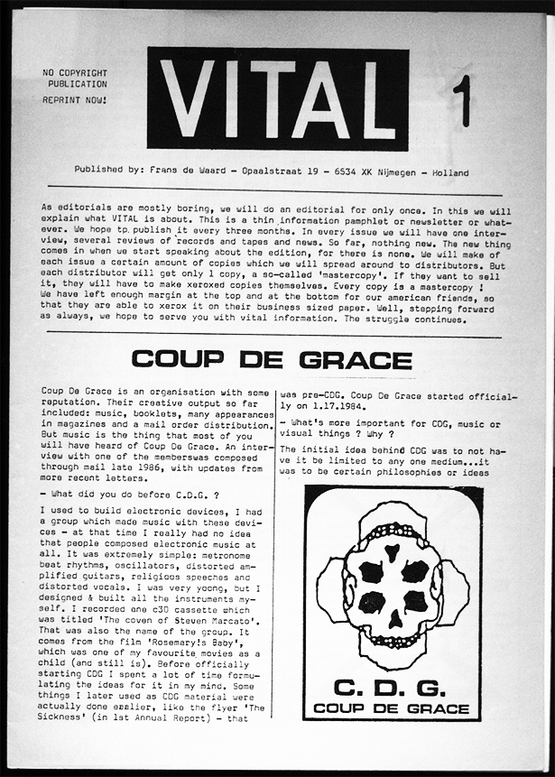
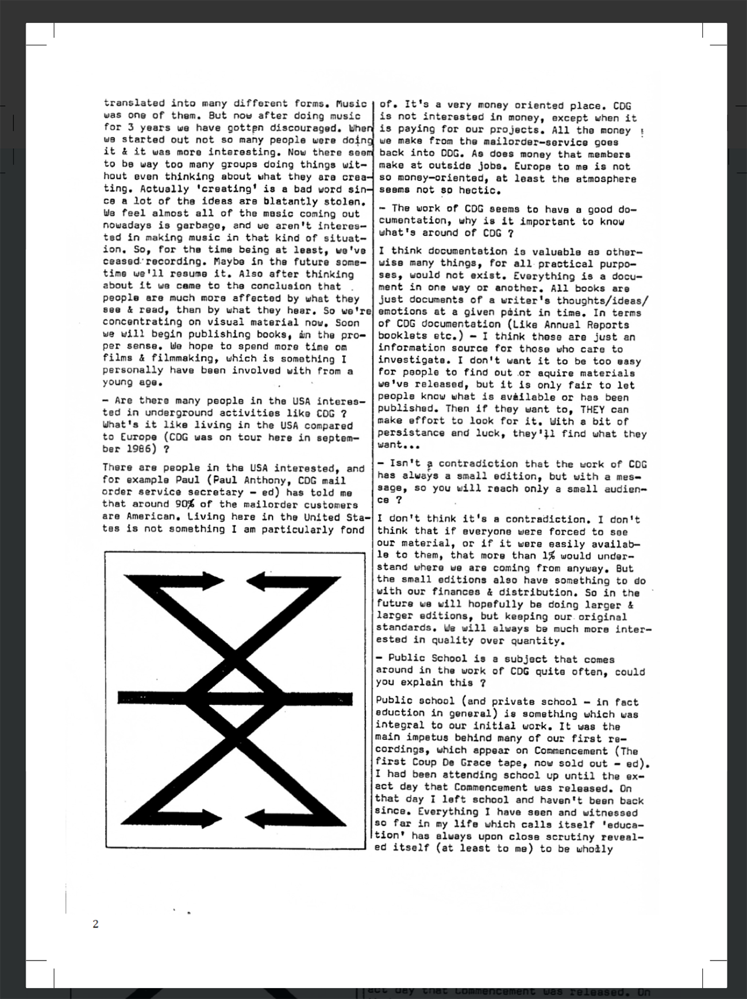
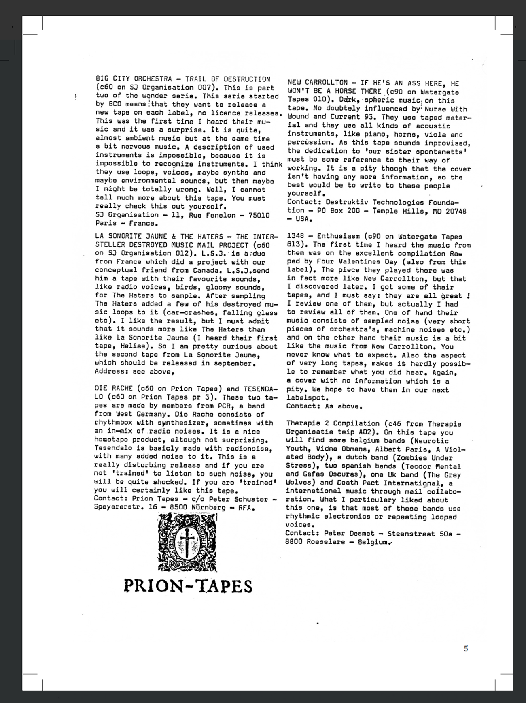
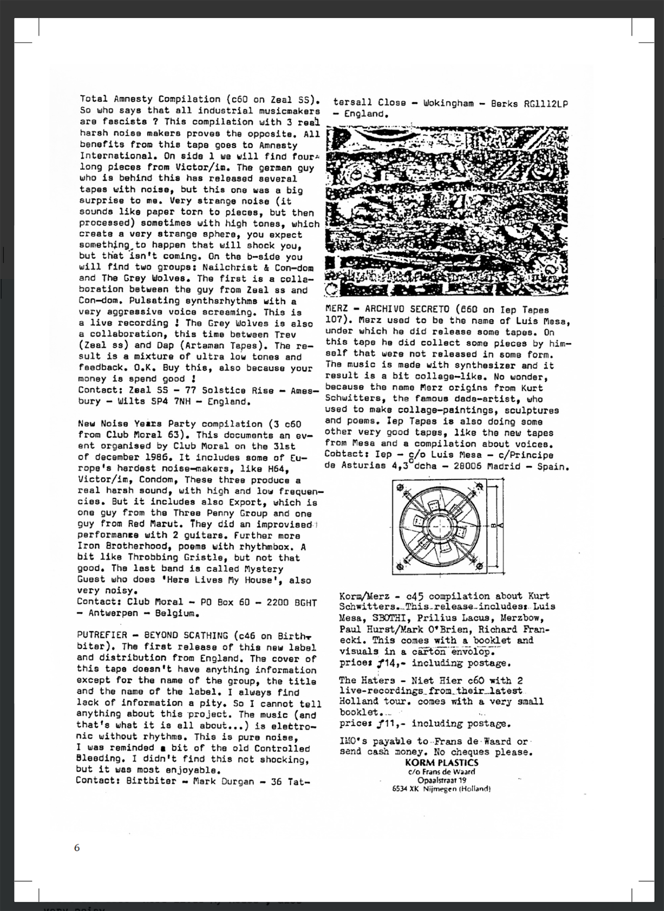
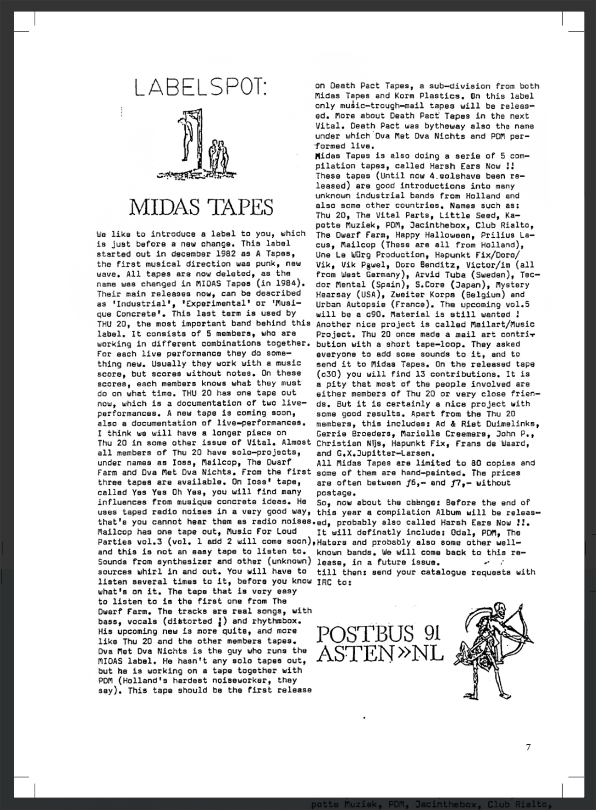
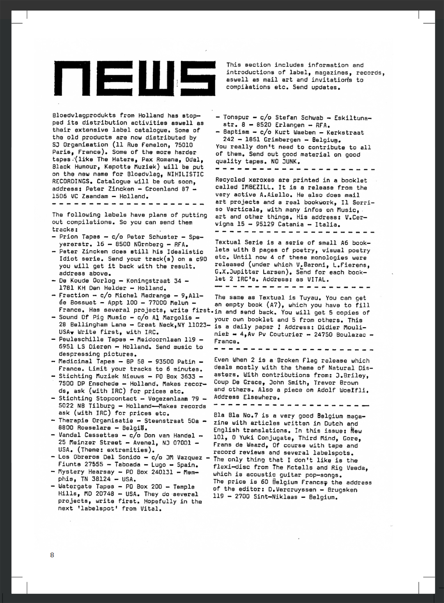
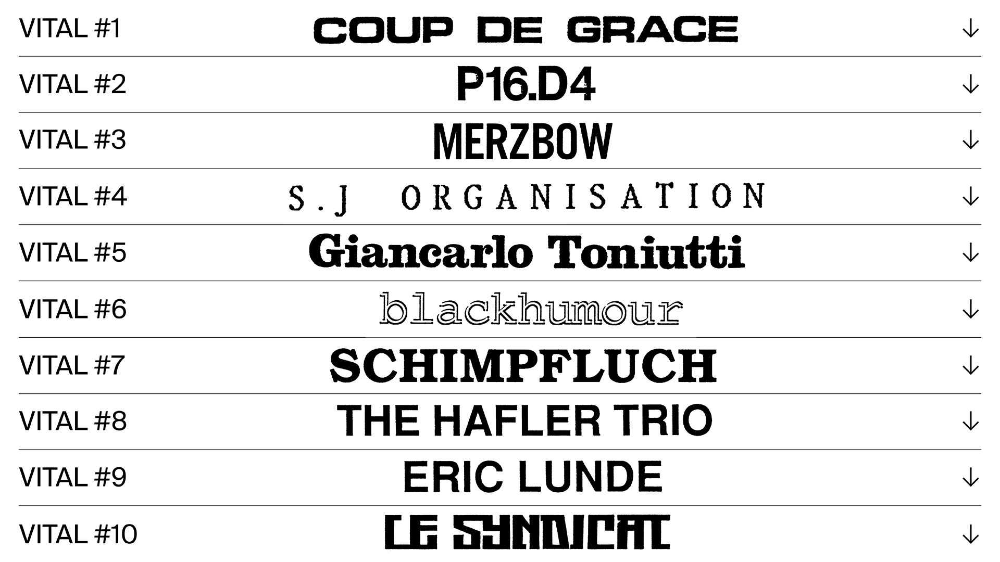
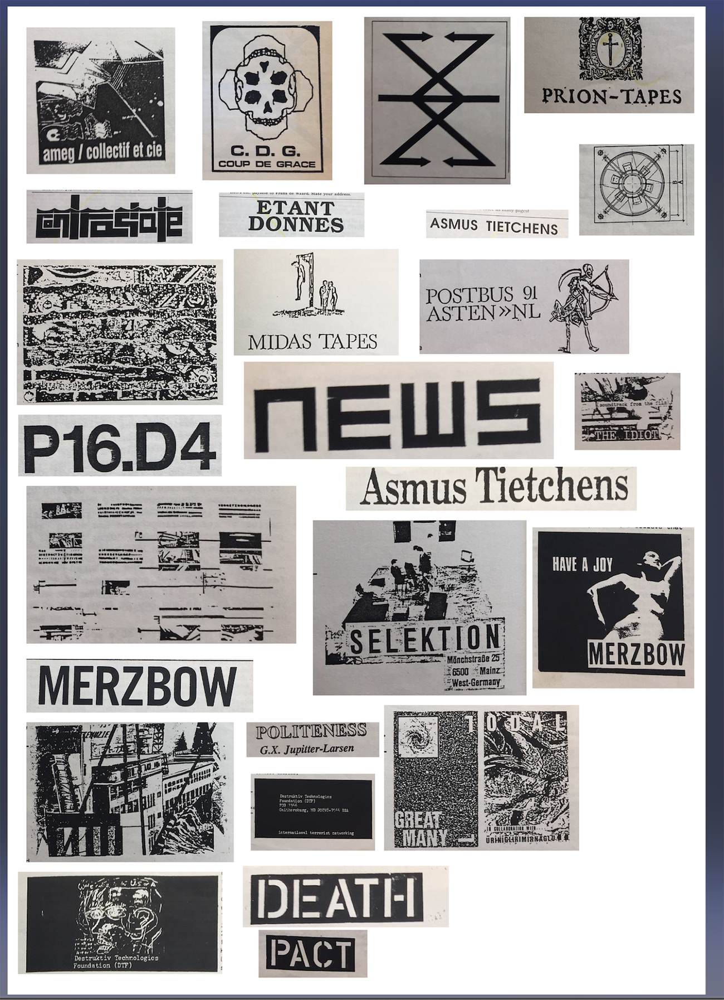
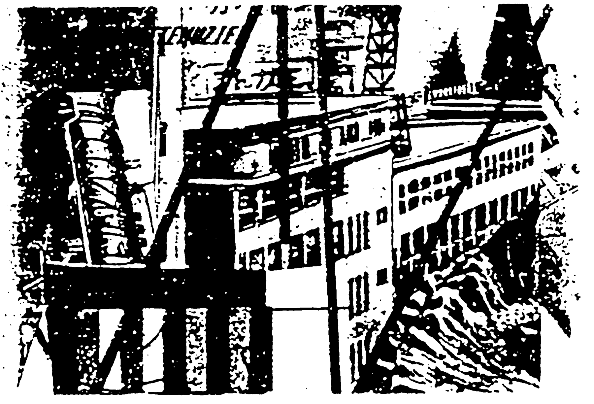
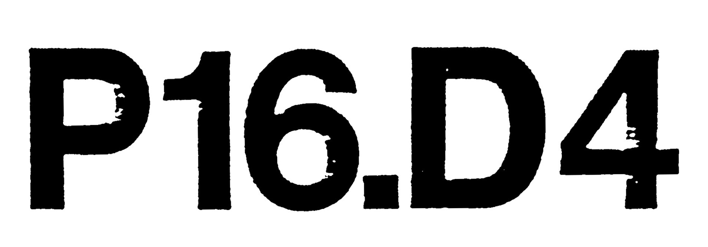

# VITAL magazine transcoding

- [VITAL magazine transcoding](#vital-magazine-transcoding)
- [What is VITAL](#what-is-vital)
    + [Metadata](#metadata)
- [Research](#research)
- [Transcoding](#transcoding)
    + [TOOL One](#tool-one)
      - [Description](#description)
      - [Methods](#methods)
      - [Results](#results)
    + [TOOL Two](#tool-two)
      - [Description](#description-1)
      - [Methods](#methods-1)
      - [Results](#results-1)
- [Mastercopy and distribution](#mastercopy-and-distribution)
- [Outcomes](#outcomes)
      - [Outcome links](#outcome-links)
- [Bibliography and References](#bibliography-and-references)
- [Questions and problems](#questions-and-problems)

# What is VITAL

Vital is a magazine focused on experimental electronic music. It started in 1987 as magazine on paper. It's simple xeroxed form ensured a free copyright and everybody was encouraged to make copies and distribute them freely. Up until 1995 44 issues were made and with the arrival of the Internet, Vital changed into a pure e-mail review newsletter and since then it appears weekly. Still as a free service and still without copyright. [Here](http://vitalweekly.net/) is the current vital website. Some of the issues are also archived in [IISG Amsterdam](https://hdl.handle.net/10622/B243EE91-F43C-4C88-9B1D-9E346CA715BA).

### Metadata

| Tag                           | Data                                                         |
| :---------------------------- | ------------------------------------------------------------ |
| **IISG Call Number**          | CSD ZO 44301                                                 |
| **Physical Description**      | Cardboard folder with magazines                              |
| **Type**                      | Magazine                                                     |
| **Medium**                    | Printed matter                                               |
| **Materials**                 | Paper                                                        |
| **Date**                      | 1987–1992                                                    |
|  | The artefact consists of 25 printed issues of Vital magazine. The individual issues are arranged according to the issue number in a cardboard packaging which is made of two sheets of cardboard held together by two fabric ribbons. On the cardboard cover is the artefact number ZO 44301 and also text that says: VITAL 1988–1992 : 1–25 + special (1989). |

# Research

Main part of our research is interview with author of VITAL Frans De Waard recorded on 11th March 2020 in Nijmegen. In the interview he talks about background of the magazine, his life and many other things regarding the magazine itself. You can find the transcribed interview below.

 
  
Interview audio

https://soundcloud.com/nenapadnej/fransdewaardinterview

 
  
Transcribed interview

02:22 So well oh... I will just... I like to talk so don't worry 02:27

02:28 Ok haha I am not worried 02:28 ***Y\***

02:28 Uhm... Before this thing... Before Vital... I did this other magazine called null-null, which is... In dutch means zero-zero. It has nothing to do with the dutch art movement called zero. Or club null I think it was called in the 60s. And uhm... this was, this one is from 1986. And I made this with a friend of mine - Christian uhm... long dead now. And is very simple typed with a typewriter. One sided 03:19

03:17 So when did u start doing this. 03:19**D**

03:19 In 1986. 03:22

03:21 And how old were you at that time?03:23 **D**

03:23 Uhm... 21.03:28

03:28 Oh, sweet! Like my age 03:28 **Y**

03:27 Yeah.. yeah.. And uh so then.. And this was also connected to the world of mail art.03:43

03:43 Oh thats what we also thought 03:43 **D**

03:45 And stuff like this... Every issue had its own piece of mail art. But it was also a magazine that in those days people will send in stuff. Already typed out and with an image

and stuff like that. You can see where the fonts changes this is my typewriter and this is my dad's typewriter. Uhm... This is my dad typewrite but then somebody else gave me this article about industrial music in Belgium. So as you is a different typewriter. So I was collecting this stuff and then I did this one... I wanted to do more magazines I realised was a bit difficult, but I really wanted to do this James bond thing. So 007. Which is actually issue #3. And this is stensil print which is the ancestor of risoprint.04:42

04:43 Ah yess we have riso print at school also.04:43

04:44 The previous version is a stensil print. This is the first time I worked with this people (the place where the workshop will take place) I think also in 1986. It was may 86 I guess. Still smudging. And uhm so I know this people since those days so 24 years now. And then I realised... then the last one was 00 #10. With the old dutch banknote for 1000 gildas.05:23

05:23 So is this like a master-copy?05:26 **D**

05:26 No no this is the finished copy05:28

05:28 This is the finished copies... So you just glued it on top the...05:30 **D**

05:30 This whole magazine...05:32 **F**

05:33 Because this the way you produce this things 05:35 **D**

05:35 Xerox...05:35 **F**

05:36 You just glue things together and then copy them05:39 **D**

05:39 Yes... in one of these boxes I can show you the original. But yeah... This were printed. My dad used to run a company where they had a printing press. And for the money... Actually the first book that I made. Was when I was 18. It was this booklet. 06:12

06:13 So where does it come from your interest in the music in general I mean. 06:14 **D**

06:17 Well ah dkhsd is not my... Oh is not my copy... Is from somebody else. Uhm... The interest well... you know when I was even younger like 15 years old. So 1980-81 I got interested in punk music and it was all about oh you can do it yourself and stuff like that but then I realised if you want to be in a band you need to find people who you want to do music with. Some damn awkward place to rehearse ten stupid songs and so the whole punk think I only found interesting for maybe one year and then quickly I moved on to getting more interested in electronic music. Because of the electronic music I realised also that there was this other whole other world of mail art. And of cassettes releases, people doing cassettes. And uhm and if you do a casette you can make one copy. If you want to do an addition... a record you have to do 500 copies but a casette you can do only one copy.07:54

48:53 Alright so, lets talk about how the design evolved. The first one is a paper I just started typing and as you can see I was already into recycling cause I used old photocopies that I did not use. And I did the typewriter thing on my desk typewriter for 3 issues but my father was already... my father was a sort of amateur historian... amateur write of books about music, classical music. So pretty early on we had a computer with a matrix, .matrix printer and my father allowed me when he was working that I can use it. So i printed out this long stripes of text and i printed them out, cut them and stick them on the piece of paper. Which of course was a bit of gamble where to make this stripes but I was also in university at that time, studying history, and there was a small desktop computer room, and all the students had the possibilities to make their own magazines about their own field of interests. They had really this old very first apple macintosh computers. And it was a nightmare, a nightmare because of course my dad did not have an apple macintosh he had whatever a 186 dx or whatever it was called IBM clone thing. So I would type out the text at home and I was already working with somebody. So I would mail it to a big floppy disk to a friend of mine for a little bit correction of the text. The old very first macintosh they could handle the floppy disk but it was not always possible to convert straight one on one. So you open it up and then there is all this weird stuff in it. But the whole idea was it was a really sort off punkick do it yourself thing. So somebody said I will learn you how to do it. This program was called page maker. I will learn you how to do page maker but you have to do it yourself. Which of course sometimes it worked out well because if you have a template you can stick it in. 52:02

52:02 But you have kind of a template.52:02 **D**

52:02 Yeah... 52:06

52:07 In some places but it didn't always work because... 52:09

52:09 You have two columns and the I don't know... you have kind of a layout. 52:12 **D**

52:12 Yes. But as you can see in... It worked well for these issues but then I don't know what happened. Well, maybe I do know but turns out that is not possible to do proper translation. I would hurry. I think you would have to pay for the hour to use it or two hours or whatever so it was not entirely free. You will have to sign up for specific times to do it. I went back to you know what i will print out this little stripes of paper and I will do it in the old way. So that's all laser printing already but still cut on paste. In some issues and in some issues they were not cut and paste... Anyways total nightmare... And now we have to go to the mystery of why the rest is not here.

53:38 Is the same issues as in the archive. 53:40 **Y**

53:40 Yeah? And then what I did lets go back to that issue... So when I was done doing this 8 pages I would go to the coffee shop reduce this to a4 and then I had my master. Now what people did if they got it from me. So this is how would you say it - generation 0, then generation 1... the reduced version is number 2. Then I would use the tpex to make all the papers look really good if its fine and then I will make xerox out of it. So that's the second generation people got. So they would put on the yellow thing that was to indicate at home this is my original - I copy from that,. The yellow, you cant copy the yellow. The xerox don't see it. So it let's you know - this is my original. So that's why I think this is from V2. I am pretty sure V2 that is.55:01

55:01 So they markdown their mastercopies 55:01 **D 55:04 to know that is theirs55:04**

55:02 Yes.. Also if it gets lost... They had a small store that would be open on concerts and stuff... Ah that if one of the other issues was lost they could go back to the store and make one of the generation #3 the original. That's why the yellow is still there. And then of course I started to work for Stalplaat. Which was more or less sort of professional label company... without the xerox. But with the benefit of having a lot of professional designers working. And designers with access to /my archive i not really like a organised/ but this designers had laser printers. So the girlfriend of my boss she had a laser printer I would do this design and then leave her this space and she would copy that in. But still would be... this is two sheets... I glued them together to know what is back and front. And then of course... So these are the very old mine generations #1 of the first issues. You can see because they are all discoloured. And you can also see I used tpax here to smooth whatever. Stuff like this... Apparently here I was still doing the printout but without doing copy and paste. Also cause I worked with Stalplaat they hired me to do initially to buy and sell stuff for the store and mail order and distribution. They didn't mind that I am doing this stuff. Cause I worked sometimes in the evening etc. But on the other hand it must not take up too much time from other people. So i could not have said to my boss ey Can you ask his girlfriend. His girlfriend is right now actually a very famous dutch artist. Fiona Tan? Have you ever heard of her.57:57

57:57 A actually yeah I like the work a lot. 57:57 **Y**

58:01 She was the girlfriend in the early 90s of my boss in Stalplaat. And she would say why are you doing this stuff for this guy? She didn't like me obviously. So yes this are the first issues. As a first generation I guess. 58:28

58:29 That big one is generation 0, this is one. And apparently... the other thing with xerox machines technically they should always do the same thing. Make a proper xerox. But there are differences, sometimes the toner is not right and you can still see these sort of lines in between. But is not in any way of form organised.... Sometimes I would just go to a proper place and printed out for my own expense. You see i didn't mark these with yellow. Let me see. Oh yes there is also... So there have been 3 issues of vital in the USA. Ah the first one is the one with the 7inch with the sort of label design. The second one is part of another magazine called report. And the third one is a very small one. I think this is it. 1:00:15

1:00:15 Like a small format. 1:00:15

1:00:15 Yes this is for a tour that I did with my band and we played with a person from Kapottie Musik. But he also wrote for vital back then and we toured together in Europe so we made this small booklet to give away. Not sure what this was supposed to mean as if there is something missing. Oh no there is more pages.1:00:48

1:00:48 The layout is different.1:00:48

1:00:48 Yes that was done by guy who was living in new yourk and he was helping us out. This is a different format as you can see is a b-51:01:13

1:01:16 And why did u call it vital is there any reason for it1:01:17 **y**

1:01:16 Yes actually there is. Yes because the reason i stopped doing this null thing is I made this magazine and I printed a hundred copies, xerox them or print them. And I went to stalplaat because this is way before I worked in stalplaat. And I went to stalplalt, v2 couple of shops and I gave them couple of copies. They made a note oh we have 5 copies of your magazine and if they are sold we have to pay you. But if the next month you come back and ask if the magazines are sold the people told you ughh we don't know. Have a look yourself. I dont see any so they must be sold. Ugh we dont know. I say you owe me five gildas for a magazine and its like we don't have five gildas. And I thought this is insane. Why would you want to do a magazine. I wanna do a magazine to promote stuff but I dont want to loose money on it and then I thought i should have a format that is really cheaply made does not involve any car. You can send out a single envelope for the lowest amount of postage and how many pages is that - apparently two a4 pages folded. You pack it up with information. And it is a more dynamic way of publishing this why the word VITAL. Had I known if in 2020 I would receive tons and tons of spam with the word Vital in them I think I would not have chosen VITAL. But yes that is the reason I thought yea you know I can use this. That was a mistake.1:03:23

1:03:23 Yes it changes meaning with the time but i think the name is good. Is also about this love for music. 1:03:30 y

1:03:30 Well that is of course something that i still have because now I a doing this vital weekly thing. And that is really an expansion of the whole magazine. Cause at one point two things happened. Ah you know my boss did not like that i was spending time and resources on making this. Although it was not too much. I had to ask a designer, I had to ask for printout, I had to print the copies out. And then somebody comes into the store and he says ughh I see I have copies 1 2 3 4 5 6 but not 7 can u make me one. Ah I don't know what to do. And then i felt why am i doing this. And one day in stalplaat an email arrives. The first time I heard the word email was in 1993. We are touring in america and we are staying with peole in their homes. Eventually we arrived in pitsburg with some guy and he says I have to go to check my e-mail. And I thought what the fuck are you talking about. But 2 years later my boss and guy who produced stuff. said they will install this tel net thing. 5 mins later they were sating we are in we are in. I was wondering what the fuck is this. We are supposed to be selling CDs, what are you doing here. And then we had email. And the first emails were newsletters attached with all these adresses. And then with copy paste I could send my own newsletter. Copy paste and spam everybody else. It was a time when you did not know what is a spam. Of course quickly on I understood that people don't like it. Yes fuck off with your bullshit. I dont want your shitty reviews and then later on of course it was all more formalized. You had to sign up with an IP adress, you had to confirm adress. If you say add me to your mailing list i can't do it for you you have to do it yourself. 1:06:26

1:06:27 And do you have any idea? Do you see everyone that subscribed to the online magazine? 1:06:30

1:06:29 Yes. I can also unsubscribe people if you want to. I can go to the system and put you email in the unsubscribed section. If people are very shitty I do that. 1:06:51

1:06:51 Is there a lot of shitty people/1:06:54

1:06:54 There are lots of shitty people1:06:54

1:06:53 Like they want you to review your music or?1:07:01

1:07:01 Lots of reasons that is also when people don't like what you do. I don't know that many people... I don't know that many... I know many people inside this music. I dont know many people outside this music. But I do know one and he is Steven Willson and he is a wild known rock artist. This year he is going to play in Amsterdam once in Aphas, he fills up is sold out already. He is that big but he is also really into that kind of music. But he said I know a lot of people in a lot different music genres rock, hard rock etc. but also experimental musicians. The worst people who are the most easily offended people are the experimental music people. Say something like your latest record is meh and they wont speak to you for two years. And he is right that happens. Oh yes you wrote a review about my EP but you dont understand what i am doing.1:08:26

1:08:26 I also remember that i was reading something on the website that you say that is not your fault if you don't write a good review and the artist does not like it.1:08:32

1:08:34 Yes but you know if you can't take the criticism you should not be doing music. You should be doing music but you should not be releasing records. Also not to mail the to people.1:08:48

1:08:48 So how did it work in the beginning when you started VITAL you were already receiving music from people or? 1:08:55

1:08:55 Oh yes yes I was.. That is interesting cause one thing that is a, also should be mentioned is that i did this blue booklet. A cassette catalogue. I was 16 when I became interested in this whole cassette thing and started collecting information. So that is a paper form of discogs. The stupid thing of course is that it does not say anything. Some tape names adress some more names. Bahama tapes no information. It should have said Bed alaskam - it is only pop music or noise or whatever. That it should say. I was doing I did this magazine or a booklet or whatever is called in 1000 copies. It costed 1000 gildas. My dad loaned them to me and he never got them back. Uhm a copy of this landed in germany a guy called krauhvaen. And he said oh wow you seem to know a lot about all of these people. I want to do a casette compilation with dutch noise music. can you organise this for me. And then I said oh yes sure. So i wrote to all these people that i like saying give me a track. And this was in a time when I was already in a contact with all this people. I already corresponded with them. I would say oh well you know this is for a compilation of a german guy blabla. Soon i had a 60minute tape compilation. And then I thought you know I can also start my own cassette label. So that happened in 1984 at the same time I started doing my own music. So all of this is connected. I did the casete catalogue for a few more years. Keep of collecting information I did the null null, the vital and at the same time I did my own casette label. So all this people will send me casettes for trades and i would write about them. Send them back a vital issue. And they would say oh interesting next time i get it you get a record for free. So uhm thats how i got eventually all of this promos that people would send out to me. I like what you do ah have a record. 1:12:13

1:12:13 So you still do it like that? In the site I think I read that you only review physical copies.1:12:18

1:12:19 Yes because I sell this. That is what I live from. My side interest is not selling on stuff is more like a thing of survival. So yes what you see here is stuff from this month and then every issue two tree issues respond oh I want that and that can u reserve this for me. sometimes more than one person kind of like the same thing1:12:55

1:12:54 So you kind of distribute the music.1:12:56

1:12:57 Well i sell it. In the end of the month I make a list. I have a separate list for people that want to buy stuff.1:13:06

1:13:06 And people can contact you through discogs or thorugh the magazine?1:13:06

1:13:05 Sometimes. Also now I am more and more selling for people on discogs.1:13:26

1:13:27 So your collection is always like shifting kind of. You don't keep the stuff 1:13:34

1:13:34 sometimes if i really like something I would keep it. Sometimes the real physical object. There are maybe 4-5 artists that i really like to keep the stuff off. And sometimes I make mp3 and keep the mp3. 1:13:49

1:13:50 And back then when you started do you think that the people had an access to the music somehow?1:13:56

1:13:58 It was like really small releases/1:14:03

------

1:14:03 The idea of doing ,magazines in general was to do what the internet does now to make sure there is contact. You do music, and I do magazine, and you want to get some publicity is not just for selling but also to that you know there is something out there and you want to contact these people. After a while a magazine has certain certain net – a group of followers.

1:14:41 you know what it is about, something you can trust. That's interesting, you have to trust a magazine to write about you. So if you read my magazine and you think uhm out of 5 times 4 times he was right it was an interesting contact to make. You'll also do it for a sixth time. If you think about a magazine that its bullshit. If you think 2–3 times its not the right people, what am i doing here, than its not your magazine.

1:15:18 the whole idea of this magazine is to establish the link between musicians and also the consumers in sense that most people who want stuff are also doing stuff. They do magazine, mail art, or music themselves or have a label. Quite a few people who want to have a label put out music themselves. Especially people who like design, yeah oddly enough. I think theres 2 types of people who want a label – fanatics who like the music and designers. Beacause even if you cant do music but you like music, i mean everybody can do music or design but not everybody is good at it, but yeah..

1:16:36 Uk label touch, quite well known label, started in the 80s doing cassetes and lots of cds these days. Its basically run by a very clever guy whos now doing music himself, but John Mosercroft who worked with Nevill Brody for a long time. So the slogan was quality meets design. So this is a thing and if you know how to press a record or make a casette or whatever and you have good visual imagination you can make a beautiful cover.

1:17:29 Yeah definetely theres some really beautiful covers. Yeah absoulutely. On the other hand you see from labels that are run by people who really like music they usually dont have that nice covers. which is also.. who cares?

1:17:45 the thing with staalplaats was that staalplaats was also very visul based label they did lots of strange packaging. But i also always say honestly I dont care that much. I like the music way more than a strange package.

1:18:16 so now Im preparing a book which Im gonna publish myself. I dont know if you noticed but I did write a book about staalplaats and it was published few yours ago in france.

Yeah I've seen it on google.

1:18:54 There is also some book in russian with your face about classical music I think.

Oh yeah its a magazine. This one. You can read this? Yeah because Im bulgarian. oh okay. One day if you have a lot of time in your hands you can translate. hahah

Its a pretty long article based on sort of workshop/lecture thing i did in moscow. Broken music yeah. Kapotte muziek is my band. Nice.

1:20:01 this book was published in france and it sold out already 3 years ago.

Is taht old picture of you? Yeah haha i was 18. Sweet. And it was in bedroom in my parents house and im holding a bunch of casettes. This was from an article that got a lot of publicity from leftwing media because you know young people doing your own stuff, do it yourself culture..

1:20:41 How was the situation back then in this area like politically? What was the context.. How was it a the times, you know.. Im wondering if this do it yourself attitude was also a response to something. Because you are also saying in some issues that you need to like.. spread the virus about the magazine?

Oh yeah that was just an expression not like to day haha (covid-19). No the idea was that it should be.. everybody should do their own stuff and of course in 80s, atleast in Netherlands alot of unemployment for young people and the idea was if you are doing your own music, your own cassetes and magazines you can escape all of that.

It wasnt necesarily political, but it was a punk spirit but for a different kind of music.

1:21:57 So last year I did a reissue softcover, i did some more copies they are coming on friday. But this book was also properly published somewhere,? Yes. But yeah since i published this i thought yea you know this very easy i know how to do this now.

1:22:35 Im gonna open this up so you can see the difference. this is way thinner paper.

(opening the book etc..)

1:24:30 but when i see the cost of production of doing this i though i can do the vital book myself. So you want to include the issues 1 to 44? 44 yeah, they are all scanned. And i made an index for so you can easily find the right page or article. Why i think is really helpful.

1:25:24 Do you include links in the digital version to the music bandcamps and stuff?

Yea i Do. If you go to the online version there are also links now.

1:25:46 I had an interesting discussion yesterday with a guy who is actually designing my vital book, about how it looks. Couple of years ago somebody said, your lines are too long you dont use any sort of breaks in the lines. So since then i have been doing this but now it looks like this (shows on computer). Its horrible! It reads better though i think. But if you go to telephone version something else happens.

1:27:29 Well as you can see im not a designer, i break these lines by hand.

1:28:30 i still use thi really free thing composer to this website..

Ye but i think its nice to do this like that diy. Yeah thats what my friend said it looks basic but you know nobody else has this so maybe thats the idea. why would i bother with it?

We like your website. Also our teacher said that its pretty nice that its only text.

Oh okay.

1:29:13 Lot of people say that i should move towards something like wordpress and i could include images and hyperlinks.

To be honest i kind of like this. Its not super practical but it has certain character. Same feeling like the magazine.

1:30:23 also nobody pays for this. I have 4500 subscribers but in donations this yer i got 100 euros hahah. So I have been giving out for 25 years for free so its a bit wierd to start charging money for it. if all subscribers give me 1 euro. I would not have to sell the stuff, the records. I would just give it away. 1 euro a month? i would have an income..

1:31:17 but i read somewhere that the printed ones you very sending for like 5 euros? I'm not sure. It should written be on there. A some point people started asking can i subscribe? 5 guilders old dutch currency hehe. Old money. 6 issues a year 12 guilders.

1:32:07 i had 6 issues a year. After number 21 is a bigger issue. But we thought no this doesnt work lets go back to 2 sheets and a supplement. The supplement was more like theoretical stuff, book reviews discussion, more of insight into the whole musical debate. So people could say oh i want to subscribe only to these 2 sheets or the supplements.

1:33:14 yeah so im not sure how i organised these subscriptions if i had a list..

There must have been a lot of work involved in the distribution right? Putting into envelopes going to post and stuff?

Yeah but i already worked at staalplaats and we had post everyday. we went to post office everyday to mail stuff. And later on we hired the post to come to us so it was even easier.

Like i said my boss and other people they didnt always like that I devoted time to it and their resources in printing. Theres one interview that came via email, but we had 1 email adress. Your email is now always somewhere in the cloud, back then If you checked email on one computer then next days the email is not on the other computer, because i already retrieved it here. So somebody retrieved the interview that i needed and it was gone from everywhere and i kept emailing this guy hey idiot wheres the interview? Then i realised it was on somebodys home computer from staalplaats.

1:35:19 I did find it eventually. That didnt add up to the fact that staalplaats didnt like me doing it. The reviews i could do that at home, take the floppy disk back to work and mail it out. there was not so much work involved anymore, however what i did is for the first 100 issues i made these booklets. They were properly corrected in english but at the same time i did my book. And that was for staalplaats more interesting cos this was more of a commercial thing. I went to the copyshop and had 100 copies made and we would sell them for a proper price. There was some money coming back to staalplaats. I didnt make any money out of it.

but you did all the reviews so it was your intellectual property.

yea i would be delighted if somebody would say you know im gonna correct all these text from all the issues and eventually have a massive amount of reviews.

Who did this artwork? I did it. Nice! This is actually something i still do xeroxes. I distort stuff in xerox or scanners. In staalplaats we had a very slow photocopier. If you would be in staalplaats today i would be going to my copier and keep on talking. And the suddenly pick up something put on the mashine and keep on talking.

1:38:44 Many of this is just envelopes. I even dated them. I still use them for my music projects.

1:39:35 These are some of my original covers from casette label. Again same typewriter.

1:40:09 Like i said my archiving is not really good.

1:40:49 how do you feel about making vital digital these days? Its nice to have something physical in your hands right? its much more easier now in terms of printing and distribution..

Uhm well, you know this sort of thing vital weekly its okay if its online because more people can see it. For my own music I dont know... i still like to do casettes. I like casettes still after all these years. Sometimes I make music that has more rhythm so i think this should be on vinyl or i do something thats very quiet that should be on cd. Its usually very quick i put it on bandcamp for free.. who cares

1:42:06 So you also connect different media to different kind of genres?

Oh yeah yeah, definitely.

1:42:20 You think it makes it more serious if you put it on vinyl compared to cassete.

No thats not it, for me the difference is technical. If you do techno music you can put it on cd without any problem, but on vinyl it will sound better. Good quiet ambient music sounds way better on properly mastered cd. On vinyl you immediately have this hiss and static. fuzzy noisy lo-fi ambient music you can put on cassette. And anything else you can always put it online. So thats the difference for me.

1:43:21 for me also if i make music that takes me really long time to make, I do sometimes that kind of music i dont want to give it away for free because i spent so much time on it. If you have quick idea and i go my back room sit down and record it and it takes me 20 minutes and i think nice its i might aswell give it out for free.

1:43:48 how do you record these days? do you record digitally or do you use like tape deck or something? like a reel to reel or something.

Noo haha. I wish i had a reel to reel. Actually i mainly record on my laptop. but since a month or two my 4track recorder is repaired so i can use that. But i forgot how it worked.

I had to download a manual to remind me how it works because i hadnt used it for so long.

So its like a tascam?

Its a fostex 4 track yeah.

1:44:33 But these machines are good people still use them

Yeah, im gonna do a music trade project with a guy who repaired it, he also has the same machine. we exchanged cassetes where two channels are his and two channels are mine.

And if they are full then we both do a mix of the material.

1:45:00 But the mix itself we recorded on harddisk or a computer like the recorded that you have you use for live recordings or outside for field recordings. Also in that respect I don't have anything against digital or analog recordings. For me its not really an issue. I rather think of what I want to do and what to use and how to use it than oh i must have a modular synth or I must have a laptop or I must have this and this and that. With the exclusion of anything else but its also because i do lot of different kinds of music. I do more techno-ish music and also very ambient music. The techno music i do on my ipad for example.

1:46:22

There's a video on youtube where you have a really strange setup of random objects that you use for making sounds.

Yeah that's kapotte music project probably. It's a trio. I'm not sure that we even exist anymore, we only play live. We dont do studio recordings. And we use junk that we found on the streets to play with. When we arrive in the afternoon we go to the street and we just pick up anything that makes a sound. And if its something small that we like to take home and to use later on. Like this thing full of dust. and i would use this in concerts.

1:47:26

I didn't keep that many things over the years. Some broken toys. Just to investigate the sound that it makes. Not like what people do when they start hitting on things. Why would you want to hit on junk. Use the junk it has dirt on it and you can rub it together and you amplify the surface thats totally different sound.

1:48:26

But like I said last concert was 3 years ago with Kapotte muziek and nobody asks.. I'm not that kind of person to go out and ask for concerts anymore. If people find me they know where I am and can contact me and I'll come but I'm not gonna write to everybody ugh can I play can I play, you know. For years I tried to play at rewire in Den Haag. They don't want me, they don't even respond. I have no idea. I don't know what they want. They want young transgenders I guess and not old grumpy white man. Haha.

1:49:25

Honestly this is probably true. I'm gonna be 55 this year and 15 years, right when i left staalplaat in 2003 if you would ask me what will you be doing after you are 50. I would have said yeah you know I hope to get rid of the vital weekly stuff and that I'll be rcognized for the music I'm doing and have some interesting projects going in whatever field. So now I'm 55 and i'm apparently still doing vital weekly and nothing much else. So some people would say Oh Frans he is the pioneer in electronic music, which is definetely not true. I'm not a pioneer. It's also not recognized by a lot of people – Oh yeah that's the guys from Nijmegen he does music but don't book him not many people will show up. Yeah that's true haha.

1:50:48

Last couple of years i palyed with a guy from Norway and we did small tours for a week or so. In germany and Liuthania and Helsinky and so on. And we only played in places that were not bigger than this room.

1:51:07

But this is cozy. Yeah but when 5 people show up you can't even pay for the train to next city. Unless of course you treat is as a holiday. And i realized that that's not what i want. Also because i want to focus on trying to learn new stuff in technology that i find interesting. Which is not modular synths. How to use for instance 4 ipads in a concert and have them control sound together so you have one control surface and make interesting music with just that. That's what i want to try and find out.

1:52:22

So what are you going to do with this stuff?

We have to figure it out, we still have to put together a concept but it's generally a bit comlicated this assigment. This idea of transcoding. What does transcoding mean? It's like putting it into different mediums. You have certain content and then you transform it into different mediums. Lets say you have all these printed things and you design an app that allows you to browse through all the different content or something. To put it in a very simple way i guess.

Allright but its not like something to use on website?

Yea sure it could be website also.

1:54:03

We are thinking of something that would combine all these different elements, aspects of the thing like the reviews, the music itself, the text, graphics and images and then make a tool that would allow you to browse it more intuitively. That's what we have to figure out.

1:54:26

So lets suppose i wasn't doing a book with the vital stuff. How would you do it?

All the 44 issues. I mean book is nice because you have them all together in one collection. That's nice but the main topic is music so it would great to have access to it at the same time you know.

1:55:04

Lets say you have this issu, its 10 i think, so you would read this review you could click it and it would bring you to the music. Yeah for example, and then you would have the graphics connected to it like the album covers that you could browse through. Could be nice.

So thats a lot of work. I suppose you would have to do it manually.

We also have a class where we are supposed to design a tool that would maybe collect these things for us. It's all connected to tho topic of archiving.

1:56:34

The distribution itself is also interesting and the mail art also, it's not so common anymore.

1:57:08

I have a box of my mail art, It's a small box beacause I quickly realised that mail art is not my thing. People would send out a blank page and you would have to fill it up and the you get it back in the end. I made this mail art magazine myself.

1:59:53

It was also quite expensive, lot of these projects required you to make a lot of copies..

2:01:24

I like the idea of downloading something randomly and then getting something else. We can send you the link to that..

2:02:25

Ye also somebody put a usb stick somewhere in wall so you can go there with your computer and get the files.

2:02:42

Would you like to have all the 44 scans?

Amazing, thanks..

2:03:12

When do you think you'll be finished with the book?

That depends on the designer really.

2:04:55

I want to also print another book at the same time because over the years i wrote a bunch of stuff for people like notes on records, aplications for grants for musicians, tour diaries and stuff like that. So there's gonna be a collection, a small page-bundle but there's gonna be no interest in that I think. So I'm thinking if i do the Vital book so people would say oh you know you have a second book for sale it's only like 5 euros I'll take that.

2:06:45

You also reviewed some people from Bulgaria.

Yeap "?Imactives?". Yea theres small comunity. You know these people? Yeah i know some of the people that release for them.

Actually I wrote to him cos I never played in Bulgaria. I'm not somebody that wants to play in Berlin every 2 months.

The scene in Bulgaria is quite nice.

I've never been to Bulgaria at all.. I've been to Greece and Slovenia to play concerts.

2:08:13

I have played in most of European countries.

Did you ever play in Czech republic? Yes along time ago in Prague in Archa theatre in year 1995. Really? I used to work there. But i was born in 1994 so...

2:08:46 it was really wierd. We had 4 concerts in Italy and 1 in Prague. And we had to drive from Sicily to Prague and we thought we would drive to Udin and next day from Udin to Prague. Unfortunately we got stuck in Bologna in snow for 8 hours. We arrived in Prague 9.30 in the evening. We tried to phone them, but we couldn't reach anybody.

We arrived and the dutch ambassador came because he paid for the concert. But we were like zombies. But we did the concert and next day we left and that was the last time I was in Prague. And one time before in 1970 when i was 4 years old and my father used to live in Prague.

2:10:27

Do you know something about czech classical music? Antonín Dvořák? Yes of course he's the man. My father used to live with his daughter in law, not as a couple. But when my father was 20 he had this idea to write a book about Dvořák. And he wrote her a letter – oh can i stay with you? My father had a bit of autism I think.. SO he wrote her can I stay with you cos I want to study Antonín Dvořák. And she said Oh come over. Hahah.

So he stayed there for 6 months. But then my granddad wrote to him, son you are in communist country I want you to come home and get a job. Of course he didn't say Fuck off old man, he said Yeah I'm coming home.

2:11:15

If you turn your head behind you the grey bundles are the original scripts of the book from 60s. It's not complete. There are even original pictures, he got them for free.

2:12:28

Did you ever review any czech music in Vital?

Yea, oddly enough a guy called Tomáš Dvořák. But I think Dvořák is a common name right? Yea it is.

This is the real book it came out in 1990. My father went out to buy books about Mozart, Beethoven and whatever every week. I wrote the first chapter about czech history, I made a research.

2:14:34 Oh I have to go soon. What are you doing are you going to this place tonight? The riso cafe?

Yea I think we have to go home, we live quite far away in Den Haag,

I used to live there.

Do you know Bunker records? I used to live right around the corner from Guy Tavares. Oh nice is he still around? Yea I saw him talk somewhere not so long ago..

2:16:10

When I was married my wife when she was still studying in Arnheim the councelman from Den Haag came to the school and said ladies if you want a job in Den Haag sign here. My girlfriend signed. She graduated on Monday and on Tuesday morning she had a job.

I was working at staalplaat at the time in Amsterdam so we had to move to Den Haag, which was.. I didn't like that.

2:17:02 We left 4 years later cos we were really fed up with Den Haag. There was a lot of noise in the night in our area. People shouting. But now the city is super quiet. But Yeah Guy from Bunker records lived around the corner.. There was also an interesting scene in the Hague I think, all the squats..

2:17:41

If I had nothing to do there's a bunch of things that are worth documenting. The whole bunker scene is one of them. It's really intense period. There's not much information online but some of the guys are still around like Guy, IF, Rude 66 and so on.

2:18:23

It was good music but they had all such intense lives, it was so filled with depression and drugs and suicide and parties that lasted way too long. I was never part of it, I never saw any of it. I met some of those guys and they talked about it and I always thought this something, somebody should make a documentary about this.

2:18:59

i know that they still release music. Also clone records are making reprints. So it still exists but I don't know what they are doing. At staalplaat we used to help Guy out doing the cd versions of the records. He is partly from Brazil and Indonesia I think at one point he came in and had a cd and wanted to do a little bootleg with indonesian rock bands. I was like Guy 500 copies why? And he said I'll sell them in a weekend.. Indo-rock its called. He knows about this sort of stuff also..

2:20:13

Well Den Haag.. It has also been a while since I played in Den Haag. I don't miss though I have to say...

# Transcoding

We decided to concentrate on the **first 10 issues** which are published in the time span of almost **3 years – 1987–1989**. We want to create a digital alternative containing the magazine itself + all other contents that were difficult to access at the time for the readers – mainly the reviewed music.

- We want to create an environment which allows you to browse the content and understand its origins.

- The digital tool we would like to create allows us to transcode the 3 main contents of the magazine into a new type of master copy – one that you can browse online. And experience the music itself.

- By making this environment we want to connect the viewer/listener more closely to the person who is committing his life to creating this magazine. We want to expose the nature of the magazine which is consequently the nature of Frans De Waard.

  

This environment will be accesible via website that will consist of three main parts (2 tools and the interview)

### TOOL One

#### Description

Printing tool for the viewers of the website to be able to reproduce the physical magazine at home, and spread it further to other potential viewers. Here is [link](https://www.notion.so/VITAL-ISSUES-b97881dc1241496485d10541d3aacde2) to pictures of physical magazine, which will be used for the printing tool. Some of the scans you can see below.

 
  
Vital scans

#### Methods

First we took images of the artefact simply with a Smartphone. Later we used the scanning machines in the IISG archive to get better scans. And later we got cleaned up scans from Frans de Waard himself. We used the text recognition within Adobe Acrobat to extract raw text from the scans. Then we pasted this text into Notion software. We created a printing tool in Atom coding software by using html, python, javascript, css and less languages.

 
  
 RAW TEXTS FROM OCR 

**VITAL 1**

NO COPYRIGHT PUBLICATION REPRINT NOW! VITAL 1 Published by: Frans de Wsard - Opaalstraat 19 - 6534 XK Nijmegen - Holland As editorials are mostly boring, we will do an editorial for only once. In this we will explain what VITAL is about. This is a thin .information pamphlet or newsletter or whatever. We hope tp . publish it every three months. In every issue we will have one interview, several reviews of records and tapes and news. So far, nothing new. The new thing comes in when ~e start speaking about the edition, for there is none. We will make of each issue a certain amount of copies which we will spread around to distributors. But each distributor will get only 1 copy, a so-called 'mastercopy'. If they want to sell it, they will have to make xeroxed copies themselves. Every copy is a mastercopy: We have left enough margin at the top and at the bottom for our american friends, so that they are able to xerox it on their business sized paper. Well, stepping forward as always, we hope to serve you with vital information. The stru ggle continues. COUP OE GRACE Coup Oe Grace is an organisation with some reputation. Their creative output so far included: music, booklets, many appearancss in magazines and a mail order distribution. But music is the thing that most of you will have heard of Coup De Grace. An inter view with one of the memberswas composed through mail late 1986, with updates from more recent letters. What did you do before C.D.G. 7 I used to build electronic devices, I had a group which made music with these devices - at that time I really had no idea that people compos ed electronic music at all. It was extremely simple: metronome beat rhythms, oscilla t ors, dis t orted amplified guit ars, r el i gi oos s peec hes and distorted vocals. I was very yoong, but I designed & built al l th e ins t rument s myself . I recorde d ene c30 cas s et t e mhi ch was titled 'The coven of St even Marc at o •. That was also the name of th e group . I t comes from the f i lm ' Rosemery!s Baby', which was one of my favourite . movies es a child (and stil l is). Before of fi ci all y startin g COG I spent a lot of ti me f or mulating the ideas f or i t in my mind. Some things I later used as COG material were actually done essli er, li ke th e flyer 'The Sickn ess ' (in 1st Annual Report) - th at was pre-COG. Coup De Grace started officially on 1.17.1984. - What's more important for COG, music or visual things? Why 7 The init i al idea behin6 COG was to not have it be limited to any one medium ••• it was to be certain philosophies or ideas C. Cl. G. COUP CE GRACE translated into many different forms. Music was one of them. But now after doing music for 3 years ws hava gotten discouraged. Whs we started out not so many people were doin it & it was more interesting. Now there ass to be way too many groups doing things without svsn thinking about what they are eras t ing. Actually 1crssting 1 is a bad word sin cs a lot of the ideas are blatantly stolen. We feel almost ell of the mssic coming out nowadays is garbage, and we aren't interested in making music in that kind of situati on. So, for ths time being at least, we've ceased recording. Maybe in the future sometime we'll resume it. Also after thinking about it we cams to the conclusion that people are much more affected by what they see & rssd, than by what they hear. So we're concentrating on visual material now. Soon we will begin publishing books, wn the proper sense. Wa hope to spend more time om films & fil mmaking, which is something I personally have been involved with from a young age. - Are there many people in the USA interested in underground activities like COG? What's it like living in the USA compared t o Europe (COG was on tour here in september 1986)? There are people in the USA interested, and for example Paul (Paul Anthony, COG mail order service secretary - ad) has told me that around 90% of the msilorder customers are American. Living here in the United Stat es is not something I am particularly fond of. It's s very money ori ented place. COG is not interested in money, except when it is paying for our projects. All the money we make from the mailordsr-servics goes back into COG. As doss money that members make at outside jobs. Europe to ms is not so money-oriented, at least the atmosphere sssme not so hectic. - The work of COG seems to haves good documentation, why is it important to know what's around of COG? I think documentation is valuable as otherwise many things, for all practical purposes, would not exist. Everything is a document in one way or another. All books are just documents of s writer's thoughts/ideas/ emotions st a given pmint in time. In terms of COG documentation ·(Like Annual Reports booklets etc.) - I think these are j ust an information source for those who cars to investigate. I don't want it to be too easy for people to find out or squire materials we've releases, but it is only fair to let people know what is available or has been published. Then if they want to, THEY can make effort to look for it. With a bit of persistence and luck, they'll find what they want ••• - Isn't~ contradiction that the work of COG has always a small edition, but with a message, so you will reach only a small audience? I don't think it's s contradiction. I don't think that if everyone were forced to see our material, or if it were easily available to them, that more than 1% would understand where we are coming from anyway. But the small editions also have something to so with our finances & distribution. So in the future we will hopefully be doing larger & lar ger editions, but keeping our original standards. We will always be much more interested in quality over quantity. - Public School is s subject that comes around in the work of COG quite often, could you explain this? Public school (and private school - in fact eduction in general) is something which was integral to our initial work. I t was the main impetus behind many of our first recordings, which appear on Commencement (The first Coup De Grace tape, now sold out - ed). I had been attending school up until t he exact day that Commencement was released. On that day I left school and haven't been back since. Everyt hing I have seen and witnessed so f ar in my life which calls itself 'education' has always upon close scrutiny revealed itself (at least to me) to be whomly against forging people of intelligence. It actually fosters a hatred of learning. Most everything I have learned of value I taught myself, on my own time. So st one time involuntary 'eduction• was s part of my day to day existence. This is no longer true. Therefor I doubt it will plays part in our future projects. Actually no recordings since 1984 have been at al l s pecific~lly concerned with the subject of education. It does still interest us though. - How important i s mt to be extreme as possible or sreth ere also other things import ant? I do not think there is any such thing as being extreme. It is a wholly subjective matter. So it is impossible for me to answer this question. I could not honestly say that I feel any COG release has ever been 'extr eme•. The thought has never crossed my mind. We'll let the people who see it & hear it, call it what they will. It real l y does not matter to us. We ourselves have no pretentions of being 'extreme' or anybbing else. We do what we do & we stand by it. I can say that for the future our activities will only get stronger & more powerful. Something to be reckooed with ••• Some information must be given on Coup De Grace as an update to this interview. Micheal of Coup De Grace has come to Europe to live here for s while. Coup De Grace is planning a memorial album with tracks from their long deleted first tape+ live and · unreleased material. Also three books will appear. Also some plans exist for releases on vi .dee. The best way jio contact Coup De, Grace is through Club Moral, PO BOX 60 2200 BGHT ANTWERP EN BELGIUM Mail order in f ormation from: C. D. G. P.O. Box 247 Cambridg8e P ostO ffice CambridgeM, A. 02140 USA ENCLOSEA LWAYAS N IRC RECORD REVIEWS NURSEW ITHW OUND/THTEE RMITEQ UEEN- 7" (WW Bl) Nurse With Wound is one of my favourite bands, so please don't expect any objective review. O.K. this is a good 7" single, that's not the reason why I wanted to r eview it. This review is ment as s complaint: this single is packed in a shabby black pa per. It has a small black and white bidding with the r emark Nurse With Wound - Crank .and The Ter mite Queen - Wisecrack and WW0 1 (What does WWm ean?). The labels of the single are totally black, of course with no infor mation. As a real collector I looked at the scratchings in the centre, but again no information. This should cost you [2.so](http://2.so/) pounds. But i t 's the music tha t counts of course. And the music is good, altough it sounds like two times Nurse With Wound. This 7" is also available fro m United Dairies which have currently made all the old deleted records available on tape again. Most of them in their original form, some albums are remixed, like 150 Murderous Passions and NWW's Insect and Indiaidual Silenced. Check this out. Bytheway: Anyone otherthere who ha§ a Nurse With Wound discography (inc. compilations) for us, we're planning to do such a thing for an upcoming VITAL issue. contact: United Dairies. 40 st.Johns Villas - Islington - London Nl9 3EG - Ul<-- OE FABRIEK/RTC- IS IT SAFE? (7" on De fabriek Records & Tapes fabprod 6). Two groups from Holland on a 7" against nuclear- energy. De fabriek is fro m these t wo the most well-ll:nown. Their track on this single sounds like their recent album 'Mads In Spain', that is industrial, with a heavy rhythm and sounds coming in and going out. Their side is on 33 RPM, whilst the other is on 45 RPM. ATC'@ mesic is hard to describe. It is very rhythmic with all kinds of percussion and mumbl ing voices. Their experi mental influence is not industrial but more ethnic. This single was pac ked in a dark-pink wall paper cover wit h blue prints. A limited edition of about 279 copies. So hurry. When you ask abou t th i s, don't for get to obtain t heir catal ogue of tapes, records and video's. Contact: De fabriek - POBOX 1135 - 8001 BC Zwolle - Hol l and Pl6 04 - Tionchor (Album on Selektion Records slp 013). Again, this is one of my favourite bands. On this new album you will 15 tracks that have been previosly evailaT ble on compilation tapes and records. How these were selected is not clear to me, but it doesn't matter. Even if you are a collector who has all Pl6 04 material you must have this record, because in some cases they remixed the tracks. for those unfamiliar with their sound, I must say that it is a fine combination of free-jazz (mainly the old stuff) and musique concrete (the new things). b!hat I like part~culary about this album is that all tracks are well documentated (recording dates, instruments etc.). On the backside you will find their extensive discography. But there is one item missing there and I like to mention it here in the way they do it: ) QUEST-CE QU'IL YA 7 International Compilation Cassette, c90 Requiem req 005 (Norway) Incl. also Cultural Amnesia, Attrition etc. l Pl6.D4 track: Paris, Morgue Rec? Relf Of course I don't know when it was recorded, the release was late 1984, I guess. Well, anyway I hope we can see another album like Tionchor in the futu~e with the LIEUTENANTC ARAME-L LA BOITE OE PANDORE/ CARNETD E CHASSE( Album on Acteon). In order to prove that we are right about the recent developments in modern music ~see last review) this record is coming along. france hes always been e country of modern music, mueique concrete, the studio es an instrument etc. Studio's and other technice ere nowadays relativly cheep so a lot of people are now working like 'old' composers (Pierre Henry, Pierre Schaeffer etc.). Thie guy hes been one of the members of Dernier Du Cults, a bend of which I don't know much. Thie record is greet. One of the beet in this genre. Very varied music, very good collage of music and above ell good college of voices. I can abeolutly advice you ell to buy this record, if you like music from Pl6.04 or NWW. A must. Contact: Acteon - c/o P.Blanchard. 31, Rue des Alpine - 74000 Annecy - francs. TAPE REVIEWS Ramleh - Hole In The Heart ( c30 on Broken flag bf 59) and Ramleh/Ain Tow - Nerve (c46 on Broken flag bf 57). So Ramleh is back ffom the death. This group operated in the same field as Whitehouse, Consumer Eleceame concept. tronics etc. They had their own un~~ue sound Contact: Selektion - M6nchstraese 25 - 6500 with low-tone eyntheeizere, feedback and Mainz - West Germany. IANCUD UMITRESC-U MEDIUMII - COGITO (Album on Selektion Records alp 015). This record doesn't look like e record from the Selektion label. Until now they were ell black end white, looking often like a collage. This one is total black with white and green letters. This guy comes from Rumanie. I think he is from the serious music scene. On each side of this record you delaying voices. After Ramleh had stopped, their was a new band Toll. Thie band wee compared to the old PIL, with guitars and drums. Not really my cup of tea. Why they again changed the name into Ramleh, is unclear to me. The first tape, Hole In The Heart, sounds a bit like Toll. Guitars, organ~ and - vocals, that's what they seem to use. The chance from the old Ramleh to the new one, was not a good one (in my opinion), but maybe I did expect more of the old stuff. will find one long piece. Oumitreecu ie the so I might be a bit conservative not encompoeer. of both pieces, but he is onl~ . joying 8 new development of a gr~up. The playing in one of the two. Both compoeitionsother tape is Remleh working on materiel a~e 'experimental' works for cello, preperedfrom the two brothers Toniutti. The one long piano, Javanien gong, kristels and metal piece sounds more like the old Remleh with objects. The result is a very good record, an in-mix of toniutti synths-sounds (~hich a bit like ~so~e) ~lder musique concrete can be compared to M.B.'s records). The reworks. But it is nice to see that the more sult is a good music-trough-mail projectT serious music is more end more getting in- The b-eide is 8 dutth bend which was totelv~ lved in (what we cell) 'industrial' muy ly unknown to me until now'. The result can sic and vice verse. In this recent develop- be descried ae experimental/ritual music ~ant we can eee that more end more today's made with tape-manipulations to create a •noisemekers 1 ere discovering the old re~or-dark sphere. The result is good, though not da and that they are now working out their surprising. own theories about sounds, music and the Contact: Broken flag_ c/o Gary Mundy - 59 functions of these. Chapel View - South Croydmn, Surrey CR2 7LJContact: es above. UK. BIG CITY ORCHESTR-A TRAIL Of DESTRUCTION (c60 on SJ Organisation 007). This is part two of the wander eerie. Thia aerie started by BCO means that they want to release e new tape on each label, no licence releases. Thie was the first time I heard their music and it was a surprise. It is quite, almost ambient music but at the same time a bit nervous music. A description of used instruments is impossible, because it is impossible to recognize instruments. I think they use loops, voices, maybe syntha end maybe environmental sounds, but then maybe I mtght be totally wrong. Well, I cannot tell much more about this tape. You must really check this out yourself. SJ Organisation - 11, Rue fenelon - 75010 Paris - francs. LA SONORITEJ AUNE& THE HATERS- THE INTERSTELLERD ESTROYEMD USIC MAIL PROJECT( c60 on SJ Organisation 012). L.S.J. is a -duo from francs which did a project with our conceptual friend from Canada. L.S.J.send him a tape with their favourite sounds, like radio voices, birds, gloomy sounds, for The Haters to sample. After sampling The Haters added a few of his destroyed music loops to it (car-crashes, falling glass etc). I like the result, but I must admit that it sounds more like The Haters than like la Sonorite Jeune (I heard their first tape, Heliae). So I am pretty curious about the second tape from la Sonorite Jaune, which should be released in september. Address: see above. DIE RACHE (c60 on Prion Tapes) and TESENOA• LO (c60 on Prion Tapes pr 3). These two tapes are made., by members from PCR, a band from West Germany. Die Rache consists of rhythmbox with s~nthesizer, sometimes with an in-mix of radio noises. It is a nice hometape product, altough not surprising. Tesendalo is baeicly made with radionoise, with many added noise to it. Thie is a really disturbing release and if you are not •trained' to listen to such noise, you will be quite shocked. If you ere •trained' you will certainly like this tape. Contact: Prion Tapes - c/o Peter Schuster Speyererstr. 16 - 8500 Nurnberg - RfA. PRI ON~ T.A.PES NEWC ARROLLTO-N If HE'S AN ASS HERE, HE WON'T BE A HORSE THERE (c90 on Watergate Tapes 010). Dark, spheric music on this taps. No doubtely influenced by Nurse With Wound and Current 93. They use taped mater ial and they uaa all kinds of acoustic instruments, like piano, horns, viola and percmseion. As this tape sounds improvised, the dedication to 'our sister apontanette• must be soma reference to their way of working. It is a pity though that the cover isn't having any more infor mation, so the beat would be to write to these people yourself. Contact: Destruktiv Technologies foundation - PO Box 200 - Temple Hille, MO 20748 - USA. 1348 - Enthusiasm (c90 on Watergate Tapes el3). The first time I heard the music from them was on the excellent compilation Ra• pad by four Valentines Day (also from this label). The piece they played there was in fact more like New Carrollton, but that I discovered later. I got some of their tapes, and I must say: they are all great I review one of them, but actually I had to review all of them. One of hand their music consists of sampled noise (very short pieces of orcheetra 1 e, machine noises etc.) and on the other hand their music is a bit like the music from New Carrollton. You never know what to expect. Also the aspect of very long tapes, makes is hardly possible to remember what you did hear. Again, a cover with no information which is a pity. We hope to have them in our next labelspot. Contact: As above. Therapie 2 Compilation (c46 from Therapie Organisatie teip A02). On this tape you will find some belgium bands (Neurotic Youth, Vidna Obmana, Albert Paris, A Violated Body), a dutch band (Zombies Under Stress), two epanieh bands (Tecdor Mental and Gafae Oecuras), one Uk bend (The Grey Wolves) and Death Pact International, a international music through mail collaboration. What I particulary liked about this one, is that moat of these bands use rhythmic electronics or repeating looped voices. Contact: Peter Desmet - Steenstraat SOa - 8800 Roeselare - Belgium. - Total Amnesty Compilation (c60 on Zaal SS). So lllho aay1 that all industrial musicmakars ara fascist,? Thia compilation with 3 real harsh noise makers proves tha opposite. All benefits from this tape goes to Amnesty International. On side l wa will find four long pieces from Victor/im. The garman guy who is behind this hes released several t apes with noise, but this one was e bi g surprise to ma. Vary strange noise (it sounds like paper torn to pieces, but than processed) sometimes with high tones, which create a vary strange sphere, you expect something to happen that will shock you, but that isn't coming. On the b-sida you wil l find two groups: Nailchrist & Con-dom and The Gray Wolves. The first is a collaboration bet ween the guy fro m Zeal ss and Con-dom. Pulsating aynthsrhyth ms wi th a vary aggressive voice screaming. Thi s is a live recording! The Gray Wolves is al so a col l aboration, this ti a bet ween Trev {Zeal ss) and Oap (Artaman Tapes). The result is a mixture of ultra low tones and feedback. O.K. Buy this, also because your money is spend good ! Contact: Zeal SS - 77 Solstice Rise Amesbury - Wilts SP4 ?NH - England. New Noise Years Party compilation (3 c60 from Club Morel 63). This documents an avant organised by Club Morel on the 31st of dacambar 1986. It includes some of Europe's hardest noise-makers, like H64, Victor/ i m, Condom, These three produce a real hars h sound, with high and low f r equencies. But it includes also Export, which is one guy fro m the Three Panny Group and one guy from Rad Marut. Thay did an improvised performansa with 2 guitars. further more Iron Brot herhood, poems with rhythmbox. A bit like Throbbing Gristle, but not that good. The last band is called Mystery Guest who does 'Here Lives My House•, also very noisy. Contact: Club Moral - PO Box 60 - 2200 BGHT - Antwerpan - Belgiu m. PUTREflER - BEYOND SCATHING( c46 on Bir th T bi t er). The first release of this new label and distribution from England. The cover of this tape doesn't have anything information except for the name of the group, the title and the name of the label. I always find l eek of infor mation a pity. So I cannot tel l anything about this project. The music (and t hat's what i t is al l about ••• ) is elattronic wit hout rhy t hms. This is pure noise, I was reminded I bit of t he old Controlled Bleeding. I didn't find this not shoc kin g , but it was most enj oyable. Contact: Birtbiter - Mark Durgan - 36 Tat - tarsall Close - Wokingham - Barks RG1112LP - England. MERZ- ARCHIVOS ECRETO( e6o on lap Tepee 107). Merz used to be the name of Luis Mesa, under which ha did release soma tapes. On this tape ha did collect soma pieces by himself that were not released in soma form. The music is made with synthesizer and it result is a bit col l age-like. No wonder, because the name Merz origins from Kurt Schwitters, the famous dads-artist, who used to make collage-paintings, sculptures and poems. lap Tapes is also doing soma other very good tapes, like the new tapes from Mesa and a compilation about voices. Cobtact: Iep - c/o Luis Mesa - c/Principe de Asturias 4,3°dcha - 28006 Madrid - Spain. Korm/Merz - c45 compila t ion about Kurt Schwitters. This release includess Luis Mesa, S:!lOHI'I, Pr ili us Lacus, Merz bow, Paul Hurs t /II.ar k 0' Brien, Richard Franecki. Thi s comes with a booklet and visuals in a carto n envelop. prices /14,- including posta ge . The Hate rs - Niet Hi er c60 with 2 l ive-r ecordings fro m their latest Holland t our. comes with a very small bookl et . prices /11,- including posta ee . I~O•s payavl e to Frans de We.ardor se nd cash ~oney , No che ques pl eas e . KORM PLASTICS c/o fr.ins di! w.,.mf Opaal<traat 19 65.J.I XI,. N11me~en 1t-111flan<II LABELS POT: ·~ fi!h .::=-t-~ MIDAS TAPES on Death Pact Tepee, a sub-division from both Midas Tapes and Korm Plastics. mn this label only music-trough-mail tapes will be released. More about Death Pact Tapes in the next Vital. Death Pact was bytheway also the name under which Ova Met Ova Nichts and POM performed live. Midas Tapes is also doing a aerie of 5 compilation tapes, called Harsh Ears Now!! These tapes (Until now 4 oolshave bean released) are good introductions into many unknown industrial bands from Holland and also soma other countries. Names such as: Thu 20, The Vital Parts, Little Seed, Kapotte Muziek, PDl'l, Jacinthabox, Club Rialto, We like to introduce a label to you, which The Dwarf Ferm, Happy Halloween, Priliue Lais just before a new change . This label cue, Mailcop (These are all from Holland), st arted out in dacembar 1982 es A Tapes, Una Le W"urg Production, Hapunkt fix/Doro/ the first musical direction wee punk, new Vik, Vik Pewel, Doro Senditz, Victor/im (al l wave. All tapes are now deleted, as the from Wast Germany), Arvid Tuba (Sweden), Tecname was changed in MIDAS Tapes (in 1984). dor Mental (Spain), S.Core (Japan), Mystery Their main releases now, can be described Hearsay (USA), Zwaitar Korps (Belgium) and as 'Industrial', 'Experimental' or 'Musi- Urban Autopeie (francs). The upcoming vol.5 qua Concrete•. This last term is used by will be a c90. Material is stil l wanted! THU 20, the most important band behind this Another nice pro j ect is called Mailart/ Music label. It consists of 5 members, who are Project. Thu 20 once made a mail art contriT working in different combinations together. bution with a short tape-loop. They asked For each live performance they do some- everyone to add some sounds to it, and to thing new. Usually they work with a music send it to Midas Tapes. On the released tape score, but scores without notes. On these (c30) you will find 13 contributions. It is scores, each members knows what they must e pity that most of the people involved are do on what time. THU 20 has one tape out either members of Thu 20 or very close friennow, which is a documentation of two live- ds. But it is certainly e nice project with performances. A new tape is coming soon, some good results. Apart from the Thu 20 also a documentation of live-μerformances. members, this includes: Ad & Riet Ouimelinks, I think we will have a longer piece on Gerrie Breeders, Mariella Creamers, John P., Thu 20 in soma other issue of Vital. Almost Christian Nljs, Hapunkt Fix, Frans de Waard, all members of Thu 20 have solo-projects, and G..X.Jupitter-Larsen. under names as loss, Mailcop, The Owarf All Midea Tapes are limited to 80 copies and Farm and Ova Met Ova Nichts. From the first some of them are hand-painted. The prices three tapes are available. On loss• tape, ate often between f6,- and f?,- without called Yes Yes Oh Yes, you will find many postage. influences from musique concrete ideas. He so, now about the caange: Before the end of uses taped radio noises in a very good way, this year a compilation Album will be relaasthat's you cannot hear them es radio [noises.ad](http://noises.ad/), probably also called Harsh Ears Now!!. Mailcop has one tape out, Music For Loud It will definatly include: Odal, POM, The Parties vol,3 (vol. l add 2 will come soon),Hatars and probably also soma other welland this is not an easy tape to listen to. known bands. We will come back to this resounds from synthesizer and other (unknown) lease, in a future issue. sources whirl in end out. You will have to till then: send your catalogue requests with listen several times to it, before you know IRC to: what's on it. The tape that is very easy to listen to is the first one from The Dwarf Farm. The tracks are real songs, with bass, vocals (distorted j) and rhythmbox. His upcoming new is more quite, and more like Thu 20 and the other members tapes. Ova Met Ova Nichts is the guy who runs the MIDAS label. He hasn't any solo tapes out, but he is working on a tape together with POM (Holland's hardest noiseworker, they say). This tape should be the first release POSTBUS 91 ASTEN>>N.L nEWS This section includes information and introductions of label, magazines, record s , aswell as mail art and invitations to compilations etc. Sand updates. Bloedvlagprodukts rrom Holland has stopped its distribution activities eswall es their extensive label catalogue. Soma of the old products are now distributed by SJ Organisation (11 Rua Fenelon, 75010 Paris, France). Some of the more harder tapes (like The Haters, Pax Romana, Odal, Black Humour, Kapotta Muziak) will be put on the new name for Bloadvlag, NIHILISTIC RECOROINGSC. atalogue will be out soon, address: Peter Zinckan - Groanland 87 - 1506 VC Zaandam - Holland. The following labels have plans of putting out compilations. So you can sand them tracks: Prion Tapes - c/o Pater Schuster - Spayararstr. 16 - 8500 NOrnbarg - RFA. Pater Zinckan does still his Idealistic Idiot saris. Sand your track(s) on a c90 you will get it back with the result. address above. Oa Kouda Oorlog - Koningstraat 34 - 1781 KH Dan Halder - Holland. Tonspur - c/o Stefan Schwab - Eskiltunastr. 8 - 8520 Erlangen - RFA. Baptism - c/o Kurt Waeben - Karkstraat 242 - 1851 Grimbargan - Belgiu~. You really don't need to contribute to all of them. Send out good material on good quality tapes. NO JUNK. Recycled xeroxes are printed in a booklet called IMBEZILL. It is a release from the very active A.Aiello. Ha also does mail art projects and a real bookwork, Il Sorriso Verticals, with many infos on Music, art and other things. His address: V.Carvigna 15 - 95129 Catania - Italia. Textual Serie is a saris of small A6 booklets with B pages of poetry, visual poetry ate. Until now 4 of these monologias were released (under which V.Baroni, L.Fiarans, G.X.Jupittar Larsen). S~nd for each booklet 2 IRC's. Address: as VITAL. Fraction - c/o Michel Madranga - 9,All- The same as Textual is Tuyau. You can get ,a Bossuat - Appt 100 - 77000 r.alun - an empty book (A7), which you have to fil l France. Has several projects, write [first.in](http://first.in/) and send back. You will get 5 copies of Sound Of Pig Music - c/o Al Margolis - your own booklet and S from others. This 28 Bellingham Lana - Great Nack,NY 11023- is a daily paper! Address: Oidiar Mouli- USAT \&Irita first, with IRC. nier - 4,Av Pv Couturier - 24750 Boulazac - Pauleschilla Tapes - Maidoornlaen 119 - Franca. 6951 LS Oiaren - Holland. Send music to - - _ _ - - - - - - - - - - - - - - - - - - despressing pictures. - Medicinal Tapes - BP 58 - 93500 Patin - France. Limit your tracks to 6 minutes. Stichting Muziek Nieuws - PO Box 3633 - 7500 DP Enscheda - Holland. Makes records, ask (with !RC) for prices etc. Stichting Stopcontact - Vogezanlaam 79 - 5022 NB Tilburg - Holland--l'ta kes records ask (with !RC) for prices etc. - Tharapie Organisatie - Steenstraat SOa - 8800 Roeselare - Balgie. Vandal Cassettes - c/o Don van Handel - 25 Meinzer Streat - Avenal, NJ 07001 - USA. (Theme: extremities). Loe Obraroe Del Sonido - c/o JM Vazquez Fiunta 27555 - Taboada - Lugo - Spain. Mystery Hearsay - PO Box 240131 - Memphis, TN 38124 - USA. Watergate Tapes - PO Box 200 - Temple Hills, MD 20748 - USA. They do several projects, write first. Hopefu ll y in the next 'labelspot' from Vit al. Evan Whan 2 is a Broken Flag release which deals mostly with the theme of Natural Disasters. With contributions from: J.Brilay, Coup De Grace, John Smith, Trevor Brown and others. Also a piece on Adolf Woaifli, Address Elsewhere. Bla Bla No. 7 is a vary good Belgium magazine with articles written in Dutch and English translations. In this issue: ~aw 101, 0 Yuki Conjugate, Third Mind, Gora, Frans de Waard, Of course with tape and record reviews and several labelspots, The only thing that I don't like is the flexi-disc from The Mctalls and Rig Vaada, which is acoustic guitar pop-songs. The price is 60 Belgium Francs~ the address of the editor: D,Varcruyssan - Brugsken 119 - 2700 Sint-Niklaas - Belgium,

**VITAL 2**

NO COPYRIGHT PUBLICATION REPRINT NOW! 2 Published by: Frans de Waard - Opaalstraat 19 - 6534 XK Nijmegen - Holland Thanks to everybody for their positive reaction to the first issue, here is thesecond one. We hope that you tind our pamphlet still worthwhile. The main purpose is still the free exchange of information as a combat against 'copyright-protected' informations. Support us by making more copies of this pamphlet, spread the virus of being independent. Till next time. P16.D4 This german band is well-known for their soundmaterial: Pl604 and SBOTHI. But on the many, many contributions to compilations ether side they use more transformation records and tapes ( for a more or less com- steps, also liae. plate list, see the backside of 'Tionchor', This year Pl604 was involved in organising their recent album which is a ratrospectivathe Captured Musi~ festival. This should with ttacks from these compilations, some make a link between early (around 1955) muof them unchanged, soma in a new version). siqua concrete from 'real' composers and Their development goes from free-jazz, im- today's experi mental music makers. A docuprovised music with the use of tapes to mentation album is planned for release in their recent work in the field of collage the near futore. and musique concrete. In the early 180 1s At their V2 performance on september the there was first a german band PO (of which 12th I handed out a few. questions which is told that they sound like Throbbing they answered by mail. Gristle) who released an album, a single, and a flexidisc. All these releases were on their own label called Wahrnehmungen. As the line-up changes, also the name is changed into Pl604 (ectober 1980). Some time later (early '82) the Wahrnehmungen label changed also n~mes: Selektion is the new name. Some tapes are deleted, and the label starts to produce records (today all old tapes are deleted (which is a pity - ed.) and they produce records only), like the compilation album Masse Mensch, Pl604 1s Kuhe In 1/2 Trauer and Oistruot and albums from SBOTHI and Mixed Sand Philanthropist. On Pl604's album Oistruct they use tapes which are send in from allover the world in oru§r ta fflijM§ij Collaboration between all kind of groups around. The concept was simple: they wanted groups play together without seeing eachother. This concept is also used on the double album Nichts Niemand Nirgends Nie !, but instead of 15 groups only two bands are working on each other's - Pl604 is one of the bands from the early 'BO's that are now well-known (like nee - STEREO ..-.. - .--.....- .-.-.. ,._ -~-~- -----~. P16.D4 , T I ONCHOII -.--..-.-.-..-·.-..-·_ ".'. -·- ·-·~· frontcover for Tionchor by Pl604 (1987) turnal emissions, portion control ate.). Most or these bands are now making more accaptabal music. How can you describe your own music compared with other bends? Does a band become more acceptable when they make music for soma years? wa think that there era a lot or ractors which influence the development or groups/ persons. Ona of the most important ractors might be the financial question. Buying equipment/instruments, producing/releasing records cost a lot of money. If you don't care for financial success, you may perhaps be able to finance these things by making music, but you'll never be able to earn much more - so that it is enough to spend living etc •• It is possible to do irregular jobs for some time/years, but that's not (for most people) not a perspective for the whole life. Pl604 members do regular jobs, so it's not necessary to earn oney with music. On the other hand this eans that t here isn't much tie left. Another factor is the aesthetic position. There are lots of people who do/ did noise music as this was a kind of fashion for some time and then follow other fashions when they change. - There seems also to be a development in your presentation on stage. What do you used to do and what are you now doing? Explain also the relation between the music and the used visual elements, PO/Pl604 started in 1980 with experiments in combinating conventional rock-instrumentation, prepared tapes and visual elements (slides, films etc.), Whilst in the beginning the •conventional elements• were dominating, the experimental elements became ore and more ii:iportant later. As there are very few concerts every concert is different from the ones before (and after), When visual ele ments are used we try to have a close relationship between the and the music. 1980/1981 many concrete elements were used (for instance pictures of trains/railway stations combined with train/railway noises and lyrics dealing with the theme 'Hauptbahnhof'), Today the connection is mostly abstract: similar principles of structuring films and music (especially for the Captured usic festival in Karlsruhe in february 1987). - Through your work at the Captured Music festival you did eat some people of the 'serious• electronic avant garde. How do you look at them and how do they look at a band like Pl604? Avant garde music of the 50 1 s and 60's was very innovative (and is still important today), Since the 70 1s the serious music is in sta;netion. New 8omenticism/New simplicity/ Minimal music/new age etc. ere all regressive. The traditional separation between composer and musician has been established again. Most of these people show a peripheral blindness. - Nowadays there are many so-called 'industrial' groups/projects, I think most oft these people are j ust into making noise or collage music without any underlying theory, What is your reaction to these bands, and what theories do you find of interest? Pl604 never considered themselves as 'industrials' (Inoustrialization is the history of the 19th centory), Knowledge and reflection of/on post-industrial society and art (and the relation bet ween them) is relevant for the work of Selektion, Especially received are the writings of the Germen 'Kritische Theorie' (Adorno etc,) and of structuralist/post structuralist writers, - One of the reasons that a lot of people know Pl604 is that you participated to a lot of compilations, What is your opinion towards compilations now, and to wards tapes in general (as you now make records only)? Tapes are essential for the worldwide commmnication of non-commercial music today, They are relativly easy to produce and distribute (co mpared to records for instance). On the other side tapes are dangerous: for the same reason it is sometimes too easy to record them. It's too easy to do anything and just release it on tape. That's the reason why we feel ambigous about tapes. As Pl604 wor ks very long on_every composition/ track we prefer to release our music on record (for the better sound-quality), And here it ends. Their next release will be (probably) t side of a double album to be released on RRRecords (USA), late 1987 (?), AsmuTs ietchens PART ONE by DOLFM" ULDER Everybody who hae a little insight in the 'industrial' or 'noise' music seene, may have noticed the following, Amongst ell kind of groups and individuals making this sort of music, since 1977, we find the names or people like Conrad Schnitzler and Asmus Tietchens. Both are musically active since the end of the 60's, trying to create a new music often by electronic or electroacousticel means, · I do not went to go into the question whether ·the germen electronic music of the ?O's was or any infiuence upon the 'industrial' music of the B01s. But I do want to give some attention to someone who knows both these worlds, es an invemtive representative, namely Asmus Tietchens (AT). by AT, 'Nechtstucke' (1980), produced by Baumann. Thie record contains melodious and harmonious tracks, music or a serious nature, with a very personal identity. The music is of great clearness, a quality or most of his music, This signifies that AT has strong musical ideas and is capable to translate them in music. 'Nachtstucke 1 is recorded et the Audiplex Studios in Hamburg. These are owned by Okko Bekker, a friend of AT, with whom he is working together for more than 15 years now. Bekker produced most of AT's music and as a musician he works in the commercial music business, In 1981 'Biotop 1 is released as the first or four records that will appear on Sky AT is en autodidact and started making mu- Records, Hamburg, The album is filled with sic in 1967, Around 1970 a lot was happe- 16 little miniatures or about 2:30 minutes, ning in Germany, Breaking with the Amari- The music is bizarre and weird, cheerful! can rock and pop culture, many groups be- and lively, but never superficial in a popgan experimentating with electronice in or- music 111ay. The main difference with 1Nechtder to break with conventions (and create atucke' is the use or rhythmprogramming, new ones), The most populair part or this This makes the music sound more •modern', scene wae the ea-called 'cosmic music' or to my opinion comparable with some work of people like Klaus Schulze and Tangerine The Residents. Dream, AT never felt any affinity with this Although AT prefers to work alone, his Sky music. releases wants us to believe somethingelse. Another aspect of the geeman experimental On all four albums the 'Zeitzeichenorcheemusic is represented by H,J.Roedelius end tar• is mentioned, with musicians like Mis- 0,Moebiue, Qoth released many albums es Kl- cha Suttense and Achilll Stutessen and otherv, uster, Cluster and numerous solo-albums, A careful! look will show you that these are Since 1973 AT is good friends with them, He anagrams of the name 'Asmus Tietchens•. appreciates their engaging music but neoer 'Spateuropa' (1982) contains 20 tracks. The wanted to make this sort of music himself, musical concept remained the seee. Again a However he did cooperate on an album Clus- aerie of tiny melodious pieces, full of ter recorded with Eno, 'Cluster & Eno' rhythm. . (1977). We can hear AT in the track called 'In die Nacht' (1983) and 'Litia' (1983) 'One•. It's his first appearance on vinyl. have longer tracks but are the slll!le in etIn 1978 O,Moebius and AT invite several mu- mosphere. Ir you like one or these early sicians to take part in a project called records, you probably like them all, f"oc Liliental. Ae a reeult Conny Plank, Okko those unknown with thaaa records, they bet- Bekker end others did record an album with tar start with 'Biotop' or 'Spateurope', very subtile and modest music. A very sue- they are the most concentrated and rich one s . cesfull (musically) production. AT was only Although there i s a strong unity on thees one or the participating musicians here, albums, all four albums contain tracks that We have to enter the 80's to come acro s s etep out or t he mus ical context or the rethe rirst solo statement by AT, cord. Especially all last tracks or si de 2 But first we have to mention the coopera- of each four, like the beeutirul 'Biotop'. tion between H.J.Roedelius and AT, Toget h- These tracks give us an idea or other muer they made some recordings in 1978. Al- sical activities in the early 80'e, though planned for release, this never he- f"rom now on hie music becomes more radical, ppened, Roedeliue recorded also en solo-al- A~ starts to investigate the world or sound bum in 19781 •Jardin Au f"ou', It was produ- -and- n~oise-, -~--~----~--------- c e d by Peter Baumann for the french Egg la- This story is to be completed in the next b~l. During the recordings AT visits Roede- Vital (febreer 1988), liue and thus gets to know Peter Baumann, Y This meeting results in the first solo-album RECORD REVIEWS Trio, but I find it very hard to identify the sounds they use. Sometimes I think they use synths or tone-generators or processed tapes, In the first piece you will also hear screaming of (I think) women. All 3 SBOTHI and (Album on Selektion Records pieces consist of sounds which are strong slp 017), This album can be regarded as the {cannot find another word), but they stop and by SBOTHI (if wa overlook the double as suddenly as they start, The Hafler Trio =um Nichts Niemand Nirgends Nie! which has an unique sound, which is impossible was made by SBOTHI and Pl604), The first_ to describe, Find it out yourself. one was experieantal, o,k,,but not very in- On Luciano Dari's side you will also find tarasting because the music want on and on three pieces. The first two pieces are a without much development, This second album bit li ke The Hefler Trio, altough it seems •and' is more in the direction pointed out obvious that Dari uses mostly synthesizer, on NNNN !, a collage of sounds,_very fas7 Probably due to this, and maybe the fact cut-ups. fhe first piece is a combi- that it is not recorded · well (or at least nation of conventional instruments {at lea- not so deformed as The Hafler Trio) it rest, that's what I think), like organ or minds ma of early ?O's german synthesizer synth, piano (in a very Nurse With Wound music, The third track, called Soviet .Proway, if you know what I mean •• ) and sound paganda, is totally out of place on this sources which are unknown to ma, The second record, This is just a normal piece of poppiece on this side is a live piece from V2 music, with drums, bass ate. Very bad! {september the 6th 1986), It opens with a If you already have Brain Song, when you processed saxaphona, a bit like the work of then buy this record, you will buy only two Lol Coxhill. This instrument appears tbboughgood pieces, If you are unfamiliar with out the whole piece, sometimes it is stoppadboth The Hefler Trio and Luciabo Dari, you and then you will hear very contrasting hard have a good opportunity to find them out. noise I cannot say that I like this piece, Contact: Luciano Dari - C,P, 54 - 80100 mainly• because I don't like the repeating Napoli Centro - Italia. of the saxephone~ The ~econd si d e opens w"i th AMORF ATI/VANDALX - 'AGAINST NATURE'( Ala piece with varied noi~es, Also im~ortantf bum on Flesh Records 125), Again a split is that there are sometimes short pieces O album this time with 2 american bands, or · l · · t again to create a contrast. • si ence in i • f th" lb better two-one person bands, Amor fati has The fourth and last track O . is~- ~m appeared more on records (all on Flesh Reopens with strong walls of nois:hw icd a~e cords) and from what I know of them it is becoming less and less towards e en ° like what I heared on this one: very rhyththis track, . 1 d micly songs with taped voices (cut-ups), It Apart from one rat her weak piece, i O ve~y reminds me from time to time of Test Dept, much like this ra~ord. This record _s pac - but then more adventurous, ed i~ an inf~rmationless cove:naein1~;e I knew Vandal X from several tapes, Heavy a~l i~formation can ~e f~und P metallic rhythms, sreaming voices, cut-ups disc it self. Very ni~~ 'ht 25 6500 of voices or ochestral works and gregorian Contact: Selektion - ones rassa - chants. All this can also be found on this Mainz - West Garmany. record, But what makes it better then the LUCIANO DARI/THE HAFLER TRIO - IOROGENI previous tapes is the sound-quality which SUPERIORI/BEN, RUACH,A B, SHALOSHETHEYME C- is far better then on the tapes (Vandal X HAOT HAUBDD(OM usica Maxima Magnetica eee runs also Vandal Cassettes, which are re- 01), A spli.t album bat wean an, for me, un- corded fer too loud) and that is an improveknown Italian guy and The Hefler Trio, the ment, The music of both Amor fati aswell as well-known intellectuals from the U.K. To Vandal Xis more pQwerfull then ever. On start with the last one. They did produce the cover you will quotations from all kind quite some records {and tapes, see tapers- of writers. A powerful! release. views), underwhich is a limited 12" on Tou- Contact: Flesh Records - POBOX 5040 - N.8arch Records, called Brain Song. Three pieces gen - NJ 07047 - USA. on this record (that is Ben, Ruach etc,.) -~· · appear on Beain Song also (which has five pieces in total). So I don't see why McKenzie & Co did rs-release three tracks on a italian record. As we are . to believe has each Hafler Trio record a sort of 'concept'. So it isstrange that only a few tracks are re-released. Well anyway the music: I really listened good to the work of The Hefler TAPE REVIEWS EXTERMINATO-R EXTERMrnATION(C 40 on Schutt Und Asche sua 01), This is a new name for whet was called until now Una Le Wurg ProdMAILCOP- MUZAK(C 60 on Midas Tapes taped uction. On this first tape you will find 022) and THE OWARFF ARM- STEALINGK ARMA {among others) three tracks that were ra- (C44 on Midas Tapes taped 017). Two new ta- leased on three compilations under the old pas on the label that we spotted in Vital l•name ULWP. But these seem to be new verBoth projects are solo-activities of memberssions,,,Anyway apart from these three you rrom THU 20. Owarr farm's tape was recorded will find mostly harsh, industrial or alecin 1986. A big change from his first one is tronical music on this tape. Also you can that this one is more quite music, almost find a sort of waltz on it. Those who love without rhythm, The first tape was very pop extrema powarelectronics will certainly lilike (although pretty weird!). A word that ke this one also. Only the sound-quality fits perfect to this new one is drone. Ev- could be better ••• ery track is based on a few, repeeti~g, softcontact: Markus Schwill - Kurre Strasse 7 tones, A nice tape as background music. You 4240 Emmerich - West Garmany. would also exp~ct 0~8 i~o~:dam~cwlafi RISVEGLI NOTTURNI( Compilation ~60 on Ois4p e calle~e~~:awhich are mai~ly based on re- cipline Pro~uzioni dp 02). Compilations are lo~g pif t ts Sometimes these soun-herd to review because they are usually a cordinge rom sdr::th'a di ital delay and mix-up of styles. So is this one. But the ds are proc~:~:sizar. 1 wa~ very delighted mix-up doesn't get boring or somathin?• Moat e_spars~ 9 ~ h " h . not some boring en- of the banas operate in the field of induswith this ape ~-ic bi: ·nnovativa ap- trial music, all with their own differences. vironment racer ing u an i You will find acceptable music from The Kliproach to the phTanomene~ tb 91 _ Asten nik and De Fabriak, musique concrete pieces Contact: Midas apes - os us from Alain Basso and Oanier Ou Cults and a Holland. lot italien bands operating in the field of THE HAFLERT RIO·- DISLOCATION(C 49 on Staal-noise orientated music. Quite a good complaat documentatieserie OOK). The most re- pilation to our opinion, cent work from them which differs from theircontact: see section NEWS. previous work. Until now most of their music consisted of f requencies which were cut SWABS OUNDH ORROR- A GHASTLES ILENCE (2 into short ongoing pieces. On this tape you C20 tapes on Ultimate Skin Labs us 010). will hear 'location recordings', sounds This is the first product from a new band from an unidantifable nature. Certainly not from Holland. Very good pecked in a Video easy music to listen to, but then that is box with additional paper work, The music is not the purpose of The Hafler Trio, They gi- 8 fine mixture of piano, bells, radio end ve information about how we are influenced all kind of funny noises. A reference would by the us surrounding frequencies. be the best of Nurse With Wound in combi- Contact: Staeltape • P.O.Box 11453 - 1001 nation with the Severed Heads (early works). GL Amsterdam - Holland. Each of the four sides has a own style thus creating a variety of music. Cannot wait dislocAlion to hear more from them. Contact: Ultimate Skin Labs - Malvert 73-12 - 6538 DK Nljmegen Holland. LA SONORITE JAUNE ERSATIA (C60 on SJ O~ganisation 011). Already announced in the first issue of Vital this second tape by this french group. T~eir first tape was a very spheric one, with dark and moody music. This new one can be described as more experimental with the use of more loops and voice experiments. They (the group) describe it as a trip towards the parallel universe, whatever that may be, This tape was more of my likings than the first one. It has a nice cover, xerox on craftpaper ! Contact: SJ Org - 11, Rue Fenelon/Bl6 - 75010 Paris - France. {Ask also for their hugh catalogue from their very good distribution). CLUBM ORAL- TERRORA USTRALISL IVE (C90 on Produktion), Usually bands come to Europa (don't know all these australian bands),but here's one th•t did go to Australia: Club Moral, belgium 1s extreme couple, Their live-appearances have become a performance where they perform one long piece of music in combination with a live act or video, So on this tape ~mu will find 4 long pieces recorded at 4 different locations. Their music is a harsh, electronic field sometimes with classical music in it (like in '19 Enochian Keys' and 'Hare Lives My House'), And always the very characteristic voice of DOV~ Also a very good sound quality ! Contact: Produktion - 88 Ruthven St, - Bondi Junct, - 2022 Sydney• NSW Australia, n E m 3: 0 ,:Jl, . r- .1. . m :Jl ::, 0 :,Jl, . c: ~ ,::,, . r- 0 I r-< m THE GREY1 1/0LVE-S RED TERROR,B LACKT ERROR (C60 and C90 on Zeal SS), This group was active some years and now they are alive again, Their music is like most of the tapes that coma out of the Zeal SS house (with groups such as Nails Ov Christ, Irritant, Brutal Love ate,), a vary strong mixture of synthnoise which has bean extremely distorded. On the second side you only hear speeches (one speech in the left channel and one in the right channel), this kind of information does not interest ma. But the three other sides are great, and reminds me of 'Beat or The Blood', the best tape by Nails Ov Christ. The cover is of course of an ext .rems nature with attempted pope killer Ali Agca. Contact: Zeal SS - 77 Solstice Rise - Amesbury - Wilts SP4 ?NH - UK. SZARKOV/MARIMOA RZIOOVSE-KL IVE AT GALLERY 33 (C60 on Oe Koude Oorlog sz 010), Anyone who is aware or what's going in today's indepedent music scene will have noticed the name of Mario Marzidovaak from Yugoslavia. Ha is a painter and musician, appearing on about 70 compilations (he hopas to reach 100 for the end of 1987). He was on tour in Holland and Belgium in septamber. He performed in Oen Helder tpgather with Szerkov, the bend behind Oe Koude Oorlog (The Cold War). I was not really aware of mister Merzidovsek's previous works, but whet he did was great, He used a prepared casio (which absolutly didn't sound like a casio) and some effect eqaipment, A strong, rh~thmic set he played, Szarkov did sound like Laibach in the old days, but on this live-event I did find it more ritual music, Slow flutes, dark voices and some various tapes. The recording of both can be described as pretty good, Contact: Oe Koude Oorlog - Koningstraat 34 - 1781 KH Oen Halder - Holland, MYSTERYH EARSAY- TINY CLOUDS( C60 on Acteon ooa). This year, this band became very active. One of the tapes they had released was this one, Their music consists of organ or synthesizer in combination with tapes, percussion, metallic and other sound-sources, This is creating a bit of ambient sphere, not real hassh music but pn the other side not too soft, A nice tape for late night listening, Contact: P. Blanchard - 31, Rua des Alpins - 74000 Annacy - France. DURCHSNITTSANFA(LCLo mpilation double C60 on Prion Tapes pr 5/pr 6), Again a hard to discuss compilation. Apart from X-Ray Pop's music (which is pop-i11usic), you will find mostly indust~al music on these tapes, Also quite some germen and french groups on these tapes, Names1 Oar 7,Versuch, Victor/ im, Silent Voices, Una le Wurg Prod, Doc Wor Mirran, Context, PCR, Empac tthese are all germen), Pacific 221, Costas, X Ray Pop, No Unauthorized (all french), The Haters, Kapotte Muziek, If Bwana/Enstruction (very good mail music collaboration). So as you can see well-known and the upcoming bands, This tape has also a very good booklet, which is the 15 BM well-worth, Contact: Prion Tapes - c/o Peter Schuster Speyererstr. 16 - 8500 Nurnberg - Wast Germany. I ! . . • • . • ;-,-;:=. . hrcucnnuuan11U I DY~Jc:,u,nuantall Kapotte Muziek makes a fast combination between high and low tones, Nails Ov Christ combinatas speeches with orchestral music and electronics, A very good, well-thought compilation, 'Force' (VlD, c60) is Victor/im second tape and this one is more based on high tones, feedback and more of such. I know people who are used to quite a lot of noise but cannot listen to this very loud and extrem tape, The music can be compared with the work of Buchenwald and other records by Vis a german label wnich started their ac- Whitehouse. tivity in early 1986, by Inge Techmeier. This brings us to the image of v. Their co- Before this he was active under various na- vars are all vary standard, with pictures mes, such as Vox Nihil and Tranquilizer Ano of porn-iTlagazines, concentration camps and Electricity. V started out with some relea- tortur. These shocking images are used to sas which are also available (in a differ- show you that these things exist. The stanent cover) from labels such as Zeal SS, Van-dardness of the covers reminds me of labels dal Cassettes and Opus Dai Society, These like Broken Flag or Opus Dai Society, The are so-called licence tapes: you send away sound-quality ranges from good to very good, a mastertape for somebody else to copy off, Their first 1987 release was a live tape You can give also some covers with it, or called 'Waffensystem A' (Vll, c6D) with 3 design a new one, The actual V label is di- bands: Con-Dom, Victor/im and H64, These revided in two divisions: one is the label, cordings were made in January 1897 in West with also licence releases in a new cover, Germany. EMtreme music, what else do you exthe other is the distribution service with pect, Con-Dom is still playing his wellalso licence releases, but with the origina1known pieces. H64 is still monoton and Victcover, In this piece we will only discuss or/im brings a harsh piece with low synth the first division, which tapes are origina-noise and feedback. ly made for v. Another tape, also live is by H64, called The first tape whichwas made originaly for 'Tortur Leid', H64 makes also very loud Vis by Inge Techmeier himself, under the music, baaed upon feedback. It is a pity name Victor/im. This tape was called Muscle that side A is recorded from the mixing (V6, c60), It has soma very extreme noise desk, side 8 from the PA, so both sides are on it, it sounds like processed radio wave more or less the same, (Tortur Leid= Vl3, noise or something alike coming out of tona-c46), . generators. All in a very dense, unclear, The most recent production is 'Slow Job 1 fog-like way, (V14, c3D) by Ethnic Acid. This is an un- About the same kind of music of Victor/im known pro~ect to me, Very loud noise of (for cqn be found on a split tape he made with me) unknown source. Sometimes I think it Con-Dom, called Dominance (V71 c6D). Only processed radio waves, but at the end of the the first track of Victor/im consists of hi-tape you can hear a guitar, Very strange, gh frequencies, a bit like whitehouse, Ot- but nevertheless very good, her tracks are more like Muscle. Probably I don't know what the future will bring us due to better sound-quality it seems clear from V, but I'm sure the boundaries of sound to me that all sounds are coming from syn- will be inve~tigated. thesizers or tone-generators. Condom's side All tapes mentioned here cost 7,SD OM (Incis (as most of the tapes I know from him) luding surface mail), Send an IRC for fall a live recording. Electronic power with catalogue and opdatas, screaming voices, Vary good, but most of his tapes eound like this, which is a pity, Only one compilation is released by V until now. It is called 'Lettre Sur La Progres Des Sciences' (VB, c60), The theme is dealing with the use of prisoners for scientific purposes, On side A it has 3 UK based bands: Tactical Aid Group, Con-Dom and Nails Ov Christ. On side 8 one dutch group (Kapotta Muziek) and two german groups, Victor/im and H64. All six groups operate in the field of hard-electronic music, but they all have their own differences, H64 is more monoton, -IYl lngo Techmeier C6ar-Klcin-Ring 4 2000 Hamburg 60 West-Germany n E W 5 -KATACOMBVEO L7. is now being compiled by Anders Moe from Yecch Tapes (Stpver - N- 8052 Bertnes- Norway). Only Hardcorecore electronics. Send it on a c90 with IRC. . raktion Recordings wants to ~o a theme compilation celled 'Industri', and (this Many new compilation requests have reached is obvious) it should include industrial us the last months: and related music. Copy to all partici- - Epitapes (c/o Mike Tetrault - P.O.Box pants. Deadline: 61-01-88. Send it to: 523, Belchertown, MA 01007 - USA) is p P.o.box 183 - Station C - Winnipeg, maniplanning not less then 11 comps: toba - Canada. 'Music Boxes' (a collection of untreated - Same country & town: Industrial Therapy music boxes end wind-up musical toys), Unit (250 Elm Street - Winnipeg, manitoba 'Gentle Metal Rein' (pieces based on the - R3M 3P2 - Canada).), _ this times theme: phrase 'Gentle metal rain'), money. 10eath 1s flying siccle cuts t he flowers - Send a c60 with 2 or 3 tracks of powerof time ••• • (a collections of extreme electronics to Cachau Productions (c/o and difficult music), Robert Maycock - 71 Milmead Road - Marga- 'My dream date with Boyd Rice' (loops), te - Kent - UK CT9 3QJ). Enclose IRC, and 'After a black day, I play Haydn' (en- you get the result back. vironmental and found recordings}, The H.E.s.s. Group did find a good way to 'To cull undying flowers' (funeral mu- promote their own music: they now do a sic and dirges), serie oe cl5 tapes with on. one side a con- 'Rituals of sleep' (music based on or cubine (guest-group) and on the other siinfluenced by dreams), de themselves. If you are interested in 'In chambers of pollen' (strange, quiet, this: s.s.A. - Oranjelaan 59 - 2712 GB eerie, beautiful musics), Zoetermeer - Holland. Enelose AS visual. 'All bare or dead forms under sunlight •- Opfer Oar Hektik wants to do a serie of cast mysterious s hadows on the snow ••• • c60 tapes with 4 bands each doing 14.30 (surrealist music), minutes of music. Also enclose a double 'Warmth and silence' (ambient or acous- sided A4 visual. Contact - O.O.H. - Bau. stic or soothing musics), tzenerstr. 6-1000 Berlin 62 - West Germa- 'The Universe is the messiah' (songs ny. that include recordings of nature, such Discipline Produzioni (c/o Via Adige N.8 - es wind, rain, birds, water, ani mals)~ 33010 Colugna (UO) - Italia) will do a new Each tape will be released as soon as en- compilation. Write to them for more inforough pieces are accepted. Any and all mation (& catalogue of course •• ). worthwile submissions will be used, on one _____________________ _ tape or another. Contributors get a free copy, submit on good quality tapes. Most of these will be part of a series. - Mario Marzidovsek (P.o.aox 99 - 62310 Sl.Bistrica - Yugoslavia) is compiling Send any military documents (originals) of your country to: Luca Brunori - Via c.Battisti, 30 - 50052 Certaldo (FI) - Italia, Periodical Documentation to all participant$. Vol.2 of Third Generation Serious Music ---------------------& Bol.2 of Third Generation New Music. New theme mail art by A.Aiello (v.Cervignano Emergence Ou Rafus (c/o Claude Escarmand 15 - 95129 Catania - Italia): The microca- · - 6, Rue Coquille - 45000 Orleans - Fran-Phaly atteek and Damnation in militairy cace) makes a compilation cal l ed 'Le Oar- rear, Attacking both militairism and pacifinier Ritual' (= The Last Ritual). Send s~. size: 8,5 x7 cm). noisy and brutal pieces on good quality _____________________ _ tapes before 0103-1988 to him. This section includes information and . Theme compilations by Stichting Muziek introduction of labels, records, magazines Nieuws (P.o.aox 3633 - 7500 DP Enschede Holl and), Submit 3 pieces on cro2 c90: -aswell as invitations to compilations and mail art. Send updates. -'Europe', music about and by European groups, sung in their own lan guage. -' Motop', industrial music but no noise Free copy ror contr i butors, do not forget to enclose an !RC. When you try ~o get in contact with somebooy else always enclose an IRC for reply !!

**VITAL 3**

NO COPYRIGHT PUBLICATION REPRINT NOW! VITAL 3 Published by: ,rans de Wsard - Opaalstraat 19 - 6534 XK Nijmegen - Holland Some editorial words for issue 3: this issue is more or less devoted to mail music, that is musical collaboration with the use of postal systems. This is a way of working which is really developping in the world of cassette (and on record aswell), Someti mes the quality lacks, but the solidarity between people across the bor der s repais alot. Meanwhile: keep attacking(§), s pread this aroun d, Next appearance: May t he first (no t with a theme en socMialism). ERBZO W On other occassion s I spread the view that - for how long is Merzbow active, with what it ie very hard to get in contact wit h Ja- kind of music did you start? What developpanese musicmakers: main problems are lan- ment do you see? guage and high postage rates. My experience is that these contacts do not last f or We started out in 1981. Before that we di d a long time. There is however one name ar- improvised music on conventiona l instruound from a Japanese noisemaker: Masami ments. I started Merzbow to perform with Akita aka MERZBOWI.t is very hard to buy non-<nusical instruments. Basi clly our eara compilation tap e or record without a con- ly aim was t o make sound for cassette-tape. tribution from Merzbow. Typing out a disco- We were interested in chan ging the context /tapo-graphy from Merzbow would probably of every sound around ourself. Our musical take a whole Vital. His tapes are too numer- development was not momentary. Because we ous to mention, not only appearing on his changed often and our works stand at each own label, Lowest Music and Arts, but also peculiar way. on labels like Aeon (long stopped), V2, AON._ Oo you work alone? So far he released the fol l owing albums: Material Action 2 (1983 on Eastern Wor ks), All records and tapes were made by only me. Batztoutai (doublerecord on RRRecords, 1986 )But I did use a lot of materials which Antimonument (1986 on ZS, produkt) and were sub mitted by others. I believe that Ecobondage (1987 on ZS, produkt), All these record contain long tracks with a colla ge of electronics, tape-loops, junkpercussion: a fine blend of industrial music. His own label, Lowest Music and Arts (although he callas it also ZS, produ kt), did release four compilations cal l ed Sexorama, and the graphical (or mail art) out-put of Marzbow shows a frequent use of porno graphy, His r eason s for that is not always clear and it shocks quite s ome peop l e, Thi s was one of the reasons for sending some questions to Tokyo. His answers were t hen send back to Nijmegen, We had to correct some of the english answers, ws hope that this didn't destroy the contents of the wordo, each personallity was disappearing during the process of making them. for live-performances I do not work alone, but with various other people. We don't think that a live-performance is the same representation of our image but changeable at each condition. - You do collaborate a lot through mail, (sea also list at the end of this) why is this important to you? The reason is the same idea as for making music: exchanging sound materials. Also we can work together in this way. Probably it is important to destroy the identity of a composer. - You use a lot of porn-images in your visual work, why is that, what is your attitude towards pronography? Nijmegen, Holland). Both tapes have nice silkscreen printed covers. THE HATERS+ MERZBOW(c6 0): on side A you will find firstly three pieces by Merzbow alone. Very dark machine like noise, with high tones. Sometimes with tape-loops of drums and shortwave. The high tones sound e bit like metal plates crashing. The Haters alone end this side, the context of the same tape-loops of car-crashing filled with other sounds (of course loops or samples). 8-side ie one long piece combinino the above elements: machine-like noises, - heavily treated instruments filled in with the tape-loops from The Haters. MERZBOWKA POTTEM UZIEK( c60): This tape is totally filled with collaboration work. If you know the work of Kapotte Muziek well, it should be possible for you to recognize One of the reasons is that I'm working for some of their previous released audiotapes, a porno magazine. The second reason is that such as the soundweves tape {on Korm Plasrecent pornography is not different then tics). It fits in the concept of Kapotte any other products of capitalism. So, I Muziek to send already released tapes to don't represent any statement such as sex- others as raw sound material. Merzbow added ually, ideologically, brutality etc by and changed the raw materials from Kapotte using porno images. I'm only interested in f1uziek. He added again high tones to it, pornography as a product of capitalism. which, I guess, are metal plates, just like _ How is the Japanese 'tape'-movement, is the above mentioned. The result is, I think, there many contacts among them, any devel- more divers industrial music then the above opment {more labels, more noise bands) ? onet, ~ec 1 ause of the use of different rawma eria s. I'm bored with the japanese scene. 'Noise' : music is becoming a fashion, just es bru- : , tally (I mean stupid) rock music. The pro- .":· blem is that japanese media haven't Hieratchy. Still we couldn't destroy the myth of rock music. We would like to separate music like we make from the conventional approach to music. - What other activities do you have, such as a job or artistic? I'm writing articles for different magazines. Since three years I'm a editor of 'Luna' magazine. - You make records and tapes. A develop- ·, ment which can be seen is that when a band starts doing records, they will interest in tapes, what is your lo~s? their Upcoming work by Merzbow is mainly new colabout that? opinion laborations, with Pl6 04, Swimming Behavior Of The Human Infant, Due Process, Asmus I think record and cassette are different Tietchens + PGR and HNAS. This should be medium. So our approach for them is differ-all records on various labels. ant. Records need time and money. So I want Contact Merzbow for more information: to concentrate more on making a record than c/o Masami Akita on a cassette. 105 Parkside Corp. 7-32-14 The interview stopps here. What will follow Takinogawa, Kita-Ku, Tokyo, is a look at two tapes which Merzbow did Japan make with the use of postal systems. One is with The Haters (from Vancouver, Canada), the other one with Kepotta Muziek (from AsmuTs ietchens PART TWO by UCJLFf1 ULEDR As said in Vital 2 AT changed his music re- surely is one of his more 'accessible' radically after the albums on Sky Records. cords due to the character of the composiThe first results of this new approach are tions and the aOdition of guitars, basses, 4 cassettes released between 1981 and 1983. precusaion, voice ate by Terry. As Jung Two of them have been re-released recently Analyst and Yuehio Jung Terry Burrows reby Auricle Music Tapee, namely 'Musik aus leased several albums with catchy poptunes. der Grauzone' ( 1 81) and 'Music an der Gran- for this and his next album 'Geboren um zu ze' ( 183). I haven't heard them yet, but I dienen' {Discos Esplendor Gaometrico, 1986) can try to describe the other two: 'Musik AT only used an old Moog Sonix Six. The saim Schatten' ( 182) and 'Musik untar Tage' me Moog he also used on the records for Sky { 183 - both released by Aeon, USA). Gasset- plus a Roland Compurhythm. Inspecting the tes with mainly long pulsating tracks. Most cover of •Geboren um zu dienen', it is very pieces are built up by means of repetition difficult to misinterpret the statement of certain elements. being made by this album. The title is Even more abstract is the music of 'Forman accompagnied by a photo of a deformed foeletzter Hausmusik' (United Diaries, 1984). tus. The quetation of the sceptic philosoA very diverse album. It differs from all pher Cioran says, a baby is a virtual cataprevious work, because no synt hesizers are strophe. Consequently the music on this alused, except in one piece. Also no other bum is dark, precussive and loud. Despair musical instruments are used, at least not that tries to shout itself down or changes in a traditional way. For this album AT into a bizar kind of humor. gath ered sound of acoustical origin. No for '5kagerrak' {Walter Ulbricht Schallfosounds that are already a mixture or compo- lien, 1987) AT choose 'Werkbund' as a pensition of different soundsou r ces. Just sim- name. This album refers to the first World pla sounds are used. In the studio AT mani- War. Since this took place it has become pulates this sound material. Where is he ai- very difficult to believe in human progress. ming at during this process? It is an ex- AT considers the human being as an evoluploration into sound. What possibilities, tionary mistake. We live in a post-war pequalities does sound have from itself. Can riod without future. To be more exact: we we discover them and is it possible to con- live in a pre-war period. struct or organize a piece of music this Imagine you are on a submarine listening to way ••• ? This is the challenge! all the sounds in this environment, and you Wheter we recognize the original soundsour- probably have a good impression of the muce or not, is not important. Just give your sic on this records. attention to the music as it is. On the ot- If it is true that there is no future for us her hand titles as 'Studie fur Klavier' cl- anymore, one of the few alternatives left early indicates what material is used. is to enjoy life as long as it is possible. For his next album '5euchengebiete• (A Mis- But for AT this is not a credible alternasion Records, 1985) AT restricted himself tive. His most recent album 'Zwinburgen des to only one soundsource: Orops of water fa- Hedonismus' (Multimood, 1987) is not an exlling on a metal plate, treated with tapes, pression of hedonistic feelings, but a comanalogue filters and digital apparatus. ment on hedonism, as the title clearly sugThis interest for pure sound prevents AT for gests. For this album AT used a fairlight just making a collage of different sounds, eamplekeyborad. This one-sided lp contains that have no connection at a higher level. one track for piano, voice and orchestral The opposite is the case. AT •creeps into' effects. Because this piece is played on a sound and tries to imagine how the worle keyborad the music is 'percussive, rhythmic' looks like from this position. in character. This is inherent in using a Although AT prefers to work alone, this does keyborad I suppose. Whatever sounds you samnot prevent him for coopaarting with others. ple, they have a percussive touch. Together with Terry Burrows he produced 'Wa-For 1988 at least two albums are planned: tching the burning bride' {Hamster, 1986). 'Aus Freuoa am Eland' {for Dom - USA). The An album with many tiny, not to say, frag- title makes clear that this album is themamentary pieces. As a whole it is not a cohe-tically closely related with his more recent rent album, as are his r ecords for Sky Rec- works. The soundsources are voices. For oros. Some pieces are too short to make a 1Notturno 1 {for Discos Esplendor Geometrico) clear impres s ion. Un the other hand it · AT manipulates all kind of sounds from a Steinway piano. Another album 'E' is crea- We will surely review the~e albums. I: you tad in cooperation with Qkko Bekker and willwant to have a complete discography (inclube releeseo by Dom - Garmany. ding all compilations with AT), send an IRC A collaboration with Merz bow and Poison Gas to: Ool f ~lulder Research will result in an album for Si- Groenewoudseweg 314 lent Records. A new french label Odd Size 6525 EL Nijmegen plans a record with Poison Gas Research on Holland one side, AT on the other side. IP(QJ) LII1rlENJE§§ G.X. Jupitter-Larsen The difference between noise, the recordings of noise, and any perception of noise is that there is far less difference between the vibrations of the subject and the documentation. Thoughts are every bit as concrete as the stuff twitching beside the mind. Mainly, there are two reasons for this. The first reason being, that those things which are mental are really just a specific kind of wave function. The other reason being, that those things which are physical are just another kind of wave function. These two wave functions being different, from each other, only in velocity. The only other kind of wave function there *is, being the state of nothingness; a function which doesn't move at all. Because that of the abstract, and that of the physical are both equally real for the same reason, it is the structure of understanding which is the agenda of debate. The act of how something is explained is the manner in which one gets accuracy through aesthetics. Debate is that specific event in which, the how in which something is explained, will be performed. Both that which is said and that which is not said being equal parts of the same algorithm. The efficiency or practicality of the explanation is completely dependent on the personal aesthetics involved in any given debate. Within my own personal aesthetic bias, there is only accuracy with a multidimensional interpretation. Any explanation being more accurate whenever it is being used only as a smaller division within that said larger event There always being more than a many explanations for any many a thing. However an explanation, regardless of context, only remains workable for those who are sensitive & agreeable to the aesthetics with which the explanation was fractionated from. Leonard mailed an audio cassette to Hugues. The recording was of Leonard calmly talking about the potential of wrestling as an unassuming engagement in continuous & contemplative thought The cassette was sent as a private personal audio-letter; however Hugues found the enclosed massage of great interest and used excerpts of it as part of a correspondence collaboration projecL Mailing people recordings, in order to have these people freely manipulate the material; as an approach to audio arrangement. It was a project that Hugues had started in order to do audio-art with friends of his who lived far abroad. The said excerpts were sent on to people like Stepan. In particular, Stepan in tum incorporated much of the excerpts in a sound sculpture which he had already been working on for some years. The sculpture was soon, thereafter, completed. It was later aired on radio; a broadcast which was accidentally heard by Leonard. An accident as Leonard and Stepan didn't know each other. While he was listening to clippings of his own words used as part of a stranger's virtu, Leonard got side-tracked; and he remembered that it was an organism's metabolism that was relative, not time. RECORD REVIEWS CIGURI - Compilation (Album on Odd Size). How to become famous - a lesson. You have your own group, quite some money to spend, and you want to be more known. You inv£te a couple of well-known bands, some unknown local ones and your first product is ready. This must be the thought of a new French label called Odd Size. The well-known ones are1 Asmus Tietchens, HNAS, Pl6 04, Poison Gas Research, Pacific 231. Local bands: Vox Populi!, Nox, ACEMS, Ureaming Together. Organising band: Eleva Modale. Their track reminds me of the best work of Esplendor Geometrico: herd, noisy rhythm. Other highlights: HNAS, this time not only sounding like Nurse With Wound, but also a bit like Severed Heads, including an american trying to speak germen! Pl6 04 is not doing some harsh collage music, but a very quite, almost ambient like noise piece. PGR togeth,er with Thessalonians have some weird piece, with weird guitar (no rock n roll !). A totally unknown group (for me) A.C.E.M.S. bring a nice sound-collage. There is one piece of this record which I didn't like: 'classical schocks' by Pacific 231. Cheaply treated classical music which does take unfortunally too much time, a very weak piece. But the rest is ranging from good to very good. Upcoming from this label is a compilation tape with 4 parisian bands and a compilation tape 'in memorial elvis presley'. We will keep you informed. Odd Size: c/o Laurent Perrier - Rue Ou Nouveau Plan - 78690 Les Essarts Le Roi - Yvelines - Francs. BLACKHOUS- EH OLYW AR( Album on RRRecords) The second album by a band which pretends to stand for true christianity. They must have had a period of mental illness, and but that is not true. I oo like it, but I wish they stopped with their nonsense image. Contact: RRRecords - 151 Paige Street - Lowell, MA 01852 - USA TAPE REVIEWS GOAL& URINIGLIRIMIRNAGL-U ••• MEETSS .S. BLA (c46 on Nihilistic Recordings) and GREATM ANY- GREATM ANY(c 60 on Nihilistic Recordings). Two music by mail collaborations on a dutch label. The first one is uncompromising hard, extremly recorded noise, soundsources which are hard to recognize. You think you are on an airport, or at some factory. Certainly not a tape to start with if you are unknown to the medium cassette. Great Many is an american collaboration between ~ohn Hudak and Jeph Jerman. This is also a noisy tape, also minimal noise, but more structered. Ongoing repeating rhythms, which can put you in a state of trance. One of the better music by mail tapes that I know. Contact: Peter Zincken - Greenland 87 - 1506 VC Zaandam - Holland. auring that time they listened to WhitehouseJOHN HUDAK& 1348 - THK IDIOT (C45 on Waterthe notorius UK group, After their recovery,gate Tapes). Another music by mail by John the guys from Blackhouse started to make Hudak, this time in co~laboration with 1348 music and started doing a persiflage on Whi-(see also the labelspot on Watergate Tapes). tehouse. D.K. stop all nonsens here ! I don This seems to be a soundtrack to the film not believe in their true christianity or 'The Idiot', but as I'm not so mush involved that kind of shit. This is just someone who with the cinema, I cannot tell wether this is quite famous in the industrial music music will fit to this film. Again repeating scene, making music under some penname, sounds (samples?) which are very hard to will only speak about their music: they havedafine. The effect is, like Great Many, a shown more development in two albums than ambient creating tape. Very good (must see Whitehouse did in 10 or so. Blackhouse mu- the film:). Address elsewhere. sic is rhythmic!~, though not danceable. , r I Synths play simple tunes, heavy treated . :' , , guitars fill in (gast star: Brian Ladd). Dis- ·· _ .:~ -· J tarted vocals mumbling about some guy cal- :-:. . ( so-tra c•. rro• j led Jesus (apperantly some kind of reli- · . ,· · - ,-,.t. gios leader). With me being so cynical, you · - rlfi ~~ start to think that I dislike this album, ~IB»(L;:: very well structured. Oth~r pieces are also pretty good structured, but these pieces sound more like modern classical stuff, A good, consequently, worked out tape . Contact: AON Tapes - P.ZZA Segrmno 6A - 20159 Milano - Italy. 1055 - MAMA(S TUDYO F A HUl~AN TONGUE){C45 on Midas Tapes) and R(GISTRO OE VCCES (C60 on Iep Tapes). Two tapes with voices, the first one is by loss, a member of Thu 20 (see Vital 1). This is the third solo tape from him. Mama is the first 'real' word babies are able to say. The tape is certainly one of the strangest I ever heard. THU 20 - LIVE IN NOBELBLYOORVP,2 , PARKYou put it in your tspedack, put on 'play', ZICHT, EUCALYPTA(C 30 on Midas Tapes). This and every once in a while you will hear so- is the second tape by this dutch band, and ma sounds, voices, And you hear sometime.,, like the first one with live material. I nothing at all: Every time I didn ' t hear feel very attracted to this tape, because anything, I thought the tape was finisheo, apart from the Nobelblydorp performance, I but then I hea rd again some, fragile, soft have saan them all. But also without having voice sounds. Highly Recommended!! Regis- saan them, you will get a good impression tro oa Voces is a compilation with human of the vary divers music they make: ranging voices, Not all contributions are solely from collages of sounds and electronics, made with voices, but also in combination to pieces with fast rhythms, and shouting with other instruments. A remarkable con- voices, They are preparing a Europa Tour tribution fro m Rafael floras: a kind of ode in July, together with Death Pact and Kapotto Lauria Anderson's Oh Superman, Other ta Muziek, Contact them very soon, if you names on this tape: Giancarlo Toniutti, can put them up somewhere. Esplandor Geomatrico, Kapotta Muziek, Luis Contact: Midas Tapes - Postbus 91 - Astan - Mase (lap's boss), Pacifli c 231, F,felipe, Holland. Lieutenant Caramel and many others. Comas with s nice booklet. NEUEM USTER- Compilation ( 2xc9D on Tonspur Contacts: Midas Tapes - Postbus 91 - Astan- Tapes), As I already said in Vital 2: comHolland . Iep Tapes - c/o Luis Mesa - c/Prin-Pilations era har d to discuss, Usually comcipe da Asturias 4, 3dcha, 28006 Madrid - pilations have a unity in music, but this Spain, one has all kinds of styles: harsh industMILITIA CHRISTI (c30 on s.s.A.). This is the first tape by a new group/project, As the name already indicates, you can expect some sort of religious music, mutilated gragorian chants in combination with synth or sequencer. Dark, mumbling voices. This tape reminded ma of Current 93, before they discovered the guitar, One thing that I didn't like was that the tape hes no informati on at all on the cover, but printed in an A4 sized booklet. But the tape is quite good, so why bother about information. Contact: Bart Hansalaa r - Oranjalaan 59 - 2712 GB Zoatermaer - The Netherlands , (Ask also for their 'Concubine & The H.E.s.s . Group' saris of clS's which is growing rapidly). rial music, new age muzak, alactronical popmusic ate. According to Tonspur 1s Stefan Swab this waa dona, to lat people Find out new music styles: someone loving new age muzak finding out about industrial music, Alth ough I have my doubts about it, I think it could baa worthwhile aim, Soma namast the Haters, Kapotta Muziak, Context, Viet/ or-im, Marz, S.Cora, Pacific 231, X Ray Pop, PCR and much, much more, Contact: Stefan Schwab - Eskiltunastr. 8 8520 Erlangan - Wast Garmany. DER HATERS - NIRGINDS (C60 on Schutt Und Ascha), In the countless list of Haters releases, I would like to point your attention to this one, On this tape you will find four pieces, of which one was recorded live in California last year. Liva tracks RICKY SCHOUTEN- THE CONVALESCENST ATE from the Haters are my favourite tracks, (C40 on AON Tapes), Thanks to this guy, you especially when there are soma audience are reading this (and alot more which is reactions on it, The live piece is the dascoming from me), because it was him who truction of soma homemade device (if I'm was my vary first tape-contact (back in 19- correctly). The thre e other tracks are homa- 80/81), Then he was running the finger In recorded. They have the usual samples, The The Dike label and some music projects. wa track that fills side b entirely, is vary lost contact, and hara he is back. This ta- good, due to the use of the staraochannals, pa has a great deal of orchestra sounds. Schutt Und Ascha also just released a com- I suppose Ricky didn't play all instrum ants,Pi lati on which coat 10 germen marks, of but that is ha is using the technics of which 5 marks are going to graanpaaca, Supsempling. The title track is far out the port Greenpeace by buying this tape!! bast of all: influenced by fil m music, or Contact: Markus Schwill - Kurza Strassa 7 - militairy march music (remember Laibach), 4240 Emmercih - Wast Germany, LABELS POT: Already planned for Vital 2, but due to soma problems, presented in this issue: Dastruktiva Technologies Foundation (DTF). This piece is based on information wa got from them, and everything placed batwaan "" are quotations from them. OTF is the name of a larger organisation, the tapalabal is called Watergate tapes. "Water gate Tapes was begun in 1983, to release the work cf 1348. A Year later DTF All (or almost all) tapes from Water gate are c90's, copied on good quality tapes. Therefor •1349 takes a long time to put out material, maybe one tape a year, the planning of a work takes months, which the music is worked out in an abst ract manner mentally. The actual execution or recording of a work is vary rapid in compasison, from a day to 2 weeks. But 1348 output will increase hopefully" (A new tape is planned for the dutch Korm Plastics lab el ). On the situation as an amarican label "I sea that most american labels are lass'tarrorist' and more concerned with music in contrast with europeans who are more intellectual/ activist", Apart from tapes OTf has other activities, such as: "DTf puts out on a regular basis 'Patient Infos' a sheet of ideas, contacts, and art that is dona in a chainlettar methoo: The recaipant adds their address to it plus anything alsa, makes copies and sands them off, Thus a rapid dissemination of information was formed to handle all aspects of terror- is achieved Another activity is a eakly ist oper ations , DTF is now the official radioprogra;ma on liff'lUC* FM 88 .l, w:shingcontact for 1348 and New Carrollton, and hasten, o.c. playing independent cassettes and release~ tapes by them and c~m~ilations/ col-20th century composers. Playlist s are availlaborations with otha: groups. able upon request". Soma their, 1348.and ~w Carrollton tapes. In the (near) future Wat ergate tapes plans ware alr~ady reviewed in Vital l, The music thr ee compilation projects: the first will o'. 1348 is based on sampled sounds of all baa c9o filled with commercials of one kinds of nature, factories, orchestras, at- minute, the second one will bathe making nic music etc, 1348 is in fact a solopro- of new soundtracks to films (ideally the jact from one of New Carrollton's members. music should correspond to each scene), the New Carrollton uses "mostly all acoustic third is a aerie of c90's with 4 bands from stimuli, of homemade variety plus a large one country Each country has its own theme barraraga of 'ethnic' world instruments, f or instanc; 'Ice' for Canada 'Death' for' both are heavily treated/abused with various Holland Ask for other themas' processors. We disdain keyboards/synthasi- Also "w; plan in the future t~ start a viazars and wa use them to a minimum if at all,ble record label to release the work of inWa prefer taking natural so~nds, and axpoun-dapendant music terrorists worldwid e," ding on bha~ out ~f co?taxt • 1 • 1 Wa from Vital hope that you will become as the result is a fin~ mixture of :ndus~rial enthusiastic about the quality of this label, (altho~gh not the right wo~d)_muaic, with a and wa would like to stop with a state ment vary divers character, reminding ma of Nur- by them· "Musically artistically intellecsa With Wound or Currant 93. Their latest tually ;tc we are ;ionaars and ;evel in tap a , I Sat_i· e 1 ! h ave t wo l i·v a-per f ormancas the spirit ' of creation, the ' force of paron it! which is for a ~reat deal based on faction. Ignorance, compromise and pratancrashing metal percussion. This is very un- tion are our most hated anemias We refuse like any New Carrollton material I heard. to derivative". 0 It is a strange kind of ambient music, and Contact address: it invokes abandoned industrial sites. "Inspiration comas from our lives , since New Carrollton members rarely sea or play with each other, sometimes as lo ng as a year, New Carrollton is a separate entity, and its spirit binds us together, But we place emphasis on live performances, We lik /hope to travel to perform, and desire contact with th ose who can arrange shows in Europa", news l)EJ.\Tl·I This section inc l udes information and int- DEATHP ACT INTERNATIONAiLs not a group in roduction of la bels• r ecords• magazines as- in tha normal way. Its members are everywell as invitations to compil a tions ano where and nowher e . ·Anyone can use this name mail art. Send updates. When your try to get for their own music by mail efforts. Their in contact with somebody• always enclose is no copyright For this name. an !RC for reply !! We like to introduce two projects of Death - --- ---- ------------- -Pact here. Very active under this name is Regard the labelspot on Vin Vital 2 as a th e guy from Atrocity Network (77 Solstice complete insight in their releases as they Rise - Amesbury - Wilts Sp4 7Nh - UK). He changed their way of working and a new name. inflicted all this with the release of ths From now on it is called CRE HATE UNLTO. first tape by D.P.I. called •Fear Eats The Their releases will be copied on cro2 tapes Soul' (2 c60 tapes). Music ran ges from hardand will have a printed cover. Use this new noise to more relaxed el ectronics. Recently address: Ingo Techmeier - Postfach 602765 - he did release two new tapes as D.P.I.: 2000 Hamburg 60 - West Germany. ' Peac e Through Superior Firepower' and 'Hu- - - - - - - - - - - - - - - - - - - - - man Kull'. The first one is again very di- MONTAGE is the title of a live-to-air part vers with a wide range in electronics. The of ART & NOISE. a programm on experimental second tape is very harsh• and more or les s music in Nijmegen. We are se arching for r aw based on a · few sounds. Abs olutly no informaterial to use in this half hour collage mation is given . on who did make this tape, (each month once). Submit any audiomat erial, the true destruction of the composers idenmusic• secretly t apped speec hes etc on a tity. c6D. When enclosed with an I RC• you get it Another pro j ect comes from Holland. It is bac k wi th t he complete show. send t apes onlYcalled Death Pact Mailmusic Tapes. Each tano pl astic boxes: Address: Frans de Waard -pe is collaboration between two people. The Qpaa lstraat 19 - 6534 XK Nijmegen - Holland. first one is by POM and Ova Met Ova Nichts, - - - --------------- --- - who have also done some live performances Recent requests for compilations: aa DEATH PACT in Hol l and and Belgium. A - Lor Teeps (c/o Jan Kees Helms - L.Nica- short. powerful set of 15 minutes attackin g siusstraat 4 - Amersfoort - Holland) plans the ears. Their tape is not so harsh as the a compilation with the the me: WAR. deadline performances. They will undertake a Europe ia July the first. submit also an artwork/ Tour with Thu 20 and Kapotte Muziek (see writing. Put it on a c6D• which you will getal so review section). The second tape on back. this label was a collaboration between The - If you are getting this Vital quick, you Grey wolves and Kapotte Muziek. A fine colhave th e oppurtunity to contribute to a laboration with ·harsh electronics. · taped t heme compilation: The call of MADONNA lui- radio speeches and many tapeloops. The third sa Ciccone. Don't know exactly who he or s hetape is by The Haters and Ova Met Ova is. but it seems that he orshe is well- knownNichts. Starting with a long spo ken piece write to: Kim IL Jung - Taunusstrasse 38 - on combustion. the rest is filled with sam- 6200 Wiesbaden - West Germany. Ask for de- plea and loops. A few more collaborations t ails. dead l ine: march the 31st 1988. will appear. including Vandal x. Odal• loss - Oespite a noise compilations, here is a maybe more. All tapes are either a c46 or real chall enge: a compilation on aucostic c60• in an edition of 75 copies and with a sounds. This can be 'any percussion• acous- highly standard cover. Contact: Midas Tapes tic instru ment or non-electronic sound'. - Postbus 91 - Asten - Holland or Korm Plas- Submit on a c90, which you wi ll get back• tics - Opaalstraat 19 - 6534 XK Nljmegen - to: Vandal Cassettes - Don van Handel - Holland. 25 ~einzer St reet - Avenal• NJ 07001 - USA. Inflict your own Death Pact International -------- - ----- - - -- - - -- project. and keep Vital posted about new One mail art invitation: Homage To Satan - collaborations as we are always interested a mail art show. Any size, any medium. do- in this. cumentation to all. contact: Grasso Staf ano- Via Delle Pugli e 63 - 82100 Benevento - Italy.

**VITAL 4**

NO COPYRIGHT PUBLICATION REPRINT NOW! 4 - Published by: Frans de Waard - Opaalstraat 19 - 6534 X!( Nij~egen - Holland Hello and welcome to Vital 4. The keyword to progress is called innovation, and as you can see the most important innovation here is that this Vital is entirely typed on a computer . We therefor hope to make a bit less mistakes. The main concern will always be to serve you as much as we can . Next appearance will be August the first. S.J ORGANISATION AUDIO& VISUAL PROJECTIO_N_S_ _ _ Production, distribution & Archives . In this Vital we would like to present an interview and a labelspot at once . A new l abe l which started off ear ly 1985. but started out a busy as the are now i n september 1986 . I n th i s very short time t hey are now amongst the most well-known labels: SJ ORGANISATION from Paris . France . We received very extended i nformation from t hem concerning the i r act i vities so most of this interview/ l abe l spot wi l l be based on quo t es from them. ' At first our aim was a product i on 1 label. There were very l ittle people involved in production of cassettes in France . There were only two dis tributors which seemt to be rea l ly interested in alternative/underground music: Vita Nova and Les Ballets Mecaniques. But they were mainly distributors and their activities as labels were very reduced . Vita Nova had been the first l abe l to bring cassettes from Girls In Fire or Tara Cross . Since VN disappeared , there was no ac t ive label left in France . The few wellknown/interest i ng bands like Le Syndicat or Pac i fic 231 were releasing their tapes on their own or on foreign l abels . Unfortunately, it was impossible t o f i nd any original release or European edition o f quite famous underground artis t s like Master/ Slave Relationship or Psyclones over here . We had t o do a label which cou l d bring an opportunity to these bands to spread ( American) music over here . This i s the reason why SJ Org decided to concentrate on re l easing cassettes from overseas artists. The hazard implied we had a large number of contacts i n the VS. so the cho i r.e was unquest i onab l e. We kept on •1elopping a l l t he forms of communication with the f oreign art i sts and decided to r e l ease over here what sounded new and exi ti ng t o us. Also SJ re l eases wor k from t he i r own musical pro j ect cal l ed La Sonorite Jaune .' What i s remarkable also . is the wide var i ety of music styles which are represented by SJ Org. ' From atmospheric to noise . from pop to untranslatable . we don't make ny difference between Rig Veeda and The -Twins and Big City Orchestra for example . Apart f rom the fact that one of the bands i s coming from Great Br i tain and the other from the VS. their music i s very different. but has the same origina l ity and power to us. We don ' t want to be exc l usive in our kind of mus i c . I f it makes the stars v ibrate . so we vibrate ! ' Another quest i on we asked t o SJ Org if t here i s any policy for re l easing t apes o r not releasing it: ' If the band i s t otally unknown that ' s great and it real ly doesn ' t matt e r. We don't care about the coamerc1al potential or the non-ccaiercial potential of the mus1c ... if we feel that there ~s something sincere. falling apart from the bad cliches of the so called industrial music. it's good for us. We don't want to miss the growing artists like Master/Slave Relationship or F/i. They are getting really famous in their own country (F/i's second LP was deleted one month after it's release on RRRl and they need european overtures. So we can try to bring this to them. Of course. the best would be for us to release an lp ... If it's impossible for now. we seriously think of this :or the future. Some of the artists we plan to release on LP are Maybe Mental, Big City Orchestra. Randy Greif, Master/Slave Rel ationship, F/i and some others. Of course, the choice is corresponding to our musical interests. but we try to see further. We want to he lp the artists who could be important. who have a real potential or originality . We are no i onger intersted in releasing anything from the first band which will get in touch with us. If we don 't release it on SJ Org. we wi ll anyway be OK for distributing it it ' s cassettes. ~hough it will have to be really worthwhile. Right now. we unfortunatly have less time than we had in our early days. It means that we now know what we want and that we can ' t find the time to release everyone ' s product who ' s getting in touch with SJ Org. So far. the situatio n is getting a little better . . . w1th more people involved in distribution of underground/ mail music. more interest on radios. That ' s great! • One of the main concerns of SJ Org was their own distribution. 'The SJ Organisation has also developped for one year a mail order distribution s 7rvice. This was split into 2 parts: distribution of cassettes in licence (these belong to the permament catalogue) and the other records and tapes we are buying at wholesale to distribute over here. This part of o~r organisation was taking too much time. So from now on we will slow down our rate .of distribution by mail order system in order to get more time to concentrate ourselves on the label and our own music. It means that we will keep the contacts with all the labels, that we will keep on ordering stuff. but that this stuff will be stocked in a shop in Paris (editors note: Les Etablissements Phonographiques De L'est - 115, Rue du Chemin Vert - 75011 Paris) and not on our catalogue anymore. It will provide us much more time to do so. So far. the activities of the SJ Org will sort of slow down on one hand to be more active on the other.• That this is true springs from the fact that I never heard about the1r radio interest . 'One other activity of SJ Org is the creation of radio network with some american radios The principle of the radioshow is · that this is not a 'commercial radioshow' but an experimental hour and a half. We are asking to bands to send sou~d material (this can be loops, environmental sounds. or whatever sound source we can use) and we are improvising with our own environmental recordings. found sounds. etc. These kind of radioshows are happening on severa l radios around the world. and each radio is using the same tracks. loops. tapes ... Phone contributions are planned. aswell as simultaneous transmissions . The headquarters for this radio network is at UBUIBI/DAS ( 1803 Mission Street - 154 Santa Cruz. Ca 95060 - USA). Of course. the soundrnaterial has to be send to any of the labels invlolved in the network and this label wil l send dubs to all the other radios. So far. KZSC (responsible: Das), WZBC (resp: RRR/ Due Process ). WCRT (resp: Manny Theiner) and some others are involved in the project. Of course. SJ Org is also involved in the project through Radio Libertaire in Paris . All informations will be spread by Ubuibi and SJ Org. We are looking for radios to be also involved in this project . ' I know only a few people who start a label. just to start a label: there is always a music project involved, and SJ Org is not an exception. The music project of Zin-Kaia and Orange Princess (as the members of SJ Org VITAL call themselves) is called LA SONORITE JAUNE. 'Our ma1n influence doesn't come from music but from different ways of e~pression linkable with art. and especially painting. Yves Klein and Kadinsky have probably been our two ~argest influences. Klein.through his installation 'Ci Git L'Espace'. has shown something which can be interpretated in different ways. For us, he has definatly burried the untranslatable space. We have wondered if there was another space behind the 'dead/material space' and we found one. This new space is called the parallel universe. It gathers all the physical elements of interstellar/outer spaces and all the terrestrial elements which will be mixed to create an atmosphere outside time/space/ movement which is well-known to us. We are manipulating the elements to make them defy time/space/movement and try to recreate them elsewhere in another dimension that we call parallel universe. There is a part of dream. too ... since our music is a deviance of personal interpretations of all the used environmental elements as well as a personal and intimate exploration of ideas suggested by Klein and Kadinsky. The way to get into the paralllel universe is quite simple but not necessary obvious . Why? Just because the emotional contents of our tracks comes from the use of environmental sounds. They are pieces of life. as it is. as we live it . We are exploring through a wall of sounds and colours the different forms of perception of reality. The fact of using these analysis as a synthesis ot' its basic elements gives to the body a new sensitivity. a new approach of sounds and sensations. This new blend is a part of the new dimensional space that we try to reach. This is the reason why we are connecting all of this with a sort of outer space. The 'terrestrial' sounds are all in all a mark which shows that one can use these as a point of departure to go into a personal interpretation of the music/atmosphere. We are igniting the process and let the things come. In a less formal approach ·. the ' space VITAL . . I ., i P . f.l oe ry writings bring a personal vision of the parallel universe. Once a~a1n. there are a lot of conncetions with outer spaces and interstellar overdrives. as well as fairy tales.We are describing elements supposed to make _you feel leaving the reality to get into a total abandon of the body functions. as well as a wandering of the spirit . This is the part of dream generated once again by the sounds supposed to show you a way. Eli~he (which is track on the forthc~ m1ng ~lbum Je Ne Veux Plus Voir Le Ciel, with on the other side Lt. Caramel - ed.). the result of the audition of the outer spaces. is the solution to move into the new space/time/ movemen~ dimension. It's like a gate of sounds and colours and you are .t he only one to decide if you feet l ike crossing it. This is just an act of love. La Sonorite Jaune has recorded some cassettes in collaboration with other artists. Our collaboration with The Haters from Vancouver was the extreme explanation of what a breakdown of _the parallel universe could be. This universe is easy to destroy by the force of will . The Haters did it. An upcoming collaboration with the amercian ar~ist John Hudak will ins i ~t on ano~her state of the parallel universe. Things and events are regenerating again and again. as a endless loop. More musicians have shown interest in a collaboration with us. • Their many plans include their first album and a compilation serie with US groups . Why not drop 2 IRC ' s or so at their address for more information? S.J OIW!INIS/11IO N c/o Pascal 0/IUllEn & Sylvie LOQUET I I , rue fenelon/6 16 750 IO PARIS Fll.i\NCE MUSIOUE CONCRETE AND THE XXTii CENTURY 1 - XXth century imposes the aesth~tics of forms and that demand submits the whole of modern art. 2 - In what metre does mus1que concrete realize the l1v1ng demonstration of that law, according to which form precedes the essence? 3 - It is not unnecessary to stress here again that all physical thing _ spring from new meta physics. The intellectual grasp of the senses and more in particular the hearing (that is: language ) is related to th~ cultural leve l of society. Wel l . it has to be said: the ear is in a savage state . 4 - The only valuable characteristic of history is modernity . 5 - The alternative: creating or realising a language gives us the problem of the exchange between producer and listener; the problem of communication . 6 - The raw sound. incorrect ly cal led noise. is the measure of man. The conceived sound , or music. is l ike the measure of man· s inte ll igence or of some other obscure gift . a - In the first case it is an intergrated part of man' s l 1f e and asks for the attention one gi ves t o wel l known things. b - In the second case : it demands and gets ho l d. 7 - What is. in a century i n which synthetics trium-ph . the ro le of impetuousness? 8 - a Today we see noise orgenized , mingled . reverberated . b Today we hear sound that comp l ies with the demands of rea l ity . c Today we see a music which is neither a refusal nor acceptance of itself but which imposes itself unthe same title as communication in the most modern fashion : the electroaccoustic. 9 - By man's modern standard. a music which is a style because it is imp l icit in man ' s contemporary sound manifestation . Pierre Henry . march 1952 VITAL l - When you have nothing to say. say nothing. Sampled music 1s not 1Dus1que concrete. 2 - What could have become the new style-movement of post-war music has unfortunately died a premature death. Rock 'N' Roll and later pop arrived. Within 36 years music changed from an artistic expression into a factorymade pastime. 3 - The idea behind e l ectro-accoustic music is in fact the only logical step when we cons1der the evolution of 19th and 20th century art. Electro- accoustics deal with real life brought into an abstract musical context . 4 - Electro-accoustic music deals with concrete all - day sounds in an abstracted form . in order to reveal the beauty of the a li -day sounds in their all-day context . 5 - a What do we do that has been done before wi t hout our know1ng it? And is that i mportant? b What don ' t we know that we shou ld know to make more releveant music mus i c ? When you have nothing to say. etc . .. 6 - What Henry and h is co l league Schaeffer achieved w:th their development of the electro-accoustic musical system was the comp l etion of the search for more and richer soundcol ours in ( class i cal ) music. a search that had been going on ever s i nce music existed . 7 - Peop le have grea t di ffi cul t y with accept i ng the f act t ~at t he sound of sighs. bangs . crack l e. or squeaks cou ld be l is t ened to as serious components i n a musica l composit i on. They refuse all-day sounds a place in musical context. they refuse to see al l -day sounds as things that can be beautiful . 8 - The words of Henry are still valab l e. At this moment l ots of people are in the pos1tion to make electroaccoustic mus1c. simp le because the most basic equ i pment is easily availab l e . 9 - Listen to beauty of the sounds in your environment. Let us then continue what has started in 1948. Jos Smol ders, march 1988 The piece on the previous page was submitted by Jos Smolders. Some introduction about h1s person and music 1s needed. He 1s a member of Thu 20. a dutch group, on which we did write a lot in the past. This group of 5 persons have a stro ng interest 1n musique concrete and music related to this . All members of Thu 20 are also acti ve with solo-activities. The output of Jos Smolders is the greatest of them all. He calls himself loss for his solo-act1ves. So far he has released the following tapes: Yes Yes Oh Yes (on Midas Tapes). I Could Be God (on Delftsche Wormen Tapes) . Mama - A Study Of Human Tongue (on Midas Tapes) and Scrtchd (Konn Plastics) . One of the developments in his music is that it is becomer more and more quite music. no harsh. industrial music but quite. electronic things, not 0 to be compared w1th Eurock music ! Right now loss is also involved in a new proJect called !MCA. which stands for Internat1onal Musique Concrete Assemb ly . Th1s 1s not a normal mail music pro j ect . but a proJect in which initial recordings are processed severa l times by several people . I t is imposs1ble to give more details yet. but in future Vitals wil l be surely discuss the off-shoot of this . An activity by Jos Smolders himse l f is called EAR. which stands for Electro Accoustic Research. This will be an organisation for the promotion of musique concrete, i.e. l ive-act i vties aswell as other projects . Send an IRC for more information . l oss is also i nterested in taking part in compi l ation projects. but he told me that he prefers serious theme compi l ations only ! The above mentioned tapes are available, except ' I Could Be God' which is sold out (but then again there were only 15 copies). For more 1nformation send an IRC to: Jos Smolders Kapelmeesterlaan 483 5049 NE Ti lburg Holland LOR TEEPS This is the name of a new dutch label to which we would like to point your attention to. Recently they have released three new tapes . The first two are compilations : The Death Project Volume One and Volume Two. On these two you can mainly find dutch artists. like: Odal. Kapotte Muziek. Ova Met Ova Nichts. Post Mortem, The H.E.S . S. Group, (these are all on vol . 1). Boris. One Voice. Dust And The Minds. Vital Parts. Salo Mentale, Forbidden Photographes . Some of the foreign names : Hagzisse. Die Rache. Exterminator. The Haters . One volume 1 the music is quite industrial. with all kinds of feedback and delays, On volume 2 you will find more more experimental music, according to chef du !able, Jan Kees . 0.K. one might call it experimental. I call it pleasant to hear ! Both volume 1 and 2 will come in a big bag with visual stuff. Then we received a th1rd tape. Thi s is a joint tape by Odal and Post Mortem (- Jan Kees himself ). The last one fills the entire A-side with the handclapping of peop le along with some mysterious sounds. Who are they clapping for : the listener who can give all his attent1on to this (joke of course ! ) . Oda! on the b-side is going back to his earlier period of loud noisy stuff (in comparison with his more recent sampled works) and fragments from films. It ' s o.k . . but he can do better. This tape comes with a booklet with visuals. Lor Teeps is now working on a compilat1on with WAR as the leading theme. Al so planned is a new tape by Little Seed (more normal new wave from Jan Kees ) and Friends In Low Places. This last one is surprising because this group did exist some years ago, but. according to my information. ceased to exist long ago. Could be good . I guess. Finally Jan Kees also releases a magazine, called Dwarsligger, unfortunatly it is in ducth. Send an !RC for more info: Lor Teeps L. Nicasiustraat 4 Amersfoort Holland VITAL ~ RECORD ECSTACY BY CURRENT !Compilation album on Schizophoni4 .sch 8801). Discontent to the compilotions around 1nade Lud from West Berlin decide to compile his own compilation record. 'Ecsta cy By Current' is the title of what will be a serie of compilations. Submissions can be made but remember: Lud is not interested in just some harsh. industrial music. but experimental. good listenable music. From about 200 submissions he compiled this first volume. 'Experimental - Good L1stenable' it says on the cover and I must admit Lud is right. To a certain extent this is experimental. but for someone who has experienced a lot of experimental or industrial music, this won ' t shock you. Very positive on this record is also the fact that Lud did choose for some very unknown names. Who ever heard of Memorandum. Subtle Reign. Dim. Retire (from Greece ! ) and Beat The Material or Solanceae Tau? More well-known names are Jeff Greinke. Randy Greif and Kathars1s. Most ot the bands here work with sampled sounds ( like Memorandum. which sound very much like La1bach) and sampled music always gives a strong rhythmic feeling to a record. The ' good listenable' part certainly 1s related to rhythmic music. I guess. My personal favourites are Dim. Retire with their piece with many vocals (which makes it almost into soundpoetry ) and G. Park. who i s working with concrete sounds . G. Park 1s certainly the most silent part of this record. Naming some favourites doesn't mean that I dislike the rest! I certainly think this is a good record. and I'm very curious to hear the following volume and of course hope to experience again some new. unknown name s. Address: Schizophonia - Grosbeerenstrasse 90 - 1000 Berlin 61 - West Germany SIGILLUM S - BOUDOIR PHILOSOPHY (Album on ADN Record~ dll 004). Ritual music? How can it be described? I find it a very hard matter . I hope you can ima gine what ritual music is. or better I give you one name for reference: Current 93. This band REVIEWS must be very popular in Italy, knowing the fact that all lot of bands do sound like Current 93. Mumbling voices. deep far away drums. deformed gregor1an chants. Imagine that and you know what Sigillum S sound like. But I must say that they don't sound as a cheap imitation of the 'big master '. but I find it very hard to say were exactly the imitation stops and that they start to develop their own sound. This is a good record. in fact much better. than a older tape which I know fact much better than a older tape which I have from them which sounded more like 'normal' electronic music. if you understand what I try to say. There is however one thing that I don ' t understand: The cover is black and white on dark pink paper. but inside YOU will find a really beautiful photograph in full colour . Why didn ' t they put that one on the cover? Address: ADN - Piazzale Segrino. 6/a - 20159 Mi l ano -I taly. DE FABRIEK/FORCE DIMENSION - FABFORCE (7"EP on De Fabriek Records and Tapes) . One of the last products from the dutch group De Fabriek (rumour has it that they will stop soon) and the first product from a new dutch group Force Dimension on a joint 7" . To start with the last one: they use synthesizers and rhythm machines, in order to create 'danceable ' music. which could very wei l be. but due to low dynamics of this 7 ". the dance music doesn ' t jump out of my boxes . De fabriek are heading towards a new episode in their music after their industrial music ( like on Made In Spain) . But what kind of music ? This is very hard to say, a fine mixture of noise (oh yes indeed). but also tickling hippie guitars (acoustic ! ) . which proves that De Fabriek cannot be caught in one specific style ! Also the cover is great: handpainted paper. with photograph. And incense ! I f this is not like the good-old-days then I don't know either. This 7" is released in a limited edition of 250 copies. so one should hurry . Address: De Fabriek - Postbus 1135 - 8001 BC Zwolle - Holland VITAL TAPE REVIEWS THE LAST FAITH Cc60 Compilation on Soundfume Tapes). On this compilation you will find four belgian groups. of which one has quite some reputation. Vidna Obmana. The other three are unknown until now. Anybody interested in some music ala Whitehouse? He/she should buy this tape. because to me it seems as if all four are inspired by this notorius british band. I like this tape aswell as a lot of other music which springs from the roots of Whitehouse. Also available from this label is a tape Vidna Obmana. Kapotte Muziek and The Grey Wolves. Upcoming tapes are by Le Syndicat and Victorim. Address : Dirk Serr1es - Parijslaan 173 - 2710 Hoboken - Belgium PGR/THESSALONIANS - IMBRICATION 2(c? on Angakok) . A strange tape. it is sold on a c54 which has music on side one for 25 minutes and on the b-side for about 6 minutes. On the cover it says that these are re-mixes from a soon to appear record. called ' The Black Field '. which. to my knowledge hasn't been released yet . It also says 'One night 1n the studio a curious thing happened ... I stumbled upon a process that revealed dialogue between autonomous pieces of improvised music . I call this process accidental imbrication.' A wonderful. but indeed strange kind of improvised music is what you will find on this tape . Needless to say. that it is good! Address: Angakok - 781-28 Fujigokaro - Kash1wa Shi 227 - Japan. SOCIEDADES EN TETRA BRIK - LOLITA (c46 on Tetra Brik Recor's). Again a new project. from Spain (a very, very active country) . Packed in a small sized computerbox with colour xerox. they musically offer. some typical 's panish ' music: harsh rhythms. disturbed radiosounds. screaming vocals. You might think that Esplendor Geometrico were the only ones to make this. but these guys prove that in fact anyone can make this kind of music. without sounding as an imitation or something like that. Address: c/o Biel Olivier - c/Luis Marti. 130 Atico - Palma De Mallorca. VITAL SWAB SOUND HORROR-. CHANCE DYING !c40 on Ultimate Skin Labs). This is their second tape (see Vital 2 for the first one). and it 1s quite an improvement ! Whereas the previous tape had quite 'ideas·. on this tape the ideas are developped into two great pieces. This 1s fine and unique blend of acoustic sounds. radio noise. tapeloops and all although one may find that this sounds like Nurse With Wound. I think it sure has it own style. Rumour has it that these guys are also working on their first album! Address: Ultimate Skin Labs - Malvert 73-12 - 6538 DK Nijmegen - Holland. ESRUK - SEVERE (c60 on Dendrite Tapes). A very unknown project from Canada with. if I'm correctly. only one person involved. On this tape you' 11 find at first some experiments with a synthesizer. For me this 1s the weakest part from the tape. The rest of this is filled with 'mixing 13 year old 4 track tapes'. I am not sure whether I understand this. but I must admit that it is very good. The music is very hard to describe. all kinds of unrecognizable sounds whirl in and out. put together as a long collage. I recommend this to everyone ! Address: Ben Wilkin - 2709 Venables - Vancouver BC - Canada V5K 2RS. FACTOR X - UNTITLED Cc46 on Indespa1r Recordings). Another highly unknown project. this time UK based. The cover doesn ' t reveal much about it. but I think this is a project from the guy behind this l abel. Obscure noises and rad1osounds . Not surprisingle new but altogether a fine. listenable tape. With this tapes comes a record. which is totally scratched. it is more an artobject. than a musical product. Address: I ndespair Recordings - 16 Climsland Road - Paignton - Tortay - Devon - Eng-land. news 'Politechnical Subway Research' is the name of a magazine. As you read this the 3rd issue is released. It is partly written in gennan and partly in eng l ish. The price is about 4 german marks . Address: Karsten Wolf - Bussardweg 12 - 7035 Waldenbuch - West Germany Extreme Art invites you for video compilation: wr i te f or an application paper soon. because the dead l ine i s ju ly the 3 1st. A j ury will decided if they take your submission . They already released one compilation video . Address : Bizarr - Kreuzstr . 23 - 8000 Munchen 2 - West Germany ' Fina l' i s a one ac t play by G. X.J upitter- Larsen. This booklet be l ongs to one of the most d i fficu l t read texts f rom the great master. The destrcution of words and the meaning of words was never more complete . G.X. i s of course we ll - k nown f rom his wor k as The Haters. who wil l have a li ve video out soon. Don ' t know who i s handling the distr i but i on on t he American video system. the VHS Pal version wil l be available from V2 (Munte l straat 23 - 5211 PT 's Hertogenbosch - Ho ll and) . G. X. Jupitter-Larsen can be contacted at : POBox 48184 Vancouver - Canada - V7X lNB 'E l ectrogenesis ' is the name of an Amercian magazine . I have here the vo l ume o f february / march this year . with p i eces on Char l es Ives and various other p i eces. And a re-pr i nt of Vita l 2 . very good ! Address : Electrogenes i s - 1940 Ginger St . - Suite 40 . Oxnard - CA 93030 . A good distribution service aswell as a record l abel i s Priapismus So f tware from West Germany. He has many i nteresting items from mainly France. USA. West Germany and Japan. On his own label he released a compilation album called 'Desperatly Seeking Suicide '. with bands like : HNAS. Die Form. Borbetomagus. Psycodrama. Algebra Suic i de. and many many names more . Send an !RC for full catalogue . Address : Franz Lieb l - Steinerweg 14 - D-8000 Munchen 60 - West Germany This sect~on includes information and 1ntroduct1ons of labels. magazines. records. aswell as invitations to mail art and compilations. Send updates. When you write to to somebody mentioned here. ALWAYS enclose IRC 'Force Meat is published irregulary as autonomous xerox supplement to Il Sorriso Verticale books' . This A6 booklet has reviews of tapes. records and magazines aswell as a text for debate . A good source for information. A. Aiello. who publishes it. hopes to release Il Sorriso Verticale 2 soon. and we are very curious to see it . A. Aiello can be contacted at : Via Naxos 16 1 - 98030 Giardini (ME) - Italy . Here we gp with the most recent compilation requests: - _RRR:cords i ntends to re l ease a compi ~ation with Elvis Presley covers . This tape wi ll be called ' His Mas t ers Voi :e ' and wil l be released when there is enough mater i al submi t ted. You will get a copy . RRRecords - 151 Paige Street - Lowell . MA 01852 - USA _Dendrite Tapes will do a compilation called ' Choker Se t·. Dead li ne is June 1988. Address: Ben Wi lk in - 2709 Venables - Vancouver BC - Canada V5K 2RS . - ' Tourney Into Pain ' is the tit l e of a upcoming comp on Beast 666 labe l . This shou ld be a 4xc60 wi th hardcore noise only . No t heme ( ? ) . no maximum of minutes . Al l participants wi ll receive a free copy set . Address : H. Ar i mot o - 2-112 Suwanomori -Higashi - Hama-dera - Sakai-shi - Osaka 592 - Japan - Ache records f rom West Germany intends to re l ease a comp i lation on August t he 8th . Dead l ine i s June the 6th. _Address : Olivier van Essenberg - Breite Strasse 2 - 8560 Lauf - West Germany. - Markus Schwi l l (Kurze Strasse 7 - 4240 Emmerich - West Germany ) has dev: loped a p l an to re l ease a compi l ation CD (!) where you can pay for every minute . The price should be somewhat of 120 OM for l minute for which ~ou get 8 CD's. Send an !RC for more information. VITAL

**VITAL 5**

NO COPYRIGHT PUBLICATION REPRINT NOW! VITAL 5 Published by: Frans de Waard - Opaalstraat 19 - 6534 XK Nijmegen Holland Still expanding! For this Vital we would like to thank Jae for doing an interview with Giancarlo Toniutti and Jos for looking for all our mistakes. Our next issue will probably have 'soun dpoetry' (music related to ... ) as a leading theme. Next appearance will be November the first. Giancarlo Toniutti The following interview with Giancarlo Toniutti was done by Jae. Because of the clearness of the questions. I will not give an introduction to the person of Giancarlo. - What is your musical background? Do you ever do live-performances. and if so. in what form? Musical background can be divided in 3 sections : al listening, bl study cl working. For the first. there is not much to say . I mean. I won 't go on with the li sts of names I was or am interested in. I can ju st say I started with electronic music. while at the moment I'm absolutely more interested in electroacoustic works . But I listen to environments with the same · interest. For the second I studied electronic music in Venice during 1982-85. It gave me a good basic knowledge in psychoacoustics. acoustics. sound analysis etc & it also pushed me out of electronics. as sound generators (it ha s been as a distinction to all that computer practice). For the third. everything started with absolutely free acoustic improvisation with a friend of mine (back in 19771. But I have no musical background really, since I can't play any traditional instrument and I have no interest in learning to. The most important thing is that my background is mainly outside of music . after all (much more morphology etc). Regarding live performances: I have made 4 live sound actions so far. Quoting them I will give you a simple and clear idea of what I can work on. live: 15.6.84: Udine - La Mutazione (30') for mag netic tape & visual action; 9.9 . 84: S.Giorgio di !ogaro CUD) - Un Piccolo Organismo (30') for 2 voices and echo devices; 24.3.8 5: Udine - 0 Nekotoryx Struktury (3 5 ') for magnetic tape and 2 stones; 25.3.86: Roma - Septikos Spinale (30') for sound sources and loop tapes. One more was conceived. but then cancelle d. It was 13 .5 .86: Milano - Sinechia Microcanonica (60') for v oice . circular device & metallic wire. But I've been considered a bad perso n and the date was cancelled. Now there is a possible date for a new action: - Pantigliate (MI) - Microclinale (30') for pipe, small objects. bassdrum and video. We' 11 see if it can be realized. Regarding this matter I can add that live-performances are not my main interest. I rarely accept invitations and when I do it's because it could give me the chance to explore a certain interest, a certain condition (so a certain process). I'm not much interested in direct contact with and response from the public. Anvway these sound actions have all in common that they are about employing processes. designed and conceived esp ecially for that situation and occasion and never will be repeated I could explain in detail every single action VITAL w process. but it would be longer than a metre of soap What do you think of the experimental music of today? Do you see any progression in music and attitudes? In my opinion there aren't many interesting things now (anvway in the past it was not that either). I mean, there is still a s1milar attitude with a lot range of people. Many persons realize things Just with the idea of coming out with a pair of tracks. doing something musical or whatever similar. This is basically a rock attitude. even when covered (sometimes only partially) by an exteriorly different halo; it is still the same. What is more annoying is the fact that in any movement there are new people who intend to present the new music, the new idea. the revolution. the movement of the century etc . Apart from the fact that this is absolutely untrue of any of their acts/realizations. the worst is that in this way the only result is ju st a different cover for the same matte r. The form is a lways the same . I really see very few people who work into structure , as well as into soundgeneration , as well as into global approac h. People usually take as many standards as possible . I 'm sure very few peop l e know (and with rea son for ) why a certain sound micro even t occurs or exists or has been placed on a certain moment or point into one of the tracks. Many people simply do what they feel as good. No com.~ent on this. Absolutely embar.-asing ! About progression. what else can be sa id in this sens e? An important thing is that I hope no ' progression' will occur, but just a linear attitude. What I hope for. is that in near future there will be an atomization of the scene. in all possible direc tions (centrifugal as well as centripeta l etc.). This atomization, thi s micro-division. must be individual (as author, editor etc.) - and this is partly already going on, within a certain area - as well as of meaning form (1n the sound working itself). As many theories as possible could give a relevant attitude to music (or what one could call music). - Of course you have favourite artists. I don't want to hear their names but maybe you can tell me what you like particulary in their music. and in what way this has influenced your own music. How did your music style arise? Some of the things I'm interested in. as part of an author's work, could also exist within my sound working. Because of a similar approach (in that specific field) depending on coincidences or appreciations or collaborations. But areas of interest can also be only part of a certain authors work and not pertaining to my own activity, because of a globally different direction. Furthermore. I can say that only within the microlife of an author's work (within the micro-cosmos of a sound working) these similarities can indeed exist, without any problems. The form. the structure has to have a specific and unique approach, otherwise no real contact between author and work can exist . Anvway, there are various interests have in music and outside of music. And of course the most intere sting ones usually tend to be lumped together into my own working. Not as pure (mere) influen ces. but as homotopies (simil ar pathways). What I'm especially interested in (and now I speak as a listener and not as author ) is the existence of a substratum of dynamics (of course as author this matter is of great importance to me). This could be within a punctual dynamic or within an ambient dynamic or within some thing else. But always in respect of the fact that to me soundworks become interesting when they overpass the threshold of music and reach the condition of sound environments (literally). Regarding my 'musical style': there ' s no other way to really reply to this question, than abstractly. To me every style always comes from consequent appriomations to current ideas ( these ideas swallowing lots of different intuitions. reflections etc.) in an unlinear motion obviously when useful rationalizations arise (often people rationally plan a style, which is shameful) . - Your 2nd record 'Epiginesi' comes with a booklet containing very nice pictures and some incomprehensible texts (because of it's 'scientifi c ' character). This way you will only reach a very small reading audience (intellectuals). Please try to explain the link (if there is any) between your music and text. Well. first of all I don't think I'll only reach a very small reading audience, because of the complexity of my essays. If there is a small reading audience, it's J ust a matter of fact on which I have no moral judgement for. Surely I hope this audience does not consists of intellectuals (or people regarding themselves as such). I'm absolutely sure that any field of my activity can be perceived & understood by anyone in the world. It's (partly) a question of app roach. All of my ' scientific' language is more literal than you think. The link between the sound & the information: obviously, concerning my essay on sound generation and construction, the link is highly present and also obvious . The text really explain s my way of working, within a global view on the phenomenon and local activity within the phenomenon. For the linguistic essay, the link is more on a theoric level; of course. My linguistic interests are highly relevant to my sound working, because of the approa ch systems and the theoretical morphological view These studies. as well as others . give me a larger spect rum and a wider field to perceive and construct the local and global structures of my works . Of course the link between sound working and information in an essay is abstract. in terms of semantic fields. There is no didascalic activity. Because sound has a meaning in itself and within the structure it grows semantically. The theoretical works conveys homotopic meaning s (or fields of meaning) .Clear enough? ---------, VITAL~ -Do you think it is important to connect music with a lot of information? Why can't music be enough to entertain people? Or is entertainment not the main point? Why, do you think. are there more and more artists using underlying theories in their music 7 Is it a new dimension to music? It is not important;it all depends on the author's activity (or kinds of). If someone has such theoretical background needing a textual form , I think it will be necessary to him to give this theoretical background an existence before the 'audience' .E.g .. I absolutely don ' t understand why people give all the technical data sometimes like what kind microphone. tape -record er, instrument or sound obJect is used etc. When the se data are not really structural or functional to the project itself. There is a large range of musicians or artists (as they like to call themselves) that is using a 'nee-poetics of the object' (as Maurizio Bianchi called it) giving a more important to what they use than to the morphology of the work. This i s a very bad tendency nowadays. I repeat myself only when it is functional and structural (and above all : meaningful) to my work. that report of data concerning that project should be given. Anvway, you mention music as entertainment. This way, obviously, music is enough in itself, and needs no theoretic background. The fact however is that entertainment has no part in my sound works, and in sound working as I think of. E.g. i s an environment entertaining? Could it be defined as entertainment? The same for sound works. Depending on the answers you give, you can understand why the existence of a theoretic background can be (in a certain way) necessary. Sound works mean something! ! And if someone knows why and how.he/she ( it ) can find it interesting.relevant (and maybe necessary ) to write down his/ her(its) view and ideas. But of cours e this is not an absolute truth. Someone could prefer to be silent. Highly respectable ! ! It is. I think. a trend now. that people think of the working with information as a new moVITAL vement (the audio-art movement). While, as I wrote above. this is very often just a question of trend (of sheep) and didascalism (descriptivism). there 1s no new dimension in music (which dimension, after all ?) because of 'information'. It is just working with sound (and in other fields) with a complex multi-focal attitude (the 'science art' in Xenakis' view) . - Do you foresee any development in your music? Please tell us also about your future releases? I have seen a great development in my sound approach and working. Therefor I can guess future development. For sure I won ' t go through linear development . Then , for sure, I will work in different fields at the same time. There can be no definite direction, as simply described by a vector . I can say however I work a lot with the acoustic sound genesis (no use of electronics here). I can 't say if this is a definitive give up of electronics, of course. anyWay. But my current working i s with the acoustic range with various approaches. I naturally try to work out sound environments using characters of multifocality, granularity etc. that environments have by their own. It ' s not a question of simulation ! ! My sound works will become real sound envirorunentsin stead of simulated environments. And above all what interests me is morphology and morphogenesis and perception. This is something I'm going to develop (study & apply) on and on. Very recently (for 2 tracks for 2 compilation records) I worked with ' rare morphologies '. but I can ' t go on about these subjects without increasing the complexity of my wr it ing. But what is important to say is that I have projects planned already , that will engage me for quite a long time (so deve l opments are. in a sense. already planned ). Most of these projects are collaborations (active col laborations. not simp l e exchange of materials) . - In April I worked the whole month on my collaborative proJect with Conrad Schnitzler. It 1s a work that has started in 1985 and ended this April '88. blending together my & his attitude. with references to each other's one. as a link. A quite moving and mani-folded work (history !) .Now that it is ready I hope to find a label interested 1n releasing it as an LP (Probably through Discos Esplendor Geometrico - ed). - A planned LP with Andrew Chalk, which is near to completion.I hope it will be done 1n a couple of months. We worked in 1987 and again now in 1988. It's an interesting project, but I don't like to give details on my current projects. I just can say it will be a very environmental, quiet and organic work. It will pos sibly be released through RRRecords in co-production. - A planned installation: sound & photos; and a documentary double LP+ book box set. with Enrico Piva. We are now starting to collect materials taking photos. and organizing the events. It is obviously a huge work so it will take quite a while. But I hope it can be done within a year's work. It will be a very architectural and coherent and field-recorded work, for what I can say now. The installation will a lmost surely take place at my home (in an adequate space). but I can 't say when , yet. The release of the double LP+ book box-set will probably be done through a co-production with Freedom In A Vacuum label. - There is a planned LP with Siegm ar Fricke. We started the theoretic work some months ago and are now collecting what we need as sound sources. This is going to become a very rigorous work and I won ' t give details of it. As a forecast, it will be absolutely in high rigor, very peculiar and very concrete (in a literal sense ). No label . so far. for re l ease . - My planned third personal LP (+ book) . For the moment. especially because of the other projects . this is highly at a theoretic level. But it wil l imply surely all the theoretic work I 'm doing from now. Quite probably a self release. No details now. All here Here it ends. the longest piece ever in Vital. Write to Gianc arlo himself. he has most of the releases. on which he appears available himself . Giancarl o Toniutti Via Sistiana 29 ·33100 Udine Italia RECORD REVIEWS FACE TO FACE VOL.lCAlbum on Odd Size) This is the second release by this label from Paris. On this record you will find two artists each filling one side. One side is filled by Asmus Tietchens who contributed two long pieces. Both pieces are build from rhythmic synth pulses. Also in both pieces there are other sounds from synthesizer used. Yet both pieces differ: the first is calm and minimal whilst the second is more aggressive. Not real harsh industrial but nevertheless aggressive. The other side is filled by Die Form. According to the cover this is music for a film, called Animal Instinct. Die Form uses samplers and micro composers. At times very rhythmic (what else can you expect from samplers), but also with calmer sounds (though not too many). Good for those who like Die Form. Address: Laurent Perrier - 6 Rue Dupuis - 75003 Paris - France DOC WOR MIRRAN - DEADTHINGS IN LOVE (7" EP on Empty Records). This is their second EP . The first one was much more punk music, but this music is more industrial orientated . It contains 6 tracks which all end in lock-grooves. The music itself is based on repetition . This record will be released in several editions which will all have different covers . When an edition is sold out, a new one will be made. The music is the best tribute to Boyd Rice I have heard until now. Address: Empty Records - Muggenhoferstr. 39 - 8500 Nurnberg - West Germany ~tR,4l' '<-'If~ 0 d .... z 1' 0 0 ' GR E S s GENERATEDP ROGRESSION- GENERATED PROGRESSION (Album on Mission Papua Holland Records ). This is a project from R. Henderson . In the past he was a member of Three Mad Dog, a band which involved music (mainly metal percussion) with video and film. This band does not exist any longer and R. Henderson decided to work for himself and after a period of money saving he now has presented his first record. He is still influenced by percussion music. Monotone. ritual drumming can be found on some of the presented tracks here. The drumming pieces are refering to Het Zweet, Test Dept or Z'ev. But that's only half of the record. For the other tracks he mainly uses synthesizer (of a dark nature) and voices. If I am not mistaken is the track Chronos 1 only voice, but all highly deformed. In the track Reise In Die Vergangenheit also a piano is used. At times I wished the final mix had been done better, but nevertheless this is a good record , and it is to be hoped that it sells good, so we can expect another one ! The price is only 15 dutch guilders, including post and package (in Europe !) , so that should not be a reason for not buying it. Address: R. Henderson - PO BOx 1672 - 5200 BS Den Bosch - The Netherlands ZONDIG (Album on Midas Music ). This is the first record project from a label which we presented in the first Vital. This record project is a compilation. On this record you wil l 13 contributions, from which 7 originate from Holland: very good. The more well known bands on this record (Etant Donnes. Blackhouse, The Haters ) will make it easier to sell it, and it i s giving the more unknown bands a chance to get heard. Most of the bands here fall into what I can easily call 'industrial' music. But there are under lying differences: Ova Met Ova Nichts and PDM are on the most extreme loud side, while Thu 20 is more collage music , and Blackhouse is using ' real ' rhythm . So I. it ' s very diverse. And therefore a good album to buy (if you want to s~art in 'i ndustrial ' music, or if you want to check out those dutch bands. ). Upcoming projects from Midas Music include a 7" EP by Merzbow and a 7" EP by Kapotte Muziek. Address: Midas Music - c/o Jae van Busse! - Brugstraat 4 - 5211 VT Den Bosch-Holland VITAL- 0 TAPE REVIEWS ENRICO PIVA - FOUR MONTHS LATER (c60 on Cthulhu Records). This is the 6th release from a label from Germany, that has spent a great deal on making a very good release. Their catalogue of releases is therefore very small, but all of high quality. This tape is copied on cro2 and has a very well done cover . Enrico Piva is. I believe. a member of Amok. From this project I know one release (on AON). which is an ambient music project. with the use of many sounds from nature. This project of Piva was also recorded somewhere in nature. but the music is based on loops or sampling. Partly a quick rhythmic effort (withhout being danceable), but minimal. Address:R. Kasseckert - Im Haselbusch 56 - 4130 Moers 2 - West Germany PCR - IN THE LAND OF CERBERUS (c60 on Prion Tapes). This is their third release. They are usually compared with Laibach. but that cannot be said of this tape. They present here a very moody, da r k music. There are synthesizers p · aying their darkest tones & howling guitars. Most of the music is instrumental, but you can derive from titles like 'In der Nacht sterben' (dying in the night) that this is certainly not a funny or pleasant. NOT recommended to any person with suicidal thoughts ! Address:Prion Tapes -c/o Peter Schuster - Speyererstr.16 - 8500 Nurnberg - West Germany THE HATERS - SWEET AUSTERITY (c60 on Nihilistic Recordings). I never did make a secret of the fact that The Haters are my personal favourites. and that I am particular fond of their live recordings. Which is what can be found on this tape. Side one opens with two shorter pieces. with a kind of sampled noise, and some noise from (I guess) a guitar.This side ends with a very long. dark piece with very dark noise, with all kinds of bangs on it. This kind of noise can also be found on side 2. A must for all Haters fans. Address: Peter Zincken - Groen and 87 - 1560 CV Zaandam - Holland (The editor of this pamphlet 1s still searching for two Haters tapes: Per - formance and P11tu Lintunen. Who can help?) blackhumour - BINARY CANO/OR) (c60 on Nihilistic Recordings). From the same label as above is this tape from a very good friend from The Haters. But unlike The Haters. blackhumour uses only voices. According to the cover of this tape, only digital and analog editing is used. no reverb, effects or speed or back-masking. Incredible, is the only word I can think off. A thick, intense. massive sound, and only with voices? This tape belongs to he best I heard since a very long time. Highly recommended. Address: as above. SADOMAOISTAN- l.MAI 1985-1.MAI 1988 (c20 on Requiem). Never heard of this band before. They offer 4 tracks on this tape. The first one is probably the most acceptable: dance rhythms with vocals and synth (all vocals in Norwegian). The second is about the same, but much more chaotic. The first track on the b-side is recorded live. and has much more guitars in it. thus sounding like all those new garage bands. The last piece is based on vocals on the foreground. and is a bit doomy. So actually four tracks which differ a lot from each other. but that is not bad at all (better than such a tape with all of this kind of music). Address: Requiem - Jens Bjelkesgt.62c - 0656 Oslo - Norway VIDNA OBMANA- THE FACE THAT MUST DIE (c60 on Soundfume Tapes). An active unit is this Vidna Obmana . He puts out many tapes, and mainly in the genre of hardcore electronics. But. despite his young age, he has worked on this project for about 2 years. On the cover it says: Mechanical Orchestration Music. Whatever that is. This is certainly not loud, industrial music, but more quite music, ritual so to say. I find it very hard to describe anyway and I think that it is something you have to listen to yourself. Take my word for it that it is good. Address: Dirk Serries - Parijslaan 173 - 2710 Hoboken - Belgium .. _ PCR, . IN THE~UND • .1,... • ·. .- OF· -~~·i. RB EltUS . . .. ...r.~ . ..... ·. : ••t : - . ,..•; · . ..; . LABELS POT: I must say that I dont know many american labels which have released only good tapes. Most of the labels have quite weak stuff. cheap imitations from European projects. I would like to present one of my favourite labels from the USA: BANNED PRODUCTIONS. This piece is partly based on the tapes that I heard. and partly on a letter which I received. 'Banned Productions grew out of my involvement in mail art in about 1982 /83. As I grew more and more bored with the mail art mentality,! put more emphasis on banned and that "scene". In the beginning, all the tapes where done by me under a variety of titles. They were. for the most part, the typical power-noise-nazi-manson type stuff. When I grew tired of being angry and realizing that this was just flogging a dead horse of a different hide, I decided I needed a change. I started releasing tapes by people and groups whose work I enjoyed on some level. like the Haters and Blackhumour. I also started doing a lot of collaborations with friends, resulting in such projects as amk/pgr amk/gx, amk/das and s o on.' The tape which Banned released from the Haters is a double c60, with live recordings made in the US in the period 1981-1986. Good recordings, showing the better side of the Haters. And soon there will be another live tape from the Haters. this time with recordings from last year. The tapes from Banned are always packed without the usual plastic boxes, but in paper/carton envelopes, which you have to rip apart before you can listen to the tapes . The amk/pgr/aem tape is packed in a nice small carton box with a full colour cover and 4 black and white photos. AMI<a bout the packages: 'I package my tapes the way I do, simply because I like adding a different dimension to the whole experience. I don't see any reason why someone would sped months on the music and then 5 minutes on the package ' But Gerald (from the Haters) told me that another reason was also that the listener/consumer has to do some action in opening the package before starting to listen to the tape. The tape which 1s released by Nicolas Ri>a 1-i 11. e C!] f·:>RODUCTIO · Collins is called 'Real Landscape'. and is, of course packed in a map. It consists of recordings made during the Europe tour by Collins. The title refers to John Cage's work 'Imaginary Landscape'. Collins uses short bits and pieces from the radio. which were then fed through sampling/delay's. The result is a almost funny Boyd Rice. A good release. 'I've put out two compilations so far and I' 11 probably do another one in the near future. The first one. 'In Another Context'. showed off the wide variety of 'sound text/poetry' with everyone from the Grey Wolves to John Trubee. The second one. 'Out Of Context'. focused on soundtracks ranging from pgr to Ramleh. The third one: I haven't decided yet; Compilations are really difficult and time-consuming to do right. so I want to do one that I can put up with working on for years'. Banned also released a tape by Merzbow. our japanese hardcore noise friend. But on this release he is working with more traditional instruments and all kinds of drumming. One of his better works is presented. But Banned is no longer really interested in hardcore noise stuff. 'What am I interested in releasing right now? Well, aside from my work with White Hand and my various collaborations. I ' m getting very interested in some of the more 'serious ' composer/artists. I"ve just released a tape by Nicolas Collins and I hope to have something in the near future by John Wiggens and maybe Steve Fisk. I'm also still really interested in sound poetry artists and I would like to find more people doing work in that field. 1989 will bring some really elaborate projects from Banned that are being worked on right now . So all in all things look good, as always ... ' Among his upcoming collaborations are some tapes by AMI<a nd GX (Haters). the latter now also living in California and who can also be contacted through AMI<. Drop an IRC at the address below and you will get a complete list of all releases still available and their modest prices. P.O. BOX 323 FREM [ONT.CA](http://ont.ca/) 9453 7 [U.SA](http://u.sa/) news 'Augenblick ' is a japanese magazine of which I have only seen issue 5. It contains several small booklets (in japanese, one booklet is the translation in englishl. with subjects like: Richard Kern. William Burroughs. Vagina Dentata Organ. Pussy Galore. Also enclosed is a 7" with Nurse With Wound on one side. Current 93 on the other. Expensive but worthwhile. Limited edition of 1000 only! Address: Supernatural Organisation 301, 1-12-22, Shibuya, Shibuya - Ku, Tokyo 150, Japan Modern Musique Concrete Composers is a new series of compilations. Each issue will be a c30 with 4 composers working in the field of musique concrete (using all-day sounds in a musical context). All 4 will come from one country. Submissions on a good cro2 tape with the length of 7.20 minutes. Everybody will get a free copy if the contribution is accep ted. Everybody will have to work under their real name (no group names!) and please state your date of birth. Also any information about yourself, the work and previous works is appreciated. Vol.1 (The Netherlands Vol.1) This section includes information and introductions of labels. magazines. records aswell as invitations to mail art and compilations. Send updates. ALWAYS send an !RC when writing to anybody in this section. USA magazines Option and Sound Choice, but there are much, more new releases). So. a worthwhile new initiative by the otherwise very active Franz Liebl.One issue costs 3.50 german marks. a subscription for 6 issues is 20DM (inc . porto) . Franz Liebl - Steinerweg 14 - D-8000 Munchen 60 - West Germany Corrosive Tapes have just released 6 compilation tapes. with: Mike Vargas, SBOTHI. The Haters. blackhumour. Vox Populi ! • Dog As Master. Bourbonese Qualk. Merzbow . and much. more more names. To this compilation belongs a booklet with graphical material from the involved bands . You must / can order this booklet seperately from the compilations. Address: Peter Moreels - 5 Terasse De La Madelaine - 7500 Tournay - Belgium Odd Size is not only a record label releasing good records. but also a mail order distribution. They are also starting a shop in Paris in October. Address: Laurent Perrier - 6 Rue Dupuis - 75003 Paris - France is out now . Also into distribution is Artware Address : Korm Plastics - c/o Frans de from West Germany . In their catalogWaard Opaalstraat 19 - 6534 XK Nij- ue you will find many records and megen - Holland tapes. but also many, many good EE Tapes does a compilation with the theme ' The Human Being ' . Send a cro2 ( no dolby ) tape with at least one original track . As I know this guy's musical taste ( and a look at volume 1. with : Attrition. Psyclones. Human Flesh. Pseudo Code. Frontline Assembly)' I must BEG YOU NOT to send any • industrial trash' (words by Eriek). Free copy to contributors. Address: Eriek van Havere Breedstr. 171 - B-2700 Sint-Niklaas - Belgium ' The SIAM letter On Industrial Arts And Music ' is a newsletter similar to Vital. only with more pages ( 40) . In Volume 1 i 1. you will find: many re views (more subjective. than informative ... ). news. an introduction to the We Never Sleep label. a discography of Throbbing Gristle. and a list of new releases (compiled from the 2 videos and obscure books. A must for anyone with Real interest in all independent media. Address: Uwe Harrun - Taunustrasse 38 - D-6200 Wiesbaden . RRRecords is keeping you busy all the time: apart from compiling the second volume of Testament (vol . 1 out soon on album and video). and working on a compilation tape with Elvis Presley covers. they have set themselves to work at another compilation tape called il Chartbustin ' Hits. with only covers of famous big hit stuff ac cepted. They also have 8 new records out now. RRRecords - 151 Paige Street - Lowell MA 01852 - USA VITAL-®-

**VITAL 6**

NO COPYRIGIIT PUBLICATION REPRINT NOWT VITAL 6 Published by: Frans de Waard - Opaalstraat 19 - 6534 XK Nijmegen - Holland. Welcome to Vital 6. Still going strong. We would like to devote a future issue of Vital to women: and especially those women who are NOT working with their friend or husband on a label or in music, but strictly as a solo activity. Send ideas. Thanks to: Jos Smolders. ? name which might be fairly new for the most of you,. i recently got two tapes from blackhumour. and was very impressed by their approach to music. they seem to use only voices, which are edited, and treated with analog and digital devices. the result is something similar to the work of maurizio blanch!, but instead of synths, they only use voices. Apart from his music he edits a "monthly report " with a kind of conceptual writing. reason enough for me to send him some questions concerning himself and his work. l. what can you tell me about your development in music (from music to soundpoetry)? first of all, i want to emphasize that blackhumour is not music. i personally refer to the work I do as "audio-work", which is accurate and earlies no "charge" . some people refer to bh audio as "poetry", which i encourage, or "audio -art", which is fine. it's important for me to have people to understand that this material is meant to be listened to outside the context of any "music" dialog~e. including anti-music. I'm not antimusic, it's just that 1 have no interest at all in add ing to a conversation 1 do not find personally relevant , i.e. music. i am, however, very much interested in poetry and language, and . at its most bas ic level. bh audiowork is primarily about the poetry of language and vice versa, even when it gets terribly abstract. in the first two things we did, "murder" and "trade and commerce", devices played a role, but 1 grew tired of comparisons to "industrial music", which i did not feel i was part of. so i asked myself: whatis the most basic, ordinary sound that i can use, a sound that people hear all the time ? logic dictated the choice of human voice sounds, SO, since 1983, that's all blackhumour has used . if you listen to the "radical positive" release. which both "murder" and "trade and commerce" are on (banned productions), you can hear the development away from effects of any sort - due mainly, once again, to the "musical" connotations ~ffects devices and reverb have. 2. how do you obtain your voicematerial: do you speak any text yourself. do you use taped conversations, or do you steal anything off the radio? i don't like taking things from radio or tv because i don't like the idea of using copyright material. I've only used radio in one short piece in a new series I'm doing, entitled "I'm sorry, she said". i gave it to Jeph Jerman of big body parts for a compilation he's working on. the only other time i've used copyright material was on "breathing like marcel" (corrosive tapes). and that was the screaming from the first haters ep, which i had g.x.'s permission to use. normally. people send me tapes. or. in certain cases. as with th~ pieces "peace in our time" (banned productions) and "prefix" (we never sleep productions}, i will sollicit tapes. recently. i recorded an interview i did with some massage parlour workers in san francisco. and rube using that as the sound-source for a piece rn be giving to banned prod. the reason i don't like using copyright material is that it creates unwanted references back to the source material. rm usually not interested in malting comments about popular communications. so i prefer anonymous sources. i also don·t like infringing on copyright particularly when it's not really necessaxy to do good work. also, radio voices are usually compressed and reverberated, and i won't use found voices that have been electronically doctored. 3. your writings are v~ry difficult to read: what is the meaning of all this? is it meant conceptually? can anything be derived from it by the reader? sure it can. if you consider the blackhumour reports as poetry, like any other form of poetry, you can "read" it on as many differentlevels as you care to. rm very careful about packing as much information as possible into the work i do, and the more knowledge you have in your personal data-bank, the easier the bh stuff is to ·read". you should understand that the writing and reports are not just meant to be perceived in a linear fashion -they·re quaquaversal (going in all directions at once). in the "how" series ofbh reports from '87, mathematical symbols and language symbols are collaged together to suggest operations of calculation. in this way, both languages. the mathematical and the literaxy. can be examined in a different context from where they usually are. and language doesn·t create images - it is images. i like the way words, numbers. and math symbols look. part of the bh mandate is to "think like math", and one of the things i used to say in the reports is "shape that thought". well, the reports are one example of both ideas - thinking like math, and generating thought-shapes. you not only get to imagine the image which is suggested by the languages used. you actually get to experience the shape of the language in and on itself. there's much more to it than that. however, so if people are interested, they should get tn touch with me for a more in-depth explanation. 4. your work is based on loops and/or samplings: what development ls there to be expected ? do you have plans to stop working with repetition ? i never repeat myself. i never repeat myself. i hate to split hairs here. but the work is based on language - looping and sampling are two techniques that i used to address my subject matter and theme. the latest work, "prefix". uses no repetition at all -it's all collage and editing, no samplers. even. the other piece i am working on. "poetry", is a series of short works which have minimal to no repetition. but lots of editing. so i am attempting to get away from repetition as much as possible . simply because i feel as though i've nearly exhausted those techniques and i need to keep the work challenging for myself and others. 5. do you perform live ? yes. we never sleep productions is releasing "performances" which is a collection of the live recordings from 1987, and i'm recording all the performances from 1988 as part of the "entropy in action" series. which may be released next year . last year, i used the live performances as a way of exploring in greater detail some of the ideas that would grow out of the pieces i was working on in studio. this year, however, i decided to have a theme for all):he live-performances, so that each performance of this year, whether it was in vancouver, san francisco, denver or wherever, would be both selfcontained and part of a larger body of work. the live-performances employ the same equipment as the studio work: teac 3440 4 track with dbx noiseredμction, yamaha cassette deck. akai s612 sampler. stereo ampli fication. it sounds like blackhumour . it might not be quite as dense at times. because some 'of the BH pieces have had upwards of 120 to 160 tracks . that's not possible for me to do live at this time. nor am I sure that i want to. even if i did have the resources. generally, the live performances are succes sful in accomplishing what i set out to do. and they're usually well received. 6. do you feel part of a movement of people working in the field of sound poetry ? not particulaxy. i feel kinship with other noise groups, lik('.t:h e haters and m.b. but my rationale for using the human voice is as i've mentioned: everybody hears it all the time, even if its only the voice in their head. so, doing what i do with the voice is one way of illustrating that there is ery little that is ordinaxy or common upon close examination. that's one attitude that infuses all blackhumour work. that's not to say that i don't like sound-poetry - i do - or that i'm not aware of the historical precedents: hugo ball, kurt schwitters, and people who used voice as a sound-source during the '60s. it's Just that my motivations are exclusively personal, and have developed pretty much inde-pendent of the work of others. 7. are you involved in radio ? sure. i'm currently producing new sounds gallery on cfro 102.7 fm in vancouver while g.x. is away in the united states. and fve cohosted that program since 1982, so my involvement in the show goes back a ways. new-sounds is really the only audio-art program anywhere in canada, and while we haven't exactly endeared ourselves to canada 's parallel art community, we've managed, through the years, to bring a very strong presence to the community we serve. a lot of people have had the opportunity to hear some great soundwork that would otherwise be virtually unavailable to canadian listeners. so that's certainly something to be happy with, i figure. maybe a thousand more things can be said about blackhumour and his work. but space is, as always, limited . soi will just mention the releases, plus some of the upcoming releases blackhumour has planned. - radical positive. - ... it was inappropiate (both on banned productions) - regeneration - binaxy (and/or) (both on nihilistic recordings) • exoterica (on we never sleep prod) - breathing like marcel (on corrosive tapes. see reviews) apart from the upcoming tapes which are mentioned in the interview, there will be a 5 tape set on vis-a-vis and a tape on korm plastics. anybody who wants more information about blackhumour, the tapes or the monthly report, feel free to write to: blackhumour 101-1345 west 13th avenue vancouver, b.c. canada v6h ln8 RECORD REVIEWS VIDNA OBMANA/ A THUNDER ORCHESTRA (7" EP on Climax Records). Th1s is a split 7" on a label from which I would only expect a sort of new dance music. But this is altogether something different . As you could read in the last Vital, Vidna Obmana is now making Mechanical Orchestration Music and he is still doing this on his side of the record. What can be said about it? It is still quiet, it is still samplings from classical music, and it is still worthwhile. But I Just wonder when he is coming up with some innovation in his music. Toe unknown 'A Thunder Orchestra' present an obscure statement with references to the bible. Toe music is almost the same as the music ofVidna Obmana. But their last track has a rhythm coming from a rhythmmachine which gives it a popmusic tone, which to me is a destruction of their own concept . A limited edition of 200 copies only! Adres: Climax Productions -Broydenborglaan 2, 2710 Antwerpen - Belgium HNAS - BITrE WERFEN ... (Album on Freedom In Vacuum Records). A record with along title, so I only give the first two words of it. HNAS. a german group, has already made several already made several albums and tapes and I must admit that I was not always fond of their music. I thought that it's too much like Nurse With Wound, too chaotic to be interesting. But what they present on side A is GREAT! Hippie time Is back I A strong rhythm with female vocals and later on an instrumental part. I played this a dozen times already. I forgot to llsten to side B properly. but that side is obviously the weakest part of the record. Nevertheless the best record by these people I have . give us more like this. please . Address: FIAV - 1 Claude ave.#203 -Toronto. Ontario - Canada M6R 2T5 BRUmSTE (doublealbum on RRRecords). On this double album you will find 4 bands which have quite some reputation in the world of avant-garde music: Etant Donnes, Vivenza, Esplendor Geometrico and Pl6.D4. I can be very short about the first 3 of them: what they present here is what you will expect of them. Etant Donnes brtng their shouting and spitting. along with the usual bangmgs, churchbells etc. Vivenza. still is obsessed with machines. Esplendor Geometrico. harsh overload rhythms. Nothing new. Pl6.D4 are the only ones on this record who are able to present a new development in their music. Whilst they started out years ago with freeimprovised music, then going on to quite harsh noise collages. they now have reached a point of where they get a bit minimalistic (no reference however to Steve Reich c.s.). Maybe not of your liking, but then again: it is something new. Address: RRRecords - 151 Paige Str. -Lowell, MA 01852 - USA MERZBOW - I'M PROUD BY RANK OF TIIE WORKERS and MERZBOW - STOREAGE (both onZSF.Produkt). Two new records by the ultimate master of Japanese noise. The first one is recorded in Siberia. at a festival of Jazz & Improvised music in march 1988. The name of the festival can give you a hint of what to expect. Merzbow's music was always improvised. but the adding of a drummer to the total sound. is certainly giving It a much more Jazzy' sound (free Jazz would be a better term) 'or It. The other one Is a new studio record . 11[ore and more Merzbow seems to emphasize on acoustic sound -sources. On this record these are. I think, percussion (although they might not be qualified as drums!. more metal percussion) and large strings of some kind. The result Is, what else would you expect with Merzbow. loud and noisy. Both records are probably released in a small edition only (300 ?), so do not hesitate to get them. Address: ZSF Produkt - l 05 Parkside Corp - 7- 32-14 Takinogawa - Kita, Tokyo - Japan #@$ 11 MAL ELEKTRONISCHE MUSIK AUS MUNCHEN (Compilation on Chaos Sound Unlimited). Electronic music is a term which can be widely interpretated. I guess you find all interpretations on this album. From the use of concrete. daily elements in the compositions from Andreas Merz, K-F Gerber. or Penko. to layered synth noise from G Schroth, Richard Atcher to pumping rhythmmachines from Intoxis . Even a piece of Baroque-like music from Wolfgang Foag. It is all quite diverse in its styles and I considered that a nuisance. Favouring some pieces did not mean a dislike for other pieces. The question remains: who dares to buy an album with so many unknown names ? Address: Chaos Sound Unlimited - Einsteinstr. 104 - VI Munchen 80 - West Germany TAPEREVIEWS MIKE SHANNON - NIGIIT IN TIIE TI-IR.OAT (c60 on Joy Street Studios). This person was unknown to me, until he mailed me this tape . According to the information on the cover Mike uses vocals. guitars, echo. bass. electronics, tapes and keyboards. these instruments lead to a very gloomy and dark music (I guess Mike uses many tape-delays from a tape-deck machine) but on the other hand there Is also very bright stuff. like on the end of side 1. a guitar piece and on side 2 a piece with a rhythm machine and noises. Sometimes a bit industrial-like, sometimes really good. I guess one should check this out. Address: Joy Street Studios - 18 Joy Street - San [Francisco.CA](http://francisco.ca/) 94110 - USA / TIIE HAFLER 1RIO/NURSE WITii WOUND - HIT AGAIN (C45 on Staaltapes) Two of my favourite groups ·working together! An all-time dream. But this ls not an entirely new product by those two. It ls The Hafler Trio at work adding music of Nurse With Wound. And if you take a good listening you will be able to recognize some of the original pieces used. A qulz for the freaks. The result ls a very good collage of sound. But I think that. knowing The Hafler Trio and their mainly 'scientific' approach to sound. this ls not really 'scientific' at all, and brings in a point of questioning whether the theories of The. Hafler Trio are true or not. The cover is nicely prtnted. and on it a new worldrecord in prtnting small letters ls set. Address: Staalplaat - POBox 11453 - 1001 GL Amsterdam - Holland IOSS - JUNKIE ON HISS SNAG (c45 on Midas Music). A new tape by this collaborator on Vital, and like some of the previous a tape with a certain musical theme (his tape Mama dealt with voices). this time it is percussion, mainly influenced by men like John Cage or Edgar Varese (he already wrote pieces for percussion ,n the 1930's). This tape has a piece on it, which is so good, that for this piece alone you have to buy this tape ! It ls called 'Study on Dissonance'. and has a low tone noise, some tinkling metal percussion and women's voices, shivering good (anybody planning a record compilation ... apply for this piece. please). The other pieces are also pretty good, but some seem to lack a good structure, which makes them a bit freaky (I know this sounds a bit vague, but you will hear yourself). Address: Midas Music - Postbus 91 - Asten - Holland (Note: also another new tape is being released at this moment. It ls called 'Corrupted Bellybuster' and ls a re-release from parts of 'I Could Be God' (originally only 15 copies made) plus 3 new tracks . Also on Midas) SWABSOUNDHORROR-ANI'SIRRITDYUM VOL. I (c46 on Ultimate Skin Labs). This ls their third one. and to be fair: it Is their most disappointing one ! Whereas the other two had remarkable good collage music with very funny changes in the music, this one ls virtually based on the use of reverse techniques . Almost everything ls reversed which gets boring at a point. But maybe I should listen to this tape better and more often. This tape ls dedicated to Bagwhan.and this ls no Joke. Address:Ultimate Skin Labs/Art & Noise - POBox 1252 - 6501 BG NiJmegen - The Netherlands blackhumour - breathing like marcel (c60 on corrosive tapes). after the interview introduction we presented in this issue of vital, we can immediately start to review the music, whis is, as always based on voices only. whilst on the previous release (binary, see vital 5) you could hear some voice of some kind, here there isn't anything similar to a voice. the 5 pieces are long pulsating, repetive tracks. the ultimate reference ls the work of m.b. (a guy working with long, monotone synth feedback tracks in the early 80's). but however monotone it sounds, 1 damm like it I address: corrosive tapes - cf o peter moreels - 5 terasse de la madeleine -belglum PIG! KILL! j • . J TIIE HYBRYDS - MYfHICAL MUSIC FROM THE 2 lST CENTURY (c60 on Magthea). This ls music for the so-called Dreammachine by Brion Gysin. After his death Genesis POrridge inherited the dream.machine . but that is something which these people don't know. It ls nice to compare this tape to a tape made by Orrtdge and Andrew McKenzie (The Hafler Trio) with music for the dreamachine . Their interpretation was an hour long pulsating track. a loop or something similar of · noise, with slightly changing tones . The Hybryds made several pieces on their tape. and splitted it into a morning and an evening side. Accoring to their own information they make hypno-ritual music. Sometimes they use african-lilce percussion. processed vocals and lots of strange sounds (refering more or less to animals). The luxurious package includes a blue-print of the [dreammachine.so](http://dreammachine.so/) you can build it yourself. To me this is a better release then the one from Orridge/McKenzie. Address: Magisch Theater Production - Juliaandillenstraat 22 - 2218 Antwerpen - Belgium GAZZA NOVEMBER UNTITLED/ UNFINISHED (2xc60 on Honeymoon Prod.). Thls is the first product from this guy. He works mainly (or better solely) with guitar . On the first of the two tapes older material from 1987 and here you can recognize the guitar as a guitar. He is playing ina very free and improvised style. The second tape is more based on feedback tones, high-pitched and irritating. Personnaly I am favouring the second tape. The package (2 tapes plus booklet in a video box) is sold for only 12 guilders inc post and package, which is not much. Address: Honeymoon Prod. - Spiekmanlaan 4 - 6824 DL Arnhem - Holland THE H~TERS - CONCEPTOLOGY Among the 8 records we mentioned in the last Vital which RRRecords should have released. there are 4 so-called conceptual albums (and more to come). These records are not meant to be played in an ordinary way. but ... what IS their use anyway.Curious as always I ordered these items. To start with the most disappoin ting one: Due Process performing the infamous John Cage piece 4'33 (A piece with no music. only silence). I thought it would have grooves which would last for 4"33, but this silent record doesn't have any grooves at all. The other Due Process record is called Do Damage, and has endgrooves carved into the record on both sides. The album by Billboard Combat looks like the best of all four: it has a lot of rubbish on its surface(grooves are not recognizable). like some razorblades and nails. You can sure play this if you are not particular fond of your rei:;ordplayer. The 4th one Is' by The Haters. and it is a blank record which comes in a plastic bag with sand, to be rubbed into the record. So, now we are back where I started: what to do with these records ? Stick them up my wall ? Play them? What is the concept anyway? To make an art- object or to make a hateful statement about the record industry ? I don't know. Will I becorlle an artist myself if I come up with some concept of using these antlrecords. Upcoming conceptual records by AMK (called Montage) and Kapotte Muziek (Heathen Muzak - ode to NON). Address: RRRecords 151 Paige Street Lowell. MA 01852 "w i"n d I i c k e d d i rt" -- 'THE!H ITIIEJl11~ :wll)gfif.lJ gE~ 1lt~tl~ .. .... •••.••••.•• v •• . ........ . ~ ...... LABELSPOT: SLOWSCAN EDITIONS There you go: I thought I invited the only real sound-poetry label in Holand for this labelspot. then I heared that they are not solely a sound poetry label.SLOWSCAN might a bit unknown to most of you, but this is due to the fact that until now they have operated in another circuit. So what is this sound-poetry about? It is not just poems which happen to be recorded and released on audiotapes. but sound-poetry ls mainly working with voice and electronic equipment (for example) in order to make music. Thus the voice is not used as an apparatus to speak and communicate with, but as a 'real' instrument. The first edition Slowscan released (in 1984) was a tape with several people from around the world being involved in sound-poetry. Among the names you will find John Duncan, Rod Summers, Henri Chopin, Cp.arles Amirkhanian. Somewhat unknown ? Believe me, these are the more well-known guys around in this area. Slowscan's 2nd release already contained music, not sound-poetry. It was improvised music from two bands of the Los Angelos Free Music Society. The third one is with two sound-poetry composers, Larry Wendt on one side and Nicolas Collins on the other.The latest one has already been mentioned in Vital 5. Jad Fair from 1/2 Japanese is playing along on the fourth edition, together with Ant Farm. The b-side is filled by Tom Recchion, who ls said to be playing with The Residents. The first 4 editions were released in an edition of about 100-150 copies. From edition 5 on, this is changed to 500 copies. Also the package (until then a normal tape-box) changes to big sized boxes of high quality. Because of these rather expensive packages. SLOWSCAN had to increase their number of copies. 'Although the market remains very small' ,he admits. His main sales are going to either the USA/ Canada, or to West-Germany and Italy. The big editions however will also prevent the release from being sold out after a short period of time. Traditionally Holland doesn't have many sound-poetry artists ('The dutch language is not good enough ' Slowscan once said in a radio program). The countries where you can find more sound-poetry are Italy. Sweden and Canada (Don't ask me why). On edition 5 you will find on one side an anthology of canadian artists, and on side b some swedish soundpoetry. Number 6 is filled with music by David Roosenboom. It is an anthology of work In the period 1968 to 1984. Thls man makes electroacoustic music using synthesizers. soundgenerators. as well as drums and trumpet on some tracks. Thls tape too is very well documented with a booklet. Another advantage of mixing electro -acoustic music with sound poetry is that people who are getting interested in the music on this label at this moment. will expierence soundpoetry later on. when they will buy the older releases. SLOWSCAN does not have a particular release policy but is mainly interested in releasing stuff of people who are otherwise known from other media, like record or video. and of which SLOWSCAN thinks that they are still exploring the boundaries of sound or music. SLOWSCAN fully admits that there isn't much progress in the field of sound-poetry. Most of the progress that one can see, is the Integration of electronics in soq.nd-poetry . SLOWSCAN also had plans to make a catalogue on sound-poetry, listing all releases related to sound-poetry. , But it seems that some guy in Germany has plans to do so. and so SLOWSCAN dropped this idea (or better. has laid it to rest. because he first wants to see the result from Germany). Well, the last edition which has appeared is one by Ron Kuivila. unfortunally unknown to me. Upcoming is an edition with swedish sound-poetry and edition 9 with music of Gordon Mumma. Mumma has not released music for quite a while now, and SLOWSCAN is very proud to present this new work by him. Anybody with an open mind to new music ru:id high quality should drop a letter to: SLOWSCAN EDITIONS P.0.Box 1548 5200 BN ·s-Hertogenbosch The Netherlands NEWS This section Includes information and Introductions to labels, magazines, records as well as Invitations to mail art and compilations. Send updates. ALWAYS send an IRC when writing to anybody In this section. Normally we don't have much mail art In this section, simply because we are not much Interested In It ourselves. But you can find many mail art Invitations In an excellent magazine called 'Metro Riquet'. It also has many reviews of magazines, and Is printed very well. Address: Francoise Duviver - 18, Allee des Orgues de Flandre - 75019 Paris - France The compilation requests: - 'Where East meets West' Is the title of a compilation (series '?) which expresses the clash of the cultures. Submit on a c60,which you will get back with the complete result. Address: The STATE Organisation - c/ o S. Meixner - 1 Milton Court - Barbican - London EC2Y9BJ- UK - Swing tapes is compiling a tape of musical diversity. Submit on a c90 a track of 5 min and 41 seconds. Release is planned for 23 Jan '89. On this day also a compilation will be released, called The Birthday Boy'. Submit harsh/ industrial on a c46. Deadline: 23 Dec '88. Address: Paul Walsh - 172 Ealand Road - Batley - West Yorkshire - WFl 7 8JF-Englan~ - 'A request to submit to a comp. of spoken word materials. Favouring narratives/nonnarratives/ short stories/ true stories/ spontaneous ad-libs and quaint antidotes. Not favouring found sound/poetry/animal calls on dogma. Music &or effects should be kept as far In the background as possible. The word peripheral comes to mind',. No deadline is given. Address: John Doe Rec. - POBox 664, Station 'F', Toronto, Ontario, Canada M4Y 2N6 -Therapie 6rganisatie is now being runned by somebody else (let us dance on the grave of Peter Desmet) who is compiling a tape called 'No Therapy for Therapie'. Address: Bang Zoom Noise - Roeselare str. 26 - 8610 Wevelgem - Belgium - E.K.O. is a dutch label which Is compiling a series of7 tapes called The EjectProjekt'. They have already released 4 volumes. Submit by sending about 10 minutes on a cro2 tape. Address: E.K.O. - Dom Huybenlaan 12 -1935 BB Egmond Blnnen - Holland - Interrupt Prod Is a new label which Is working on Its first product: a cl20 compilation. He already assigned quite a few dutch bands and wants some more foreign bands. Submit a graphic paper of 6cm at 1 Ocm as well. Deadline: 20 december 1988. Address: Claustrophobia Sounds - Marten Michielshof 21 - 1483 CA De RiJp - Holland - 'Voices In A Dark Room' is the title of an upcoming compilation on Honeymoon productions. Submit tracks on a good tape (you must always do that) to: Honeymoon - Spiekmanlaan 4 - 6824 DLArnhem - Holland - Deaf Eye Is a new label from Berlin and they want to do a compilation with electronlcal to experimental to popmus!c. Free copy to all. Address: Deaf Eye - Rathenowerstr. 46 - 1000 Berlin 21 - West Germany - Frustapes has Intentions of doing a compilation. They are also planning some sort of magazine. Write for more Info to: Amanda Man - Gerbrandylaan 15 ; 4571 TW Axel - Holland We got a nice and handy booklet called 'C/0 Contact/ Organisation l '. 6 pages wifu a lot of addresses of labels, groups, magazines and distributions. Well done. Price unknown, maybe you must send 1 or 2 IRC's. Address: Balduin - Friedrichstr. 51 -8520 Erlangen - West Germany We have received some info by ARfBRUT from Vienna. Currently they started working on 3 new projects: - A cassette compilation series wifu for each --- style a different comp . Enclose recording-info plus information about yourself for a booklet. - 'Induktive Wahmehmung' ls the title of a compilation video. Send 'non-conform. Innovative and experimental' ideas. With a booklet also. - Finally they will have their own magazine . Ask for their advertisement-rates, or send music for review.Could be an interesting source. Address: Art Brut - Haberlg.45,6 - 1160 Wien - Austria.

**VITAL 7**

NO COPYRIGIIT PUBLICATION REPRINr NOW! VITAL 7 Published by: Frans de Waard - Opaalstraat 19 - 6534 XK. Nijmegen - Holland. Yes. Us again. The ongoing experience. This issue: the historic context. We are still looking for contributions by and about women who compose experimental music, and who are active in any form of organisations (labels etc). Interesting subjects for next issues are also welcome. We had a positive response to our last issue·s lay-out: the costs however are rising, and we would like to ask anyone to send any money to keep Vital alive II Thank you. Thank you also: Ios Smolders for correcting it all and submitting a piece. Next appearance: may 1 SCHIMPFLUCH One day I got a package which. after opening, surprised me very much: the record it contained was packed in a sleeve which didn·t have the usual album size, but which was cut at about 22 cm. On the cover a plastic fork was glued. It read: ·2erstuckelte Denkkurbeln', a title which I am unable to translate. It is the second release by a new Swiss label called Schimpfluch (a combination of a sneer and a curse). It's a compilation-album, but that can not be seen on the record: all tracks on the record are placed in such a way that it looks as if there's one long track on each side. It is a pity that Vital is written in English and probably read by a majority of not german reader/ speakers, otherwise you would have a big laugh at some of the names this record carries: Drangende Hebelkraft, 3 1 I 2 Stempelkissen, 4 Schizoide Musikanten, 0,66 SE, Fam. Pigdog. Together with this record they sent a catalogue with all tapes released by G•Park, plus some of the upcoming record projects. To me this was reason enough to write them for more information. Quotations are from a letter by Rudolv, probably the brain behind Schimpfluch. -nie first idea was the consolidation of artists and anti-artists to produce and distruct art. But because it is difficult to meet with a good response a bigger circle of persons with action- art, the main work now lies on mail-art/ music. Schimpfluch mainly produces and distributes concrete noises like the Wash Your Brains LP, the G•Park tapes etc (see below - ed.)." The maJn inspiration for this label seems to be DadaJsm. This art movement started in 1918, and its principle goal was to ridicule bourgeois society and its dull and virtuous culture. DadaJsts 'stole' official art to re-cut it and present it back as new art. This art-movement (with well known artists Raoul Hausmann. Tzara, Kurt Schwitters) started in the same city from which Schimpfluch originates: Zurich. "Thanks to the actual residence in Zurich (Switzerland) there exists of course a tendency towards Dada. A publication like the MerzJazz tape "(Sch)merz (live)" - poetry and texts from Kurt Schwitters accompanied with Free Jazz - gives reasons for it." Merz-Jazz is from East Germany and they performed here in the west at several jazzfestivals. It is a pity that Schimpfluch didn't include some more info on this band. There is a big difference in styles between the various bands on their compilation. From the very shortcuts of Pl6.D4 to the quite rhythmic efforts of Fam. Plgdog. ·No. we don't try to find new forms of music but we try to conceive a kind of anti- music.· ? • I also got a sticker by Schimpfiuch which says: 'ultimate waste disposal and re-utilization of conventional music'. The re-utilis ati on of daily sounds was Invented in the late '40s in studios in France. Pierre Schaeff er and Pierre Henry composed music in th eir stud io by crucifying a piano, walking up and down stairs and shouting in buckets. But they also abused records and recorded train-sounds. They would pick sounds from the streets, metals or just anything and re-shape it in the studio in to a new piece of music . Some of it was constru cted in a very academic way, pr esented as studies. A lot of the contemporary 'industri alists' . using industrial sounds or any othe r type of noise , are in fact working with the same ideasin a non -academi c way. and some times with interesting results. Environmental sounds are not just produc ed to provoke or to blow your ears ofT: th ey can also be very soft and silent . An example of this can be heard from the Swiss compose r who calls himself o•Park . His music can also be found on the compilation mention ed above and on a compila tion called 'Ecs tacy By Cur ren t' (see Vital 4). G*Park uses sound s recorded in his environment durin g the summer ; during the winter he proc ess es these sounds Into music. Schimpfiuch now has all tapes by G*Park available (total of 5). and we heard the one called 'Zwei Freund e'. Ind eed some of the tracks very obviously contain sounds which can not be made with a music instrument. But in the title piece it seems as if some sort of piano sounds ... Anyway, I don't bother to argue whether or not a piano produces concrete sounds: this tape Is beautiful! The other record we received was by Wash Your Brains. and It had the same sort of cover as 'Zerstuckelte Denkkurbeln' (they seem to work to something of a personal style). In stead of a fork, It comes with a plastic bag of saw dust and tape. The tape Is composed with voices only: a very funny Nurse With Woundlike collage of pure madness. The music on the record combines the best (worst?) of the above. being composed with one long collage of sounds. murmuring, talking, people trying to play in struments. Pure. insane madness . At times these collages have wonderful results. at other times it seems like the sounds are Just randomly put together. which makes it less interesting. The sound quality is poor at times but perhaps this Is the anti music they speak about. Well. as usual with art. statements are also pr esent with Schimpfiuch. Here they are. Think whatever you want about it ... 'After a Jong study about ideologies of persons like Marcel Duchamp. Rene Margrttte etc . we have come to think of the following principles : l . The everyday noises lack singularity and are therefore not dictated by esthetical enjoying sensations. which are responsable for the restric ted limits of music . 2. Owing to the fact that it is named so, the noise becomes music and the choice of the noise depends on the absence of a good or bad tas te. 3. The combination on mathematical accu racy during the combination of the noises tak es the optionality ofT the end-product and leaves the noises thelr reciprocal mutation. Because of that, composition and accident don't work side by side or against each other, but together. Not later than during such a work you come across the result that the music is considered finished and that it looses the significance. ~ Yes. well... I think this label is well worth checking out. and you'd better keep your eyes and ears open for the forthcoming releases. We will give a ttention to the upcoming works on this label (among which a tape In a plastic bag of dirt ... ). Write for a full catalogue to the following address (do not forget the IRC): Schlmpfluch c/o lmvluss Po Box4804 CH-8022 Zurich Switzerland THE ART OF NOISES (Abridged} The historical references of Schimpfluch gives us a good reason to re-print The Art Of Noises manifesto by Luigi Russolo. Most of you people will have heard about It. but have never read it. Jos Smolders selected the interesting parts of it. and added some comments. Dear Pratella, great futurist composer. In Rome, in the C. Theatre. while I was listening to your futurist music, a new art came to my mind, which only you can create: the art of noises. First, the art of music sought and achieved purity, limpidity and sweet ness of sound. Then different sounds were mixed together. taking care to caress the ear with gentle harmonies. Today music is becoming continually more complicated and strives to mix together the most harsh, dissonant and strange sounds . We are coming ever closer to noise -sound . This evolution towards noise sound was not possible before now. 18th century man could never have endured the discordiant intensity of certain chords produced by our orchestras . Still, the limited circle of pure sounds must be broken. For many years Beethoven and Wagner shook our nerves. Now we are satiated and we find far more enjoyment in mentally combining the noises of trams, backfiring motors and bawling crowds. Let's go l We should leave before we are overcome by our desire to create a new musical reality by slapping some faces soundly and discarding violins. piano's and plaintive organs. Let's go ! If we go through a great modem capital with our ears more alert than our eyes, we can delight In distinguishing the murmur of water . air, and gas in metal pipes, the mutter of motors, breathing and pulsing like animals, the throbbing of valves, the thudding of pistons. We can enjoy orchestrating in our minds the crashing of metal shop blinds, the slam - ming of doors. the muttering and shuffellng of crowds. We want to attune and regulate this tremendous variety of noises harmonically and rhythmically. Noise, in fact. differs from sound only in that the vibrations which pro duce It are confused and irregular, both ln rhythm and Intensity . Every manifestati on of our life ls accompanied by noise. Noise, therefore, ls familiar to our ear, and has the power to pull us Into life Itself. We are certain that by selecting, co-ordinatin g and commanding every noise we shall enrich mankind with a new and unexpected delight. Although it is chara cteristic of noise to recall us brutally to real life. the art of noise must not be limited to imitative reproduction. It will achieve it's greatest emotive power In the sheer acoustic enjoyment that the artist will create from combined noise. Here are the 6 families of noises of the futuris t orchestra: 1. rumbles, roars, explosions, crashes . thud s and booms. 2. whistles, hisses, snorts. 3. whispers, murmers, mutters. rumbles, gurgles . 4. creaks, rustles. buzzes, crackles. scrapes . 5. noises obtained by percussion on metal. wood, skin. stone etc. 6. voices of animals and men: shouts. screams. groans. shriek s , howl s , sobs, wheezes, laughs . - Futurist mu sicians must continually enlarg e and enrich the field of sounds. This corre sponds to a need In our sensibility . Moving further and further away from pure sounds . they achieve noise sound. - The limited variety of tones possesed by orchestral instruments today must be replaced by the Infinite variety of tones and noises , reproduced with appropriate mechanisms. -The variety of noises is infln1te. Today, when we have perhaps a thousand different ma chines, we can distinguish a thousand dilTerent noises: tomorrow we will be able to distin guish ten. twenty or thirty th ousand different noises. which we shall not simply imitate, bu t combine Imaginatively. - We therefore invite courage ous young musi cians to continually observe all noises in order to understand the various rhythms of which they are comp osed. After having acquired futurist eyes our widened sensibilities will at last hear with futurist ears . Dear Pratella, I am not a musician and have therefore no acoustical preferences, nor any works to defend. And so, bolder than a professional musician could be, I am unconcerned by my apparent Incompetence and convinced that daring posseseses every right and can open every door. Luigi Russolo, painter Milano, march 11, 1913 After writing and publishing this manifesto. Russolo began to work on his Intonarumorl (noise-makers), whileBalilla Pratella and Luigi's brother, who was a professional musician also started to compose music for orchestra and lntonanimorl. When we hear those compositions today, we are greatly disappointed; the music sounds dull. lt breathes the atmosphere of 19th century salon-music and at its best it's like music for old Frankenstein -films. The intonarumori sound very interesting. though. They were boxes, Inside of which mechanisms were placed, that could produce sounds, like those described In the 6 families of noise. The pitch of the noise could be altered by a lever that was placed on the side of the box. These intonanimort were nothing less than the nonelectronical forefathers of the synthesizer and fairlight- computer. After a few years of reasonable success the futurist music was forgotten, but the Ideas ofRussolo were not. All over the world people lnterpretated the manifesto and composed music that was not (only) based on the classical sound of orchestras, but on the principles of the art of noises as well. Among those were Edgar Varese, Georg e Antheil and John Cage to name a few. This letter to Pratella was the letter-bomb that made music blow away from it's straight Jacket in which it bad been captured for centuries. Jos Smolders/E.A.R. Energiepleln 21 Tilburg I Holland RECORD REVIEWS THE HAFLER TRIO - INTOUTOF (Album on KK Records). The only really new Hafler Trio work that appeared In 198 8. On the cover you find a long story about a man In a building . Ortginaliy this story was told In dutch and, together with he music broad casted as a radio programme. But due to the fact that Andrew M.McKenzle couldn't find a proper person to read the text In the engllsh language for this record. he decided to put the music on the record and the story on the cover. Apart from the opening of one side, and the closing of the other side, which are quite harsh (it sounds like a synthesizer, but knowing the Haflerl'rio that Is unlikely) most of the music Is very quite. The sounds they use for this music ortglnate from our environment, but due to a dlfficult and a long process of editing, It Is very hard to recognize these sounds as being natural sounds. I find It very refreshing that, although It sounds like the same working process. the result is different from the previous works by Hafler Trio. These previous compositions I associated with short collages, that were placed one after the other. These pieces consist of long. ongoing sounds, with just enough changes to prevent It from becoming dull. A good release. With a beautiful cover! Address: KK Records - Parkstraat 25 -2700 St.Niklaas - Belgium YEAST CULTURE - RENA LEICIA (THE EXPOSITION OF NOTHING)(?" and 10" on Petrt Supplies). This one comes In a very nice package, containing an old 78 record and a 7" with 'music'. Each 78 record is unique, the 7" is the same for the total edition (being 114 copies only). The music on the 7" is noise of a very strange kind: compressed sound, a synth ?, heavily processed record sounds ? I really don't know what it is. Nor do I have anything to compare it with. But it sure sounds fascinating. That's all I can say . Plus that you have to hurry to get one ! Address: Incubator - PO Box 45702 - Seattle, WA 98105 - USA ARCANE DEVICE 3 - FEEDBACK MUSIC (2x 7" on RRRecords). Who would call his music feedback music? You always take a risk to get confused with Whitehouse c.s. Arcane Device 3 proof that It is possible to approach music made With feedback In an innovative way. One 7" is recorded live, and here it sounds like the most of what one can expect feedback music to be . Highpitched tones are replaced by low tones and vice versa. The other 7" Is recorded in a studio, and not only do both sides of the record differ from each other, they're also very very different from the live 7". One side can be compared, In a certain sense, with music that people like Stockhausen and Cage made In the 50s and 60s. The other side starts out as a more or less poppy music, but It becomes extremer towards the end. The only sad thing about this record Is the cover with a person who looks like he Is playing In an SF film. but the records are recommended. Address: RRRecords - 151 Paige Street- Lowell, MA 01852 - USA FUTURISM & DADA REVIEWED (album on Sub Rosa) And again an Item that deals with dada. This is a record that is released by the belgian Sub Rosa-label. Uke Dada For Now, a record that was released a few years ago this new record Is a documentary product. Dada For Now however dealt with the 20s and 30s in a more general perspective. Futurism and Dada Reviewed contains music or soundpoetry by futurtsts and dadaists only. On side 1 we hear Russolo and his intonarumori, Marinettl and Apoll1naire. Side 2 gives us interviews With Duchamp and Tzara, poems by Schwitters and Cocteau singing With orchestra -accompaniment. Of course the sound-quality is at times extremely poor , but when I imagine that the people on this record were the geniuses who made it possible for us to be even able to see noise as a musical element, then I am fascinated. The record Is accompanied by a lot of explanatory notes . This Is truely a very important document for all music-collectors and all those people working with noise-art. address: Sub Rosa - P O Box 808 - 1000 Brussels - Belgium. (IosS) TAPE REVIEWS CITY OF WORMS - WHIME (c60 on Big Body Parts). I never heard of this band nor from this label. But one day I got this release from them, and I was immediately impressed by it. After several times of hearing it I still can't point out anythingwlth which they did make their music. Therelsasortofrhythm(tape-loop.orrhythmbox) and lots of sounds In it, like radio or synths . At times it remembered me of Zoviet France. but, probably due to poor recording equipment, not on their high technical standard. I wonder what would happen if these boys would get a chance to work In the Zoviet France-studios ? Address: Big Body Parts - 3031 E. Platte# 2 - Colorado Springs, CO 80909 - USA. BLACKWOUND -BLOODHOUND (c46on Black Death). The name says It all, probably. Years too late if the Intention would be to shock: this new unkwown band from The Netherlands plays exactly the same that Whitehouse, Sut cliffe Jug end did 6 years ago. After the second wave of the power electronics (Nalls Ov Christ, Victor/Im, Post Destruction Music) there are enough tapes around to destroy your ear. But on the other hand, people stlll pay too much for the rare Whitehouse albums. so if you want the same but you haven't got the money : buy this. Address: Black Death - V.Cleeflaan 1187 - 2722 RG Zoetermeer - Holland MORTUARY ATTENDANT - ANOTHER EMBALMER (c60 on New Flesh Tapes). From a new. small amerlcan label I received this tape . One of their tracks Is called Razorblades. and it seems like razorblades (or scissors) and magnetic tape are the most important Instruments they use on this tape. Words and pieces of music are cut, and repeated, cut and repeated etc. The result reminds me a bit of old Nurse With Wound stuff. Their label, New F1eshTapes. is also compilinginterestlngsamplers . Address: New Flesh - 2837 N.W. 66 Street - Oklahoma City, OK 73116 - USA DAVID PRESCOTT- STUDIES (c50 on Tonspur Tapes) and DAVID PRESCOTT - PRAGUE (c60 on Prlon Tapes) . These are the first lengthy works by Prescott I hear. From what I understood from his intervlewinAudionMagazin e # 9 he ls sort of influenced by the old synth master Conrad Schnitzler and other, more obscure avant-garde musicians. Side A of Studies can be used by other people working with mail music. live actions or radio. As a piece of music to be listened to, It Is too monotonous, without a decent structure. Side B Is a piece for two basses. As a background tape it is very nice music to listen to, not too offensive. The other tape 'Prague· is recorded live and this has some more different musical elements in it. At the base there are slow, repetitive synths, with freaky, melodic stuff. some short wave. and voice sounds. This release is more 'harsh' compared to the other music by Prescott. As a whole it's not really new music, but enjoyable. Address: Tonspur Tapes - c/o Stefan Swab - Eskil tunastrasse Pxion Tapes - c/ o Peter Schuster - Am Roch us Kirchhof 4 - 8500 Numberg 70 - West Germany SWAB SOUND HORROR - ANTS IRRIT DY UM VOL.2 (c40 on Ultima te Skin Labs). The only band who had all their tapes reviewed until now. After the rather disappointingVol. l, I thought Vol.2 would bring us more of the same, but luckily, it didn't . Piano seems to be the new Swab Sound Horror toy. and they (he/ she) knows how to play it. The tape opens with a long piano. with only a few added sounds. Also pretty dominant , at times, ls the voice of their 'leader'. Sometimes with a 'decent' Engllsh accent, or with a 'filthy' American one. With this tape they seem to be back on the road of doing interesting sound collages, like they did on Change Dying (see Vital 4). Address: Art& Noise - POBox 1252- 6501 BG Nljmegen - The Netherlands THE CALL OF MADONNA LUISA CICCONE (c90 Compilation on A/1/1/P). I would like to thank everybody for telling me who Madonna is. nobody read the message in Vital 3 as a cynical joke. The result is now finally released. The names are one big laugh: Psychodonna. Der Gelbe Maradonna. Ciccone Men. Hypnovirgin etc . Most titels of the tracks deal with old Madonna songs. like 'Into The Grave. Into The Groove'. 'Who's That Girl - version', 'Desperatly Screwing Susan' and 'Desperatly Sampling Susan' . Above all I would like to regard this project as funny. Artistically it Isn't high quality. but it's fun. Probably within the next decade most of this will be Jokes nobody can laugh about. because Madonna has dis appeared. But for today, it Is o.k .. Address: Artware: Uwe Hamm -Furholter - Taunustrasse 38 - 6200 Wiesbaden - West Germany MISCONCEPTION Vital is an ongoing experience. I would like to thank all people who give some sort of advice (positive or negative) or help . Also thanks to all people who send in their record or tape for reviewing. As usual you'll get a free copy. But sending me a record or tape does not mean that I will always be positive about It: apart from an objective description of what the product is, I have a certain attitude towards music. I expect people to develop. especially those people working in the area of small labels. where one can (and must) take the risk of doing something new . I do not want more of the same by the same people . Another misconception that people sometimes express: if I put a message in Vital for a compilation. I know nothing more or less than someone who contributes. I get letters saying. this or that was in the Vital, I sent something but got no reply . This is a damn pity but unfortunately not my fault. With this I hope to help a few mis conceptions out of the world . Frans de Waard Labelspot: STAALTAPES DOKUMENTATIE SERIE Staalplaat, the already well-known shop for tapes. also have a label. Until now it seemed as though they were more Interested in releasing well-known names on tape. like Laibach. The Hafler trio and Etant Donnes. But times are changing. They have Just released four new tapes. by fairly un known bands/persons. In the pipeline are many future releases, like CD's by EtantDonnes. MusUmgauze. Controlled Bleeding. The Nocturnal Emissions. a tape and record by Autopsia and a Blackhouse album. But that's for later. Here is a review of the five recent tapes: ENDE SHNEAFLIET - LIVE (c60). This tape contains the only concert this 6 men band ever gave. in a dutch national radio studio . This concert lasted for about half an hour. On the A-side you will find a registration of this. on the b-s!de bits and pieces of the rehearsals for this live concert. For those of you unfamiliar with this group, I can say that the music is electronical with heavy synthesized voice, but it is by no means industrial . It is more like the Residents at times . Probably most of the Vital readers would classify this as too much popmusic (and therefore reject It). A very nice release. that's what I think. FNTC - OPERA (c68). This is a band of four persons (although assisted by master violin player Jon Rose) who did a series of concerts. where the people were blindfolded and told to lie down on the ground. The music (and on some occass!ons the scents aswell) came from all directions. Some people told me that they experienced this as a hippy meeting (I never experienced it at all). but the music on the tape (which is to be heard with headphones) sounds quite interesting: they seem to rely on an improvised style. Women use their voices as an instrument. And all kinds of noises accompany the lot. ENRICO PIVA- DOUBLE BIND (c66). A new tape from this Italian person (see also Vital 5). This Is a more extreme work than the previous 'Four Months Later' . The extreme factor lies in better a short stream of sound. This Is re peated many times on this tape. When I first heard It, I rejected the piece as too simple. But I took a second and a third listen to this tape . and now I'm beginning to appreciate his chal lenging sound. He sure has guts I S.CORE - PRETENSION (c46). Until now I associated this Japanese band with harsh. monotonous rhythm pieces. but this tap e shows quite a change. Thelr music has be come much softer. and one can even discover some oriental influences in this music. I mus t admit that I prefer this new style from S.Core to his old style. His music is richer of tones and spheres. MISSION PAPUA HOLLAND - SON GENG (c53). This dutch band has released two rec ords at the same moment (back in 1987) which unfortunately never reached Vital. One of their records is dualistic: at times It is poppy music, on the other record they present dark synthi collage pieces . On this tape all music Is like the second catagory. They echo almost everything. and this creates a moody, dark sphere. The church bells that are sometimes used, sound like a death march. Certainly not a pleasant tape. yet very well done I All there is left to say is that the packages for these five tapes are the usual Staalplaat plas tic bags. Enrico Piva got a colour printed cover . the other have to do with, also beautiful. colour stencil covers. Address: Staalplaat P.O.Box 11453 1001 GLAmsterdam the fact that Piva uses only one sound, or The Netherlands NEWS This section includes information on and introduction to labels, records, magazines aswell as invitations to compilations and mail art. Send updates. When you try to get In contact with somebody, always enclose an IRC for reply II We received a nice booklet from Artware, the german distributor of records, tapes, videos and all sorts of other stuff . It Is called the Artware Questlonalre Vol. l and It contains all kinds of Questlonalres sent by all kinds of people. like RRRecords, S. Stapleton, Negatlvland, Lisa Suckdog. etc. Address: Uwe Hamm -Taunustrasse 38 -6200 Wiesbaden - West Germany West Germany seems to be full of small dis tributors, here is another one: Georgel. He is mainly focused on records, especially those that are hard to find . Well worth contacting for the collectors of obscure records . Address: Georg Odijk - Thomas Mann Str. 3 - 5000 Koln 51 - West Germany Recent compilation requests: Here We GO I: -ZNSTapes - c/oAndreas Vogel -Haupstr . 18 - 4630 Bochum 7 - West Germany. No theme, no deadline. - 'Biotope Art Org . is a nucleus of deviant entity that intends to blend spasms and disar ticulatlons of 'anti art". They Intend to release every 2-3 months a c90 comp. Submit 3 tracks on a c90 plus documentation for visuals . Send to: B.OA - Lanzill1 Guglielmo -Via S. Gaetano No.10 - 82100 Benevento - Italy - IRRE Tapes (c/o Matthias Lang - Barendellstrasse 35 - 6795 Kindsbach - West Germany) does a compilation with the theme of 'Rambo' (what do you think about that etc.). Send it on a good cro2 c60 for 31-5-1989. Free copy to all. - Gregorsamsa compiles two comps: one with Industrial music and one with ambient music. Free copy to all. Send to: Lusetti Guido - Via Primo Maggio 24 - 42015 Correggio (RE) - Italia - Big Body Parts is doing a new compilation with voices, and they want words which are mangled, cut-up, re-arranged or destroyed beyond all recognition. No music. No booket. Free copy if they take your track. Deadline ls April the 23rd. release ls June the 1st. Send to: Big Body Parts - 3031 E. Platte #2 - Colorado Springs - CO 80909 - USA. - Harsh Reality Music ls compiling 12 compilations, for 12 countries. These will appear throughout 1989, once every month. From January to december, the schedule ls as follows: USA, West Germany, Holland, Canada, England, France, Belgium, Spain, Italy, Aus tralia, Japan, Africa. Countries may change due to lack of interest. Submit 1 to 3 tracks on cro2. Length Is open. Copy to all. Address : HarshRealityMuslc - P.O.Box241661 - Memphis, TN 38124-1661 -USA De Fabrlek say that previous plans to stop are cancelled, they remain active with records and tapes (they just have completed 6 tapes!), but they did stop performing live. Lor Teeps (see 3 and 4) will re activate after March 1989. Just in case you didn't hear anything. His current address: Lor Teeps - Stationsstraat 28 - Amersfoort - The Netherlands . 'Certain Gestures' Is an arts zine. We received no .7. with two short stories . I haven't seen other Issues , but I wonder when arts come In .. . Also from the same people Is a band called 'Somewhere In Europe'. in which the group experiments with noise, found sound, repetition and fragmentation. Address: Certain Gestures - 55 Perowne Street - Aldershot - Han ts - GU 11 3JR - Engeland ·o Crepusculo Dos Devses' Is the name of a portugese radio programm. They ask for records and tapes to be broadcasted. They also write for a portugese magazine. Address: Eugenio Teofllo - Radio Un!verldade Tejo - Av. Cidade Lourenco Marques 374 5-B - 1800 Lisboa - Portugal.

**VITAL 8**

NOCOPYRIGHTPUBUCATION REPRINT NOWl. VITAL 8 Published by: Frans de Waard - Opaalstraat 19 - 6534 XK Nijmegen - Holland. Thanks to Peter Duimellnks (forwrttlng some reviews) and Ios Smolders (for correcting and also some reviews). Next appearance: August the 1st 1989. THE HAFLER 'TRIO In 1984 Ha.fler Trio started its existence. Probably due to the fact that Chris Watson (ex-Cabaret Voltaire) was one of its members The Ha.fler Trio received a lot of publicity. But also their 'sctentlflc" approach gave reason for attention. On the first record. 'Bang - An Open Letter'. there are a lot of references to Robol, an organisation for the research on sounds and the effects sounds have on people, and to a researcher called Robert Sprtdgeon, with a list of books he has written. Stlll a lot of people doubt the existence of Sprtdgeon. Other members were Dr. Edward Molenbeek (who gave advices on techniques etc.) andAndrewM.Mckenzie (spokesman, who was also responsible for the lectures he gave in The Netherlands). Because a lot has already been published (mainly through brttain"s music press and a lot of independent fanzines). we suppose that most of the above is not new to you. A few fundamental changes have taken place lately. &fwardMolenbeekdledonaugust the 23rd 1987 at the age of 84 and Chris Watson seems to have disappeared. Andrew M.Mckenzie lives in Amsterdam since april 1987. Since then Andrew has been doing some live performances (The Netherlands. France, Spain), and he was busy with presentations of the dreamachine (see vital 6) and the Hailer Trio released only one record in 1988: lntoutof (see Vital 7). Reason enough to ask Andrew about the present situation of The Ha.fler Trio and how this effects his work . [1b.ls](http://1b.ls/) interview was done partly by mail partly by phone. 1. What can you tell us about the changes in The Hatler Trio, and what the musical conse quenses are ? Who are member now, what is their background ? The Hatler Trio is always changing, so I can"t really say anything too precise about this. At the moment. The Ha.fler Trio consists of myself, but there is always a possibility that this may change in time. We are absolutely NOT concerned with music . I was, in my youth , and have always kept it a seperate interest . 2. You once said that you know all the effects of every sound that you have put into the work of tht. How are you doing this research at the moment since you no longer have any contactwithRobol. I test everything out that I do on myself. With all myexpertences and experience with machines that capture sound in one way or another. and machines that pump it back out again. Further have I not. ROBOL was never that important to me anyway, but I must add that it is not without the bounds of possibility that a sprtdgeon book, or rather a bookabouthisllfeandwork.maybepubllshedin the near or distant future. We were already developing our techniques in the main and biggest part long before we had any contact with Robol. A red herring . 3. A lot of people tell me that they doubt the 6. A lot of people see what the Influences of ex1StenceofSprtdgeonandMolenbeek. What's sound are. What can you tell us about the your comment ? · reactions you get to your work. Sprtdgeon died in 1963 so I never met him. I have met Edward Molenbeek only a couple of times, I have letters from him. What do people expect me to do ? Publish the letters, make xeroxes of his passport ? What ls to be done ultimately to prove he did exist ? It really makes me sick, that still a lot of people need these proves of their existence. 4. I think that The Ha.Oer Trio has a very ldeallstic aim (restoring communication), does this mean that content goes above the form? As to whether content takes precedence over form, I can only say that both are different. One ls not more important than the other, but requires a different set of needs and require· ments. Toe kind ofvaluejudgementlmplicltln yourquestionlsnotreallyapartofwhatwedo. We spread certain Ideas (mainly to make people aware of the fact that they are lnfluenced on a subconsious level by sound), but we are not that naive to think that lt will change this situation. Toe kind of sounds on the records and tapes Is not that Important to me, as ls the whole ldea of making records etc. 1bls ls the commerdal part of what we do, and it really doesn't interest me at all. 5. A lot of people see tht as a musical group, would lt therefore be possible to see your sound lnfonnatlpn as aesthetically beautiful. I think a lot of people will buy your materlal because of its aesthetic qualities. (paradox) There ls of course, no REAL paradox in that people find what we do 'beautiful', but using that word invokes such an enormous amount of subjective phenomena. that it Is Impossible to make any kind of statement about it. If people want to see us as a 'music group' fine. Or anything else for that matter. The very act of releasing a record, or doing any kind of work in the public arena. involves the strong possibility, and virtual certainty, that it will be misinterpreted. The effect is, to a certain extent though, always within our control, created. as it is, by objective means . I'm not really interested in reactions to anything. Any responses to what we do have always dealt with on the level that they arose or were directed upon. This ls their particular business. ls always an ongoing situation, and is the most positive aspect of what we do. It ls not really to be des~bed in a postal interview. A lot of people contact me, and I'm always willlng to listen and answer, even when I am supposed of doing something else, which may seem of much more Importance. Answering questions are of equal importance with making a record sleeve. The Hajler Trio in Arnhem (1988) (PhDt.o by Freek Kinkelaar.I 7. Now that a lot of your ideas are well-known, would lt be a logical step to make specially composed music (like music for study of healing) ? Why (not) ? Your question about changing what we do as a reaction to something that happens ln another sphere ls rather baflling. What we do changes as a result of circumstances which affect us, not those that are artiflcally created by those that know better than to sleepwalk through life. building theories stolen and built upon others. 8. Ustenlng to to your records one can hear a lot of the same sounds ? What is the meaning of this? ·If a sound la repeatefdro m one record to another, I find this normal. Is lt strange that for fifty years that Frank Sinatra has sung with the same voice, in the same language (and probably in the same suit) ? The sounds that I use are like words to a storyteller. Or a hammer for a carpenter. A tool. As contexts changes in which they are placed, the meaning changes of these sounds. 9. But don't you want to use new sounds, to stay original ? The fact that you have to be original in order to be Interesting, ls what I called a 'western disease'. Very much unlike the situation ln the east. where the story is much more Important than the words (which are tools to tell the story). 10. Please tell us about your recent'interest and involvement ln the Dreamachlne of Brion Gysin? After the death of Brion Gysin Genesis P.Orrldge inherited the Dreamachlne but because of lack of time, he gave all the rights to me. The Dreamachlne project shall shortly be released on KKRecords (Belgium), consisting of a book, a record, a CD, and Dreamachine kit. It is the most easily available and effective method this time to directly apprehend the workings of the creative processes of the human brain. It Is probably the ultimate creative tool, and It ls scandalous that we have had to wait thirty years for it. The sound application has . been completed by Genesis P.Orrldge and myself, and is the first step in making further researches into the propeties of the Alpha waves present in relaxed or connective creative states. 11. Other plans and releases ? Apart from the release of The Dreamachlne, Ignotium Per Ignotius was released with a book on CD by Touch at the end of February (see elsewhere ln this Vital). A CD called Moods & Events is planned for KK. plus a 78 RPM record called Maar. The Hailer Trio Play The Hailer Trio is now being put together and the entire HaflerTrio catalogue is due to be rereleased on CD in October of this year. 'Seven Hours Sleep' , parts 6,5,4,3.2 & 1 making the completion of the cycle, each part with new lnstalment of the story and packaging by Ben of Zovtet France. Further more F1lm Soundtracks and Installations over Europe, and possibly flrther afield. Soundwork for live Psychic 1V shows. Sound work for Etant Donnes. And lots of other delights. I hope that I have been interpreting my notes on the telephone conversation right and it Is most likely that Vital keeps an eye or two open for the further activities of The Ha.Oer Trio. In case you might think that still a lot remains unanswered, remember that in order to tell -you something you 'must stop the white man's habit of asking questions . The Ha.Oer Trio can be contacted bywrlting to and sending an IRC or stamp to: The Hailer Trio Alexander Boerstraat 30 1071 KZ Amsterdam The Netherlands RECORDS / CD'S REVIEWS CAPTURED MUSIC (Compilation album on Selektion) and Pl6.D4 • ACRID ACME (OF) Pl6.D4 (CD on Selektion). Two interesting new releases by Selektion. At the Captured Music Festival held in Karlsruhe (February 1987), electro-acoustic music of the 50's and 60's was confronted with modem music-productions. Toe cut-up technique ln Its different ·developmental stages and the problems of authorship (e.g. sampling), were the leading themes of the festival. The Captured Music LP ls not a live documentation. As basic material, and as a continuation of the festival's themes the live recordings of Nicolas Collins, The HaflerTrio, Christian Marclay, Nachtluft, Pl6.D4, Psychic 1V, SBOTIIl, Elliot Sharp and Asmus Tietchens were used. On side one Pl6.D4's cut-up technique, allows the listener to recognize the basic material"s inherent structure. Side two shows a further transformation of side one, by As· mus Tietchens, SBOTIIl and Nachtluft. The conceptual idea is Interesting (as are most of the other Selektion releases. remember Nichts Niemand Nirgends Nie), but does this mean that from a purely musical point of view, this record is worth buying ? I think It does . especially side twow, hich ls quite dJverse, ls a real treat. and I really enjoy listening to that side. Diversity ls also charactertstic of the Pl6.D4 CD. It ls dJvtded Into 4 main sections: Section 1 i 19811 with three pieces, consists of material recorded In 1981 and recomposed and treated ln 1987. Section 2 il98T) with five pieces, features Pl6.D4 compositions presented at the captured Music festival. rearranged with two pieces. Section 3 ("Musique Concrete Improvtseej consists of two pieces. As the title lndJcates, these pieces are Improvised dJrectly to tape. Section 4 ls by Pl6.D4 and Merzbow and ls one piece. A collaboration of these two groups, entitled ·zur Genese der Halbbildung". Not only do the sections differ from one another, also does each piece within a section have its own particular sound. Because ofthe use of several production techniques, each track sounds new and refreshing. Although the CD lasts for 61 minutes, I never got bored Ustenlng to lt. which ls usually the case with lengthy pieces. Of course I have my favourite track, which is the Pl6.D4/Merzbow piece. They managed to come up with a totally new sound, and not as I expected a Pl6.D4 piece comb1ned with a Merzbow piece. If you still haven't got a CD player, this is a perfect good reason to buy one, for this CD is not to be missed. Address: Selektion - Monchstr. 25 - 65 Mainz 26- RFA(PD) THE HAFLER TRIO· IGNOTltJM PER IGNOTIUS (CD on Touch). I always felt that music by, for Instance, Nurse With Wound or The Hatler Trio would be at lts best when released on CD Instead of easily damaged vinyl. "That scratching is making met itch•. And yes, here lt ls, the first CD by The Hatler Trio. ·1p1 was initially Intended to be released as a three r box set with booklet. But r records usually are of very bad quality. And this must be one of the reasons that 'the IPI project now has been released on CD. The music (?) itself ls not that much different from what we have heard of the last few records, with maybe as exception 'Intoutof (see Vital 7). But what makes it really interesting, is the sound quality. Usterung to it is not easy. At times you 'hear' only silence (no scratches, no noise, Just silence), is the disc over ? No: suddenly an enormous avalanche of sound roars from your loudspeakers. with, an Impact only possible on CD. As is usual, this release Includes a booklet (32 pages). The whole text ls in reversed writing, which makes it very dJfficult to read. In fact I didn't even trouble myself, decoding the text with a mirror. I assume that basically all Hafter Trio texts are the same. And it doesn't have any Influence on me when I listen to the music. Texts like these (about different forms of alchemy?), merely help to create or maintain the hafler Trio's scientific aura. Another interesting detail about this release: the CD isn't packed in the usual plastic box. but in a beautifully designed booklet (20 at 13 cm). Address: Touch - 13 Osward Road - London SWl 7 7SS - England (PD) TAPE REVIEWS PRINTED AT BISMARCK'S DEATH • ALCHIMIE DU SON (C60 (no label)). I first came ! across this name in a fanzine and their sound : was described as 'Nurse With Wound or Hatler Trio interpreting Stravinsky', which of course . , is a very interesting combination of two ex' tremes. A few weeks ago I received this tape which has been recorded live in 1988. Side one ...,. . is very rhythmic, with a very clear singing ' ~ . .' voice. Superficially listened to, one would easily describe It as rockmusic. But you can ·also dJscovcr the sound of a tinkling piano and this gives the whole a more 'experimental' Idea (well, relatively). Side two ls more · noisy, dJstortion are full open. Whitehouse is a name which comes in mind. The concert ends in Stravinsky's Rites Of Spring and this ls, for me, the only reference It has to Stravinsky. Nurse With Wound or Hatler Trio? I don't see It. The result ls interesting enough to try and get hold of more of this. Address: Heiko Mutert - An der Bracke 44 - 7145 Markgroningen - RFA CRASH WORSHIP - THIS (C45 on Rocco Fresco). 1llis is the first time I heard something of this group from the USA. and the quality in presentation. recording-quality and music is outstanding I Their music Is mainly percussive and has a ritualistic character to it. But there ls also a great dJversity in their music: 'Madon' has a sophisticated use of feedback, 'Karezza" a hippieflute I 'Rainbird' is danceable. For those of you who want a name to compare, I guess 23 Skidoo would be most likely. 1llis tape comes in a beautiful colour cover and with a booklet. It seems that these people have released records and other tapes. which will be worth checking out. Address: Rocco fresco Prod - 1949 Riviera Dr - Vista. CA 92084 - USA BORA AUREA (C60 Compilation on AK Tapes). AK Tapes ls one of the few labels in Austria and it exists for 5 or 6 years now. Their releases (musical aswell as visual) seem to emphazise on the ritual, magical and occult side of life. Hora Aurea means something like 'the golden hour'. Some names are wellknown, like Vox Populi, Kadmon and Luciano Dart, others are unknown, such as Dependance, Allerseelen and Place Of Clod. Some of the bands Involved use rhythmic elements. Allerseelen use a trumpett sound and a rather simple synth melody, but without sounding boring. Well, the first 6 or 7 minutes of the Aside are filled with absolute beauty: Mental Measuretech, unknown until now, have some sampled vocals ' and a very nice marimba sound . A magntflcent piece, worth buying the whole tape. Address: AK - c/o Petak - P.O.Box 778 - Al O 11 Vienna - Austria THE MASTER MUSICIANS OF JOUJOUKA/ BRION GYSIN -BACK IN NO TIME (2C60's on Staaltape/ dokumentatleserte). The long announced release has flnally been brought to daylight. One tape (one side only) contains an interview with the now deceased Brion Gysin, the famous artist who was a good friend of William Burroughs and who lived in Morocco for 23 years. In the interview he talks about his friend Jean Genet (French writer), his daily life, his friends and other things. To me he seems like a very funny person. he is remarkable witty. The other tape is closely connected with Gysin, because during his stay in Morrocco, he heard the music of The Master Musicians. He liked it so much that he wanted to hear it every day of his life. Their music is based on very long ongoing pieces which can put you in a state of trance. They also had a great influence on a band like 23 Skidoo. Drums and pipes are the ingredients they use . Fascinating stuff, recordings are made in France by Etant Donnes. nus package comes in a specially designed wooden box and a very good bound book by Andrew M.Mckenzle about the person of Brion Gys1n. An excellent release. Address: Staalplaat - P.0.Box 11453 -1001 GL Amsterdam - The Netherlands GREGORY WHITEHEAD - PLEASURE OF RUINS (C ?) USA soundcomposer Whitehead has a general interest in the use of words and language. Wordplay used to be his main issu e but for some time now he ls occupied by language, words and their associative environments. 1b..ts tape, for Instance: deals with ancient ruins but their ancient mystery ls also placed in auditive snapshots of adventurous films and radio plays (look, I've found something ... .1t's, . .it's .. alivel). POR ls less complex than some of his previous tapes but it still kept me listening to it again and again to decipher the story that lies hidden In the Intricate composition. address: ART EAR - 312 Caselli Av. - San Francisco - CA 94114 - USA (IS) PRILWS LACUS - DENTRO DE LA GRAVEDAD (c42 on V2) DdlG ls PL's last cassette. It is not to be listened to by adults and comes In a disgusting PURfoam cover (goodbye ozone- · layer). So far the negative part. And I haven't said anything about the music, yeti The music is an attempt to communicate emotions Ooy, anger, grte.t) with abstract means. This ls very tricky business and more often than not leads to disastrous results. But I must say PL have succeeded in creating a good balance that ls acceptable. sometimes agreeable, and most of the time even enjoyable . There ls a lot to be heard. Every magnetic particle of the tape has been used which makes it dilllcult to hear it through in one go. but you'll certainly want to hear it all. Ask them to leave the cover ofil BOOKS REVIEWS CULTURE POST MORTEM (book published by Karsten Wolf). Fanzines usually give topical information. At the moment when a fanzine is released. the information ls already out of date. It is therefore very hard to discuss a larger movement. or to speak much more In detail about persons or activities. Books must. because they are more expensive to produce. contain information which ls valid over a longer period, so that ls still worthwhile reading after 5 years. The few people who do understand this are the editors of the excellent RE/Search books., Years after reading for Instance Toe Industrial Culture Handbook' still contains a great impact on people who read It. A similar lnitiative comes from Karsten Wolf. You might know him as the publisher of the magazine Politechnlcal Subway Research (see Vital 4). He now says that the form of PSR didn't fit.any longer in what he wanted and he therefore has edited a book In which he presents some forms of underground culture, I.e. the performance group Das Synthetlsches Mischgewebe. and action artists like OU Blo, Mark Pauline and La Fura Del Baus, musicians like Foetus and Einsturzende Neubauten. filmmaker Nici{ Zedd and the organisation Staalplaat. In short it ls a good addition to the fanzines address: V2-archief - Muntelstraat 23 5211PL Den Bosch - Holland (IS) - around. The copy I have ls xeroxed and unfortunately the book ls written In german (which ls. I guess, unfortunetaly for the most of you). JOERG THOMASWS - TOMATO (C45) Thomasius ls a musician from Eastern-germany which made me suspicious about the music . Experimental music from behind the iron curtain I used to associate with hippie's · playing some sort of heavy Jazz-music. I played the tape, and to my surprise I liked it very much. It ls music of a refreshing originality. Sounds and noises are used In a musical way, which is something that cannot be said of much of the experimental music that rve heard lately. At times the music reminded of the early-residents music but by far the largest part I Just enjoyed listening to. address: JoergThomasius -Auguststrasse 19 - 1040 Berlin - DOR (IS) Nevertheless It is a must for anyone who can read german and who ls interested in some background information. Address: Karsten Wolf- Bussardweg 12 - 7035 Walderibuch - West Germany SILENCER (Book published by Katharos Foundation). Unlike the above book, this ls more a work with artistic products (poetry, visuals ect .) and ideas on several subjects. It contains a story by Pollutio, a article on sex by The Temple Ov Psychic Youth, two articles by Genesis P.Orridge , a piece by the Book of Pleasure of Austin Osman Spare and an article about Collage and Montage in Dada. The book has 36 pages. is well printed and it a silkscreen cover. Address: Katharos Foundation - P.O. Box 837 - 5000 AV Tllburg - Holland labels pot: BIG BODY PARTS In the previous vital you could have read this name for the first time, and now they already fill the labelspot. In a relatively short period I got many tapes, which are packed in a simple, direct way (black and white xeroxes), but With a strong musical impact: tapes by Hands To sound harsh, a direct attack on the ears, but also Innovative. City Of Worms (COW from now on) ls about the same, but not as harsh. more in the :Z.OvieFt rance: style. Within three weeks I got a very nice letter explalning all I wanted to know, so apart from adding some comments myself, labelboss Jeph Jerman speaks to you: ·mg Body Parts Productions was started by me in december 1986 to release cassettes of bands I am involved in (being COW and Hands To - ed.) and other local projects. To date we have released over 50 tapes. I started the label because there wasn't much interest from other people in releasing our work and I decided to do it myself. My criteria for releases ls Just anything which l think is well done and which interests me. Mainly, music or sound work with some concrete idea behind it. not just music for the sake of making music. In conjunction with Alamut Records (run by Lance Burton) we have begun releasing records because we can now afford it. and many people stlll take albums more seriously than tapes. Also the money made on album sales goes back into the label to help and finance other projects. Many more albums are In the works, including a Hands To Ip sometime this year". The first record was a re -issue of the long deleted Whitehouse album A Date With Destiny (previous editlon of 200 copies on Rectifier). one side recorded in Denver 's Slaughterhouse and one side in Roebuck In London. A performance ended by the police: it Is all on the record. Also live in the second one, with recordings from the Haters, the title being Tractor, and it ls out now. ·Hands To ls my solo project which deals mainly with the effe'cts of sounds on the body/ mind/psyche. without the listener knowing the origin of the sounds. All sounds used are highly charged emotionally, being sounds of specillc events (le, dogs attacking. cannon shots. car crashes. body sounds etc). I am trying to find out if people can feel the emotion of the e','.ent. even though the sounds of the event are disguised and heavily processed/ mixed. COW differs only slightly from Hands To In that Cow·s music is usually more rhythmically oriented , thus making for easier assimilation by the listener. Also, Cow is a group. consisting of myself and my partner George Ericson, so there ls much more to give and take and discussion of our ideas. In live performances. Cow uses film and video works to disorient the audience and to try and cause a sensory overload.· Big Body Parts also prints magazines (one by the name of Afterbirth) and puts on performances by such artists as The Haters. lliusion Of Safety and Eric Lunde. In the summer of 1988 BBP participated in Lunde 's Colorado Terrain Investigation and helped In the performance which this Investigation cumtnated In. They are also on the boxed set 7" released from this work (an excellent release on RRRecords. try and get a copy of it), and we sell a video tape of the performance and other Lunde's works. So if you write ijlem. and it ls to be hoped it is not only for the Whitehouse album. ask for their large catalogue . Address: Big Body Parts 3031 E.Platte # 2 Colorado Springs. CO 80909 USA NEWS This section includes Information and introductions to labels. magazines, records aswell as invitations to mail art and compilations. Send updates. ALWAYS enclose an IRC when writing to anybody in this section. Invitations to compilations: - Clockwork Tapes compiles a serie called Three Into One. On each volume he presents three groups doing 20 minutes of music (Ix 20 minutes or 2x 10 minutes, you decide). Free copy of your volume. Send a good cro2 tape to: Micheal Wurzer - Glef.6nerplatz 3 - 8500 Nurnberg 50 -West Germany - RRRecords plans ahead I For 1990 they intend to release a CD-compilation only with interpretations of John Cage, entitled Testament John Cage'. RRR is only interested in your actual performances of Cage compositions. His taste decides. No royalties or studiocosts, you11 receive free copies of the CD. Not stated are a deadline and type of tape you have to use to submit. Ask: RRRecords - 151 Paige Street - Lowell. MA 01852 -USA · - Also from RRR are three compilations which are entirely based on cover versions: 1. # l Chartbustin Hits (only big hit songs) . 2. We Can Work It Out (only Beatles songs), 3. 20 More Jazz Funk Greats (only Throbbing Gristle songs). Address as above. - Tabloid (booklet & tape): send approx. 6 minutes of music, noise, sound etc on a good quality tape with a graphical paper (10,5 at 14,8 cm) to: Indespair - 16 Climsland Road - Paignton, Torbay - Devon - UK TQ4 5LX (deadline: January 1990). - Underground prod. is searching for short. original & well recorded pieces concerned with the theme of 'acoustical muslc(s)'. You may sing if you like to. free copy to every selected band. Send to: C. Petchanatz - 41 Av. Felix Faure - 69003 Lyon - France. -A series with the title (and probably theme) Is called Heart Beat. compiled by Corrosive Tapes. Send a track of l minute to: Peter Moreels -5. Terrasse De La Madeleine - 7500 Tournai - Belgium. Free copy for contributors (volume l Is out now). - Musicians producing experimental/ ambient/ world music can send their work for a compilation to: Soundlmagcs - 17 Baylis Rd - Stough - Berks - SLl 3PH - England Freedom In A Vacuum (Vital 6) has moved to: 16 Maple Grove Avenue, second floor -Toronto - Ontario - Canada M6K lNl. PSR publishing who Just delivered the 'Culture Post Mortem' book intends to do a new series of magazines which can be put under the term 'philosophy'. It's aim is to present statements disturbing and undermining the 20th century's culture, lifestyle and cllchees. These can be about: death, sexuality, psychology. rituals etc . Write for more info to Karsten Wolf -Bussardweg 12 - 7035 Waldenbuch - RFA Soleilmoon has a small number of excellent tapes of well-known bands, like The Nocturnal Emissions (which is a very good release). Musllmgauze (idem). Smegma (a bit disappointing), Coil and Absolute. Their address: The Ooze - 2190 W. Burnside St. - Portland, OR 97210 - USA. Distribution in Europe by Staalplaat (address elsewhere) 'A Taste Of Bile' Is a sort of fanzine. which mainly deals with underground and obscure/ obscene films. Also some news about music. It can be had in trade for your stuff. Ask details about subscription. ATOB - P.O.Box 7150 - Waco, Texas 76714 - USA. Chemical Castration No.5 is a nicely printed fanzine, with apart from reviews and comix, an interview with racial hatred band Terre Blanche. For me: it says it all: Hate them. SEnd a couple of IRC's or l US Dollar. Address: Ben Gilbert. - 40 Chase St . - Newton, MA 02159 - USA On D(eadline) Day 3 excellent records dropped in: Merzbow /SBOTIIl - Collaborative (Album. 7" plus booklet on Extreme: P.O.Box 2627X - G.P.O. Melbourne-Vlctoria3001 -Australia). Runzelstlrn & Gurgel-stock Bel Abwesenhelt ... (half Album and half sandpaper object on Schimpfluch - c/o Imvluss - PO Box 4804 - 8022 Zurich -Switzerland. Dreaming Together - 4 Edens and a World of Shells (Album on Odd Size - 6, Rue Dupuis - 75003 Parts - France). Maybe more on these next time.

**VITAL 9**

 VITAL 9 Published by: Frans de Waard - Opaalstraat 19 - 6534 XK NiJmegen - Holland. Now we are entering our third year of existence with a lot of changes: we have decided to publish Vital from now on bl-monthly, and you can subscribe to it. 10 dutch guilders for 5 Issues Inside Europe or 7 US Dollars for the same 5 outside Europe . This is much cheaper than sending us 2 IRC's per issue. Another change is that we now have 4 people who write regulary for us: Peter Duimelinks. Anton Viergever. Ios Smolders and yours truly. We hope to serve you with the most actual and vital infor -mation which others fail to give you in such a short term . Also we like to know from everybody who Is copying Vital. how many copies she/he is making, because we want to have some more insight In the circulation of our work . Thanks to Freek Kinkelaar for corrections.Next appearance: october the first 89. ERIC LUNDE Since about half a year or so this name is getting quite famous. So far he has released 3 T's on RRRecords and more recently an LP on Alamut Records . His work seems to be something special: it ls a mixture of hard electronics (feedback). distorted vocals (or better spoken text). perf ormances at obscure sites (such as old Indian places) and an overload of written material . Lunde Is also known as a member of the group Boy Dirt Car . but that area of his work ls not of our interest here . There are plans to get him over to Europe for some performances. An introduc tion into his person and his work seems neccessary. 1. From what I understand your solowork ls more like a performance than a conven tional music-concert ? What can you tell us about these performances and their contents? Recently . my body has been the central staging area and reference point for my work. With XCHdX. the body was confined (and at some points . grafted) within a metal skeletal structure and given a task . which was the repetition of a movement. the prophecy refered to in the title of the work (and the Ip - reviewed elsewhere) . The ta:.k was a simple pulling and relaxing of cords latched to points on the metal frame and to a grid suspended over a prone and buried 'other'. a body of another human. the ter rain. Another perfor •r•.l'Emance, 'Hym' (which was less succesful in execution and result) dealt with projection through shadow. mimicry. and tracing of the 'other· .The major concern and theme of recent performances has been the question of being, of human beings. and of being in general. And a speculation on a possible mode of being in light of our recent existen tial shift. in terms of our technological ad vances and our specie atrophy . What I pursue Is an authehtic theatrical experience of this shift. a theater of cruelty for our con temporary experience of being, existence. self and life (I should add, this is the goal . the expectation. it Is yet to be fulfilled). within an information-excessive social structure and the metaphysics of the infor mation/ excessive society which has developed with It. A double for it. not to enter into it. but to stand outside it and within life itself, to affirm life in an arena of life which would comment on the sphere of the simply living, that living dominated by the informa tion excessive and the metaphysic .Yet. to remain non-representational. I never place meaning ln the action and language of my work. in that there ls some slgn to be decoded for meaning. I feel that the performances are languages in themselves. In terms of an active hieroglyphics of the body. the terrain lt Is placed ln. and the positing and reposltlng of the body. terrain and sense objects (sound. light. smell. tactile). In most cases. I perceive meaning after or during the performances. never really prior to the experience. l suppose l should shout my discov eries to the audience as the action proceeds. l would say that a noticeable change in my pshyche. in my relations to my body, to my being human. occured after the first XCHdX presentation. l enjoyed being part of the frame. being changed by the frame . 1 felt a larger strength which exhibited itself throughout the days following the events. I think it has permanently altered my perception of life. I often desired to return to the frame . l still desire to return to it. 2. 'Eros ion· is a term which is used a lot in your records. but l think it is a negative metaphor. Do you agree? No. 'Erosion ' is not exclusively negative. nor is it exclu sively positive. My use of ·erosion ' tends to be metaphoric, but it in itself is not. l feel the use of erosion is similar to it's existence as a force in our universe (a force that has lost it's privilege. for l don 't think we allow ourselves to think about it). It is neutral. It is not either/or . good nor bad . as an acti ve force in our world . it is always at work. it tears down one site and uses what it has torn. the material of that s ite. to build upon another site . It removes and displaces . but replaces. It is an active double force : it removes and replaces, it destroys and it construc ts. And it is always at work. 1 think because of it's double nature . I have adopted it as a central theme. because with erosion recording . that is what you do : you destroy one sound to build another sound with the elements that remain. Regardless of conten t. value and meaning . Whether it's good or bad . Although. 1 do wish It would act on some undesirable elements in our soc iety. and the sooner the better .Let's put it this way: eros ion is the silent killer. But it is also the silent creator . It is also . and will be. natur es/the earths ultimate vengenace upon the idiot/man. For those reasons. I don't think the naturalists have to worry about it too much. Erosion Is very life affirming (Although, lately, the recordings have revealed another side. and that ls of cloning, duplication of duplicates. the possibility of ·repltcant degeneration' etc, which is all very appealing to me). 3. One slde of the Aztalan EP was recorded at an artgallery, do you feel connected with the 'official' art movement. Why (not) ? No. 1 don 't feel part of the official art scene at all. Nor do I want to be part of it. What did appeal was getting grant money, but then 1 would have to be official and answer to the state of Wisconsin and the US Government for that money. Also. galleries are as worthless as nightclubs . They both have their incestuous offspring, their sexual favors for display space. their red tape and regulations which makes both highly unappealing . 4 . Your work also seems to be quite theoretical (unlike most other things from the USA). do you agree and what responses do you get to your work? I have always taken a theoretical approach to my work and towards life. And I place great value on the thought behind a work. Theory Is fiction and rooted in imagination. Theory is the spark of invention . It is the sidecar of strategy . In the US there is a complete lack of this urgency, something I find disstressing. An urgenr.y which theory provides. What I get from the US Is puzzled indifference. From Europe. puzzled inquisitiveness. 5. I read something about a new set of work called 'Enhancement of the body '. What ls it about? Simply, it's improving the image body. enhancement of the form. It Is temporarily becoming inhuman. Now. with the new Re/ Search , the three volume 'Fragments For The History Of The Human Body', stelarc etc. the terrain of the body is becoming a concern, under the gaze of art. science, theory and every mutation between . Whereas the Re/Search cronies are statisfied with some fulfillment of sensual pleasure through negation of body function. a pleasure In the pain of the body meet or seperate. 1 am concerned with being human. of pointing out the failings of the human and working from the body to achieve a physical experience of the body . From there . I th ink one could arrive at an improved body. a body that would be completly physi cal and material. Where I seperate with the Re/Search body modlfication-ists is their spiritual valuation of the self/body. I would like to see man achieve full body function : a completly materialist body. a body free from duality and hierarchial structures and metaphysics. To feel the body with body, and to feel the soul with the body and not with the soul, the feeling of entrapment. On the other hand . I run counter to the current rage (especially here in America) of atheticism . of running , weightlifting, the total human body conditioning . I am rather inclined to say that much more could be achieved through cybernetic prothesis, Implants. circuitry etc . A much more fulfilled body . I am very far from achieving this. but I think that more important than the actual development of this new technological body. is the establishment of a working philoso phy towards this body. I am more engaged in this. in a relationship to technology . of a philosophy and world view which is cable ready and cable which is not christlan. 6 . Assuming you've never been to Europe. what do you except to find here. what will you be doing here (performance wise::). I have not been to Europe. I am not sure what I would be doing. I could say. it would be very stripped down. possibly backing tapes, slides. video (no full body proth esis. too cumbersome. expensive). some tape ersoslon/ cloning, spoken/broken word.I would hope to find Europe very alien, by which I mean. I would like It to be completly different and new to me. I've always enjoyed experiencing and recalling the initial experi ence of a new site. an unfamiliar territory . Thats really all I would hope for. and hope to find. Unchartered territory for the body of Eric Lunde. 7 . Can you inform us about other plans you have? I have begun working with samplers and midi interfacing with drum machines and macintosh computers . A completly new experience. Translating my•r•ersosion work to disc (all three LP /EP releases. cassettes) is an alien experience I am enjoying . Like transferring my central nervous system to a computer. I plan on investigating computers with the same theories I investigated sound with . So far. the results are exhilirating. Gibson 's Cyberspace has started to become tangJ.ble to me.I guess. I would like to build myself a new body . For now. I am rehabilitating the XCHdX suit with skin. veins of electrical wire . weapons and a central power and information gathering unit. Making all the functions I do with two hands accessible by movement and one finger. 1 know this : this much is possible for now. Also. I'm preparing a couple of publications which I've been working on for sometime . Details forthcoming . Vital will, as always. keep an eye/ ear open regarding new work of Eric Lunde. and report about it in future Vitals . For those who want any specific information write to Eric Lunde . Add an !RC for a reply . Eric Lunde P.O. Box 93241 Milwaukee WI 53203 USA ASMUS TIETCHENS Part Three by Frans de Waard In Vital 2 and 3 Dolf Mulder wrote a story about this German composer. Since then a lot of new material has come about. so an update is necessary. Part two ended with the announcement of 2 upcoming records. 'Aus Freude Am Elend' (Dom USA) and 'Nottumo· (Discos Esplendor Geometrtco). Both these albums use e.xclustve soundsources. the first one uses vocals and the latter only piano sounds. Tietchens treats the sounds in the studio using all kind of equipment. and when you thus hear the results it is sometimes very hard to recognize the original sound material. Although both albums use conventional soundsources. it gives a clearifmg e.xample of the evolution which one can find in Tietchens work: the studio is an important instrument for the contemporary composer. Quite an odd release from Tietchens is 'Linea· (Konn Plastics). his first cassette release since 1985. Originally this should have been released on Trance Port Tapes (but they went broke ). then on Ladd/Frith (they didn't like it). and so it was finally released 4 years after recording. 1'wo long linear compositions \JJith synthesizer and rhtyhm. Highly mimimal music. just when you think it is only a tape-loop. there are very little variations. Reactions to it vary from e.xtreme enthusiasm to extreme rejection of the tape. and nothing in between. The split album on Odd Size ('Face To Face'), one side by Tietchens and one side by Die Form is mentioned in Vital 5. so it's not mentioned here. Most of the Tietchens albums are produced by Okko Bekker who owns the Audiple.x studio. where Tietchens records all his. works. Together With Bekker an album was made. 'E' (Dom). The 6 pieces on it differ very much from each other: there is for example an improvised piece for bassclarinet and tape, a marimba piece and an orchestral piece. The record comes (limited) with a T' with solo pieces by Bekker and Tietchens. The most recent work by Tietchens ls a new record on Hamster Records. It is the second in a series of four ('Watching The Burning Bride', recorded together With Terry BurroWs was part 1. and part 3. a new solo record by Burrows. is out now) and it is called 'Abflelschung'. No less than 20 pieces on it. and it all seems to be recorded with the use of concrete sounds . but heavtly treated, so that these sounds cannot be recognized. Like I said above, this also seems to be another logical step in his work, but this time he Is not using any conventional sounds. While writing this. I know that there are more releases to emerge this year. but I feel it is better to give names and labels when they are released. A complete list of all Tietchens work (inc. compilations) can be obtained from Vital. Send an !RC! RECORD/CD'S REVIEWS Lately we did receive a lot of albums (we always do receive a lot of cassettes) and we cannot review them all. We made a selection of what we think ls interesting and give a short list. plus addresses of the others. Otherwise there might be no room for our tapereviews. which we don't want ... COLLECTIVE FOIST (Album From Foist Magazine). What goal do compilations serve? This is a tricky questi on: what's the use of having the lOOth track by group X on a compilation Y? On this compilation you will find very unknown groups from the States. With an overall good musical quality. it varies from sampled vocals to african-like music. Some names which can be found here: Deco. Deerpark. Lilacs. M.L. Quebed, Dinosaur, Health and Beauty plus much more. This record is especially recommended to all people with an adventurous attitude towards music and really interested in new names.Address: Foist Magazine - 287 Averill Avenue - Rochester. NY 14607 - USA SBOTHI & MERZBOW - COLLABORATIVE (Album and 7" on Extreme). These two have started a serie of collaborations of which this is the first offshoot. It seems that our friend Merzbow has adepted some techniques which are commenly used by SBOTHI: short cuts. fragments of sounds. SBOTHI uses his own short -cut techniques in a way he has been developing from his previous album 'and' on. I find it very hard to describe the collages these two guys have made. For reasons I don't know. I like SBOTiil's side more than Merzbow's: it seems to have more dynamics. while Merzbow seems to stay on the same volume. Nevertheless this release is worthwhile to buy.Address: Extreme - PO Box 2627X - GPO Melbourne - Victoria 3001 - Australia RUNZELSTIRN &: GURGELSTOCK - BEI ABWESENHEIT .•• (Half Album. Half Object on Schimpfluch). The object part is a piece of sandpaper glued to the albumside which has no grooves. Needle destruction for sure! On the music side there is only 1 track. One•r•long collage of sounds. similar to the work of SBOTHI. But. probably due to the fact that you can recognize some sounds. it is more humourous. One of the sounds which I found out was the famous car crash sound from the Haters. but there should be more. A record recommended to those who love the more harsh form of musique con crete (what do you think of the term Noise Concrete ... ) Address: Schimpfluch - c/o Imvluss - PO Box 4804 - 8022 Zurich - Suisse ERIC LUNDE - XCHdX, TERRAIN OF PROPHECY (Album on Alamut Records). Elsewhere in this Vital you can read about this person and his work . Side A starts off with feedback distorted vocals. machine noise and ticking sounds (clock?). This goes on and on. The vocals get stronger (clearer) towards the end of this side. Side B has a similar track of about three minutes. ending in a lockgroove. The rest of the vinyl is used for an etched drawing of [Lur.de](http://lur.de/) hanging In his body machine. I find Lunde's music the best 'power' electronics I've heard in a while. because it is combined with performance and written material and not plain noise. Address: Alamut Records - PO Box 1444 - Colorado Springs, CO 80901 - USA MUSLIMGAUZE - IRAN (CD on Staalplaat) Finally the first CD release from this dutch cassette (and record) label. In the past ten years more than 90.000 people got killed in Iran. so I don't see any reason at all to admire that country's politics like Muslimgauze does (the fact that they have other ethic values is no reason for killing other people with other ideas!). Although the cover gives only three tracks. once you hear them you will discover that each track has more tracks within them. The music hasn't been changing that much: strong percussive music. made with very advanced drumcomputers. probably added with real percussion. As I love music that goes on and on. I think it's o.k .. while a friend of mine rejected it because he thought it was just pushing down a button of the computer and nothing happens at all. You either love it. or you hate it!The booklet has a text by Andrew McKenzie. called 'Knitting with Fog·. but (unfortunally?) it is in dutch.Address: Staalplaat - PO Box 11453 - 100 1 GL Amsterdam - The Netherlands AUTOPSIA-THE KNIFE (12"EP on Staalplaat). From Yugoslavia comes this band which bas released only tape s so far and of course a lot of postcards and other media attacks (Make War! Make Love!). The Knife on side A is a dark gloomy track. sampled vocals, sombre rhythm. with additional percussion and synthesizer. The flipside has a more up-tempo rhythm. with sampled noises. A good record (of course too short .. ).Address: as above OTHER NEW RECORDS Black.house - We Will Fight Back (album on Staalplaat - Address above) The Decay Of The Angel (compilation album on New Strength - 77 Solstice Rise - Amesbury - Wilts SP4 7NH - UK. With: Condom. The Grey Wolves. Ramleh. White Hand. Vidna Obmana etc.)- The Haters - Tractor (album on Alamut Records - Address above)- SCUM - Scissors For Cutting Merzbow (double album on ZSF Produkt - 105 Parkside Corp, 7-32-14 -Takinogawa, KitaKu -Tokyo - Japan)- Motop 1 (compilation album on IF Records - Postbus 3633 - 7500 DP Enschede - The Netherlands. With: Merzbow, Kapotte Muziek. Luis Mesa. 1348. Esruk. De Fabriek. Condom etc.)- Violence And The Sacred - Suture Self (album on Freedom In A Vacuum - 16 Maple Grove Avenue, second floor Toronto - Ontario - Canada M6K lNl) TAPE REVIEWS A1N SOPH/SIGILLUM S (C60 on Cthulhu Records er 07). Cthulhu is a small label concerning the number of their releases. but what they release is always very professional packed. Their main interest seems to be a kind of 'gloomy', "ritual' music . For me it was the first time I heard music by Ain Soph. and I was quite surprised not to hear synths and vocals and above all tons of echo. Medieval like vocals and flute in "Es tey' and organ and vocals in 'Retrowange Novelle'. I think they have a new approach to a kind of mus.ic wh.ich otherwise leads to flogging a dead horse. Sigillum S (also Italian) gives an example of what I said above : lots of echo. vocals which sound like 'popmusic". Not that good, but fll guess many who will like Ain Soph. will like the other side too. This release comes in a plastic box with well-printed cover.Address: R Kasseckert - Im Haselbusch 56 - 4130 Moers 2 - Germany [Reviews cont. on page 8) PUBLICATIONS TAK TAK TAK 3 . This is already the th.ird re lease in the TIT series. Also an audiocassette is added Oust like the previous release) . In the TIT booklets you can find poetry in the broadest sense of the word. Apart from well-known writers like Bataille , Karl Blake and McCarthy, you can also find texts that [a.re](http://a.re/) found. and whose writers [a.re](http://a.re/) unknown.Together with the found photos and drawings TIT ts a booklet worthwhile to have. because of its diversity. but certainly also because of it's contents which offers more then Just,r,wrttten text.The tape which accompagntes this release, was compiled the same way as the booklet. Pieces of found tape [a.re](http://a.re/) placed right before a piece of studio music, which is followed by a sphere recording, like a tea-break in a cafe. This makes It a varted and lively cassette.Apart from the TIT series. Tak Tak Tak also releases other bookworks. Two Interesting ones [a.re](http://a.re/): The Eight and Halfth wonder of the world', writ ten by Roger Wakeling with photos by Paul Robinson and 'Longes de Lounges· by Ted Milton (from Blurt) with poetry in English (left pages) and a French translation (on the right page). Address: Tak Tak Tak - 46 Bailey Street - Old Basford - Nottingham - NG6 OHA - England (PD) EL DJARIDA 8. This a norwegian magazine which since 1985 is published regularly. The first issues were in the norwegian language , now they [a.re](http://a.re/) mainly in English. It is mainly phocussed on Mail Art. but it Isn't strictly limited to that. In issue 8 there [a.re](http://a.re/) also other forms of art. Written pieces with titles such as 'Art As A Drake" and "Draft Policy For Artists Liberation· have interesting contents . and are worthwhile to read.Also important is the lay-out of El DJartda: photos, drawings, collages (sometimes with one extra colour). These [a.re](http://a.re/) the things that makes El Djartda one of the magazines essential to have. Address: El Djartda - Po Box 4536 - Kalvskinnet -7002 Trondheim - Norway (PD) RATTLESNAKE ARENA 05. This is more fanzine alike, probably due to the fact that it Is xeroxed . The most funny part is it's size: a small plastic bag with a cassettebox full of small papers . Not particulary good for the eyes. It contains some autopresentations and many reviews of many tapes and rec ords. plus lots of contact -addresses. Price is 2 IRC's In Europe and 3 IRC's elsewhere . Trades [a.re](http://a.re/) also welcome. Address : Discipline Prod - c/o Gianfranco Santoro - Via Adige 8 - 33010 Colugna (UD) - Italia labelspot EXTREMA PASION It's summer; so why not a labelspot from sunny Spain? Fonnely Extrema Pasion was known under the name of Iep Tapes. a label with a long reputation in the spanish music scene. The music on which it emphasizes is what Is too easily called 'electronical' or 'experimental'. Luis Mesa, the boss ofEP. did send us a letter with historical informa - tion aswell as statements about his activi ties." IEP as a label started in 1983 and so far I have released about 30 tapes from people like Comando Bruno, Merz (his own musical effort with friends - ed.). Recursos Ajenos. Tecnica Material, Miguel Ruiz, Big City Orchestra and If. Bwana. I also did some compilations. such as Codex and [Regist.ro](http://regist.ro/) De Voces. The latter was a compilation dedicated to sound poetry and audio poetry . It came with a booklet in a plastic bag. Personally I think that is one of my best releases to date. because the theme is approached differently by people like Giancarlo Toniutti. Esplendor Geometrico . Fracisco Felipe. Randy Greif and many others . I also did two volumes of a series of cassettes dedicated to ambient music. On both tapes there where two people . on vol.! Miguel Ruiz and Francisco Lopez and on Vol.2 Frans de Waa.rd and Micheal Wurzer. '"Because my musical taste has changed over the [yea.rs](http://yea.rs/), I decided to change the name of the label too . When I select music for release. it is just my personal taste that decides . I like cut-ups. collages. rnusique concrete but also hardcore electronic stuff . Earning money is not important for me. though it is necessary for releasing new works. I think EP will be more restrictive in the future when releasing works . I th.ink that people [a.re](http://a.re/) tired of healing always the same things . The last 6 to 8 [yea.rs](http://yea.rs/) didn"t see too much Innovations in electronic music. The ideas [a.re](http://a.re/) the same : Apart from the normal releases (for any catalogue freaks: numbered from 101. 102 etc .) there is a EP 1989 serie. A reason for this is not given by Luis. In this serie there has been so far two releases. one by Luis himself (see review section) and one by Miguel Ruiz and Hector Hernandez. accord ing to Luis 'two of best spanish musicians '. who have made a soundtrack for an ima ginery Science Fiction film in the style of films from the 50 's. 'If you saw 'Forbidden Planet', then you 'll know what I mean.Toe ·normal ' series did include in the past many releases from spanish musicians (find their names above). now there seems to be more space for music outside of Spain. Just released [a.re](http://a.re/) tapes by Big City Orchestra (of course ... ) and If. Bwana. Soon to be released are tapes by Mental Anguish (it seems that they too want to have a release on all the labels in the world), Die Rache and Context (both from West Germany). Another change for EP is that they started using nice colour covers for their releases. instead of the black and white ones they used until now. All releases [a.re](http://a.re/) limited editions. with an average of a.round 100 The future will probably also see record releases: "but I prefer going slowly and not releasing rubbish. I th.ink there are too many records and tapes released with this kind of music, and a lot of them don't have much value . It seems the same thing with a different title."Another project will be a compilation with ambient tracks (selected tracks of 10 minutes) with different artists from the USA and Europe (no names given yet). If you want to have a complete catalogue . which is unfortunaly in spanish , Just drop an IRC to: EXTREME PASION c/o Luis Mesa Principe de Asturias 4. 3o dcha 28006 Madrid Spain NEWS This section includes information and introductions to labels. magazines. records aswell as invitations to mail•r•art and compi lations. Send updates. PLWAYS enclose an IRC when writing to anybody in this section. BITCH is the name for a magazine mainly devoted to women. In no. 24 you"ll find Joan Jett. Kim Gordon. Katie Webster and others . No real experimentalists though . Our search continues. $1. 75 for a copy.Address: San Jose Face - Suite 164. W.Hamilton Ave - Campbell. CA 95008 USA WALL is a magazine with two series: l. Send 35 copies of your work. size : 2lxl4,8 cm. theme free. 2. Wall Kwadraat series. send 60 copies. size free. max: 2lx29,7 cm). theme: walls. Address: D"Haeseleer K - Meerstr 41 9308 Gijzegem - Belgium EXTREME , who just released the album by SBOTI-II/Merzbow (reviewed elsewhere) also has a list with many australian cassettes . I especially recommend the tapes by Toe Laughing Hands (a band from the early 80's who made improvised music which shouldn't sound improvised), which were formerly released on Rash Tapes. Address elsewehere. YEAH invites all groups who want to appear in it's magazine to send material. lyrics, informations, drawings etc . Also tracks wanted for compilation. Address: Spennati Giuseppe, Cassetta postale - uff postale Ge. Rivarolo - 16159 Genova - Italia Network 77 wants tracks for compilations . send an IRC for more info to: Network 77 - PO Box 4713 - Cape Town 8000 - South AfricaA!so from this address you can get a magazine called Blits. It is nicely printed and has lots of news and information on music from South Africa. Price is around 2 US Dollars . Nihilistic Recordings have a new address: Peter Zincken - Esdoornlaan 6A - 1521 EA Wormerveer - Toe Netherlands' r:ew label is Les Productions Improductives. Two tapes have real weird packages: one is a plastic box with a condom and mothball the other looks like a big candy . Musically, also interesting! Address: L.P.I. - 17 Rue Berthollet - 75005 Paris - France (Tapereviews Cont.) SPIRAL (C90). This is the first ever monthly audio -information service. a production by the Radio Art Foundation. Toe Hafler Trio and Touch . What can you expect? Interviews. atmosphere recordings. lectures , arguments, audio experiments, plays, news items, forgotten audio information. Toe first release brings you thus: Tristan Tzara, George Oshawa, an excerpt about the death of Rudolf Hess, Tuppy Owens talking with an 18 year old virgin boy. Charles Wirstrom about left and right brain development. the last five minutes ofYukio Mishima and L.Ron Hubbard singing . It all sounds like a radioprograrnm, but it has the big advantage that you can turn it off and listen again when you want to. Expected soon from this initiative are booklets and CD's . So you better watch their moves! Address: RAF - Alexander Boersstraat 30 - 1071 KZ Amsterdam - Holland C.SCHULZ - JAHRE SPATER (C46 on Entenpfuhl) . According to Frank Dommert, maitre du cuisine. C.Schulz is a trained musician but this is only his (her?) first release. A most odd and wonderfull release. Sometimes it really sounds like '70s progrock (?), sometimes he uses collage cut-up techniques . most of the time it is very funny . Unfortunally it is released in an edition of 50 copies. so hurry.Address: Frank Dommert - Alteburgerstr. 355 - 5000 Koln 51 - RFA ALLERSEELEN - LACRIMA CHRISTI (C60 on AK Tapes) . All sounds were created with the sole use of human bones, says the cover. Reminds me of the also viennese Zero Karna . Why are austrian people obsessed with bones? I don't know . But musically I find this a very nice release. much better then their previous tape 'Morgenrote', which had a lot of synth sounds. This is percus sive. but not too much . It ls repetitive, but without becoming dull .Address : Petak - Po Box 778 - l O 11 V!P.nna - Austria 1 1 I

**VITAL 10**

NO COPYRIGHT PUBLICATION REPRINT NOW VITAL Published by: Frans de Waard - Opaalstraat 19 - 6534 XK Nijmegen - Holland. CONTRIBUTORS: Frans de Waard, Peter Duimelinks, Anton Viergever, Ios Smolders. Subscription Rates: Europe: fl 10,- for 5 Issues I Outside Europe: fl 15,- for 5 Issues IMO's etc. payable to Frans de Waard. State your address. Next Appearance: Dec. 1 1989, dead.line: Nov. 15. Vital is proud to present its first face • to face interview. At a big fair 'Europe Against The Current' (see also elsewhere) we met J.M Onni of Le Syndicat and we decided to do a kind of improvised interview, not only about Le Syndicat, but also on his other works with Entre Vifs and La Sonorite Jaune. The name of Le Syndicat may be well known to a lot of people, because they appeared on numerous compila· tions. They also have released about 16 tapes with their own music, mainly on their own label, La Procedure (formerly known as Le Syndicat). The music of Le Syndicat is a noise orgy; harsh feedback, music to blast your ears off. But: it never bores (at least so do I think). Sometimes you can hear shortwave sounds mixed through it. The covers and other artwork are almost always the same: futuristic lettertype, and pictures of the most awful diseases. Another activity, which J.M. Onni promoted at the fair was a shop in Paris, called 'Les Ets. De Phonographics De L'est' (from now on to be called Les Ets.), where a lot of independent music is sold. 1. When did you start working with music and what did you do? When we started in 1980, we made much noise and for this purpose used all kinds of machinery. It was really low technique. So about 1985 we changed more to the so-called Hardcore electronic music, which many people know from us. We have just released a new tape called 'Macisto Fuzztanz' and again there was a change in the sound. We now use a lot of rhythm, but it is still very powerful. We call this new direction 'Panzerbeat'. 2. Why change the sound? This is because the members of Le Syndicat change. We don't have any specific musical style. But it is always powerful. Speedmusic ... We start with just noise which becomes music. Now we work with synths and samplers, but in the past we also worked with badly switched tapedecks, which made an awful amount of noise. Entre Vifs differs from Le Syndicat in the sense that Entre Vifs uses a lot of self-built instruments. These self built instruments are a kind of wires and the sound is lead through special Well, now it is time to have J.M. speak ... Onni · effects. These instruments are built by Zorin, who is also an ex-member of Le Syndicat, and are perhaps a bit No, these records will be released by influenced by Luigi Russolo (see other people and not by us. We Vital 7 for R.'s manifesto the Art of simply cannot afford to release Noises • ed.). Apart from that Zorin is records, so we will stick to releasing also the person behind La Procedure tapes. It is a choice of a label to and be has a job as a designer/ release something on record or on illustrator. tape. We choose music for a label, and we don't care whether it will be 3. You also play in La Sonorite Jaune, released on tape or record, although which is totally different music from we prefer to release the tapes ourwhat you do in Le Syndicat. Can you selves. comment on that? The ideas of Pascal of La Sonorite Jaune (see the interview with him in 7. What can we expect on these re· cords, i.e. who will release them? Vital 4 • ed.) are really open ideas, it There will be a hardcore noise album has no restrictive concept, and yes, on Freudwerk from West Germany. his music sounds ambient, at· This is bytheway a split album with mospheric and it has a lot of im: Entre Vif~. Another german la~el, provisations. But you see,. J.M. Onm BogArt, will release an alb~ with is not Le Syndicat, I hke to do our more recent music (the different things. But perhaps these panzerbeat stuff). ~d on [Freed.om](http://freed.om/). In things seem a paradox. A Vacuum there will be a rep1tabve noise album ... a symphonic one 4. Another activity of yours is the (laughs). shop, This shop also organises per· formances. What can you tell me 8. What about performing live? about that? Entre Vifs would like to play more live, because it is easier for them to do things. Their music is more impt'ovised. For Le Syndicat perform· ing live is more difficult. It needs more equipment and production. Well, the shop is the only one in Paris where people can buy indepen· dently released music. We also do concerts and expositions, but we don't have much money. So we cannot pay for travel expenses etc. But a possibility is that anyone who I hope I have interpretated my notes is planning to go to Paris sends us of our conversation correctly. You get information about her/his activities two addresses here, and for contact and maybe we can organise of Le Syndicat and of course one something for them, maybe together from the shop: with parisian bands. LA PROCEDURE . 5. In France there is a large music scene, what's your opinion on their activities? There are indeed a lot of people doing music and releasing tapes, and I think that's good. There seems to be just one problem: there is a lot of competition between the people, which is not good, because the circuit is very small. It's better to work together, then to fight each other. 6. Le Syndicat will release three albums. Does this mean a farewell to audio tapes? 178 Bis, BLD. De Montmorency 95170 Deuil France The shop is located at: Les Ets. De Phonographics 115, Rue du Chemin Vert 75011 Paris France LA PRO[edURe .,.., = CZ: :::, .&, e GUM of 500 copies is available. The covers B n • • ai:e black and white and a T' single Y ..reter Dutmeltnks with the word 'Vin~l' J.>ainted on it is This article is derived from letters ~ck 1n ie cover, inside a large log. and printed material sent to me by cei:: Y um has released a second Andrew Curtis, on~ of the two ~cir y ctallTed'F 2akY0e ars In Lue Movies members of Gum. Andrew Curtis and e O e An Orgasm' with Phillip Samartzis formed Gum mid ;ho :~cks. G'B.lood On The Floor' (a 1986. The name comes from a german 1 ro d mg nstle cover) has to be Rubber Fetish Magazine Some t.aye at 45 Rpm. John Murphy (of xeroxes of that mag come ~th the 'M u:!i t~Iped out ?n. this track. first record. Between christmas '86 . d (33 Rimp) Fallo~t . is the other and early '88 they played live seven si. e pm and it is made up of times before they ~ot sick of it different sounds created in the studio When' performing live they w01tld use and cut together over a period of six to eight recordplayers and simply abou~ four months. Not all of the improvise, creating the sorts of soun are made of scratched and sounds you can hear on their first lo~hedth r_ecofirds. Another. difference record. They use records of various Wl eir rst record 1s the way music styles, and scratched loops and ~otht tracksd hare constructed. On the rhythms into each record. 1:5 • rec?r t e tracks were more of a Their first record 'Vinyl' was recor· m~-:/ist nature,. the so?Dds s!iifted ded and mixed over quite a lonf tshmoo dy from their start1ng pomt to peno. d o f t'1 me, on an e1. gh t trac . N e en 'B.l d o Th recorder. During that period of time , ow . 00 n e Floor' is what they were constantly discovering new Y01 bug~t .call ad'real' song .with a methods of making sounds from re- rea egmnmg an a real ending. On cords. Each song would be built u , the other hand 'Me~ted Limp Fallout' from track to track. A lot of sounI; uses, !ery econom.1cally, the cut-up would be recorded at random but tec;nqidude. An atm?sphere is created then carefully mixed down to create an su enly ~ut mto. another atmo· an interesting texture of sound. The ·:fhere .. Sometimes witty, sometimes rhythm scractched into the loop at {eatenmg e~c .. the end of side A is typical of the T 1~ record is m an edition of 750 sort of rhythm they would scrtach c?pies and ~he beautiful covers are into records although there would be s1lkscreened m black. the music df that record underneath ioth. 0cords are directly a~ailable the scratching 0 ~· um · clo Andrew Curtis · 28 A good exa.m'.ple is 'Injected By A lrvmg ~oad · Toorak · Victoria 31A2 . Certain Amount Of Noise' which is A!-15traha simply one loop with a scratched The World Brokenrecord Rolls On" rh~hm, recorded over and over RECORD REVIEWS again. 'Vinyl' is not a record of loops only DIM RETIRE . THE OTHER SIDE created to make noise. There is a , (Album on Ano Kato Records). This st:11~tur~ which has some heritage in band from Greece was one of the best m~nimal1st p~rf?rmers such as Boyd , groups that I discovered on the !lice a~d Chnsban Ma!clay, and more · 'Ecstacy By Current' compilation m particular Steve Re1~h. Each of the record (see Vital 4). After that they ten trac~ explores different so~nds released a split T' with De Fabriek and va1;ed tempos. The song titles and now there is this record. Believe are denved from the photographic me if I say that my greek isn't that 'portraits' by Joel Peter Witkin and good at all. What I can make out of fro'!ll B~la.rds book 'Crash'. it, is that it was recorded between '!'his mdicate.s the very many april and june 1988 in Greece. The influences coming together so succes- titles are not translated fully in ~his record. . Th.e music is at times ..;ery electronic, Me~nwh1le the first pressing of 500 usmg synths (maybe sampling) and at copies are sold out, but a new edition other times, it all sounds very improvised, in a Recommended ' But the first three parts are well Records style, I guess. Some pieces enjoyed by me. are quite accessible, others difficult. Address: 235 Media • Spichernstr. 61 . The voices are quite nice; often it is Koln · West Germany two people singing with another voice in contrast. It is a varying record, but good. Cross the borders of western culture and discover ... Address: Bebop Music · Asklipiou 106- 108 · Athens 11471 · Greece THE HYBRYDS · OCTAHEDRON (T' on 3Rio Art). A new product from this mysterious belgian band. The side with a label on it (with the title Octahedron) has one track with rhythms, samples and murmering voices. A bit like the well-known ritual stuff, but not boring. It ends with a female voice message. The other side is stranger, because it has grooves with music from grooves, but nothing that is commonly defined as music. First I thougt my recordplayer had given up. Very strange and quite puzzling! Addres: 3Rio Art · Juliaandillenstr. 22 · 2018 Antwerpen · Belgium NURSE WITH WOUND · A SUCKED ORANGE (CD on United Diaries). As probably everybody knows, Steven Stapleton stopped his musical activities in december last year and moved to Ireland. The three record set 'Soliloque For Lilith' was sold at a wrong price, and this meant a great loss of money for Steven. Nevertheless there are still new releases, like re-edition of several sides of the first NWW albums, a completely new record and Automating Vol.2 (with several tracks from compilations). And this oddity on CD. You can find 29 tracks in 50 minutes. Tracks lasting from a few seconds to four minutes. Among them well-known Nurse With Wound sounds, which are to be found on compilations (but then mixed with other musical material) or on their own records, like Sylvie And Babs and Spiral Insana. Also some HORST RICKELS · MERCURY (CD on complete new tracks, like Rockette 235 Media). Rickels is a german born Morton (Capt. Beefheart's early bass· artist, who lives in Holland since player), an early Steve Reich phase 1972. He played in various ensembles · shifting piece (to be released in the like The Four Win':15 and Der ~un%e fy.ture on a Baro.oni Records compila· Hund. He was tra1ned as a p1amst hon). The CD itself is a beautiful and saxopho~t. The pas~ ten ~ears coloured one (haven't seen many of he devoted h1s work to wind obJects. those) and Pm sure it will find its F?r ~xample V~ released. a tap~ from way to the fans. But I have my him m a plastic ~ox with; a hngual doubts about some of the pieces ... stop of a harmoruum on it, so each Address: probably available at any buyer has an original musical instru- good record shop. ment. His instrument Mercurius Wagen is made out of an old organ, REAL TIME MUSIC KAPOTTE but the bellows have to be hit, so it MUZIEK (T' on Midas Music). First is more like a percussion instrument. there was this little box with parts of A complete description is in the book· a destroyed cassettedeck in it, and a let. cassette. An explanatory note told us The sounds from this instrument are that the music on this cassette had shrilling at times, sometimes Pd been recorded live, real-time. There compare it with flutes. The music it had been no mixing or editing of any self is quite minimal, the name of kind. All sounds heard were produced Steve Reich enters the mind quickely, at the time of the recording. I liked especially in the beginning of the that concept; being sick of all those second part (which is one of the best pre-recorded stuff and trying to get parts). Part three is much easier, back to the basics, and still make softer in tone. The fourth part is electronic music. Now there is a rhythmic, but it takes too long, and record, called RTM. Same concept, therefore gets boring after a while. but the sound· quality has improved just like the music itself. It all sounds tated music, with rhythms and oscilbetter ~repared than the cassette· lators, and sounds as if Luis is a bit stuff ~h1ch was mor4: or le~s only , an influenced by Esplendor Geometrico. execution of a good idea. Im wa1tmg This tape comes with a. very good for part 3 ... : . looking colour xerox. A nice release! address: Midas Music · PO Box 91 · Address: Luis Mesa . Principe De Asten · The Netherlands (loss) Asturias 4, 3 dcha - 28006 Madrid . record reviews cont. on page 8 Spain TAPE REVIEWS SOUTJJ AFRICA Everybody tells [tt.ie](http://tt.ie/) to watch out with DVA MET DVA NICHTS · HOSKINS my South African contacts. The fact VS RAMPA (c30 on Midas Music). Athat someone is involved in making a new tape by someone who had, atmagazine, releasing audio tapes and least to me, the best track on Zondigwho is also highly into politics is (see Vital 5). If you are searching forenough, at least for me, to trust him. any of those musics on this tape, you That person from South Africa is Jay better play side b first. This is the Scott. more extremer side of DMDN, a harsh Our contact started just sometime ago noise attack on the ears, with a thick when Jay mailed me a magazine layered sound of synths and delays. called 'Blits'. Most of the artists The other side is more quiet (a which it featured where unknown to relative idea in this kind of music); me, but nevertheless our contact was the name of Maurizio Bianchi comes born. After some time, Jay also to mind. I prefer this side above the mailed me info's on a cassette other. But altogether a well-done compilation on which he was working release and a cassette by a band called Address: Midas Music - PO Box 91 · 'Sphinx'. So we asked Jay to send us Asten · The Netherlands some commen.ts on his activities and about the situation his country is in. · 1 3 4 8 ·IKE DNA UM BE RT O · 'Network 77 is a sound revolution of GEMEINSCHAFTGEFUEHL (c60 on different (most new) artists with Watergate Tapes). A long awaited exciting sounds on tape through mail release on one of my favourite labels order and selected outlets. People and by one of my favourite bands. - send their tapes and if they are of 1348- uses a lot of sampling of pieces suitable quality and emotionally well which they 'mix and bake'. The music done then it can go onto the Network is sombre, not too harsh, not too soft. 77 list. We are also planning 2 c90 A real sound collage of old records, compilations. People have asked me metal sounds and noise of an what the theme is, and that is exactly undefined nature. The b-side has what they send and is chosen to go some rhythmmachines and thus on these very interesting tapes which sounds like Esplendor Geometrico. come from the Southern most tip of Yet another good release from -1348-! Africa (read what Nostradamus says Comes with a hand painted cover. about this area!). The pieces are put Address: DTF . POBox 7566 . in a particular order to flow "well". So Gaithersburg, MD 20898-7566 . USA if you have something obscure and · likably being worthy of inquiring LUIS MESA · BRONCE ARENA (c60 minds putting their ears to: send it.' on Extrema Pasion). Oops. When you 'The South African music scene is, oh have read last Vital's labelspot well, dear, quite tired (Yawn). Message you will surely have noticed that it received? O.K. I'll be amicable about say~ that this . tape ~as going t? l;>e this, it's mainly ethnic and jazz with reviewed. But 1t wasn t, so here it 1s. lots of hotel cover musicians who The first five tracks of side A use a really have to bottle to make a living. lot of sampling sounds, probably My heart goes out to them, it's tough sounds of concrete nature. It sounds out there in the frontline! Alternative, better than most stuff I. heard with punk and new wave, make up the samplers. The last track (the oldest balance. Some of their fans think that on the tape) has a low synthesizer sampling experiments are a series of tone and feedback sounds. The b-side cooking lessons ... ha! And ambient also presents some more synth orien- means you are crooked. So far I .have - onlf located about 8 people doing EUROPE AGAINST THE CURRENT. 'we1rd/different/inovative' music' This is a catalogue of all 'Politics, ah ha, yes this is a famous, organisations which responded to the which is the right word Oaughs now), invitation for a big fair held in land. My dear's, TV only arrived here Amsterdam on september the 15th to about 25 years after USA/Europe. the 17th. Many couldn't come, but Could the situation be because Van their names are mentioned in this Riebeeck built his castle in Cape book. Some came, and were not Town in 1~ dash, what a beastly mentioned (Vital see .ms to be so thing to do.' famous that our response is not in On the new Sphinx tape 'Absolute the book ... ). Not only music is to be Animal' you can hear a track called found here, also political organisa' Babalan' which features a metalic tions, health food, ecologists, voice treatment of a discusion about publishers, magazines etc. The whole the political situation in South Africa. spectrum of what can be published Maybe people talk too much and subcultural. A good, though (very) altogether nothing changes. incomplete, sourcebook. The rest of this release is very varied, Address: Europe Against The it has some rhythm pieces (which Current -c/o Eef Vermeij could be industrial..), softer synth Jodenbreestr. 24 1011 NK music and spoken word pieces. It Amsterdam - The Netherlands sounds like a (nice) compilation of bands, but it isn't. RE IS E AR C H 1 2 : M O D E RN Their previous tape 'Transformations' PRIMITIVES. This new research is more in a style of Klaus Schulze, carries a subtitle: Investigation of with many synthesizers and some contemporary adornment and ritual. piano sounds. Also remarks are made This book deals with bodies and how on the cover for a healthier world, to make them look better, by with not as much pollution as we tattooing, scarification, piercing and have now. other kinds of modifications. It starts Musically these tapes may be too soft off with a historical overview about for our noise audience, but then mainly tattooing in non-western again we are speaking about an iso- cultures. After that there are features lated subculture and I think it is about Fakir Musafar, Tattoo Mike, worthwhile to give them some atten-Anton Lavey, Sheree Rose, Hanky tion and state that not all . white Panky, Monte Cazazza, Genesis & south africans are rasists. They Paula P-Orridge (of course) plus deserve your attention! more. Also an article about Mayhem Address: Network 77 - PO Box 4713 - Culture by Wes Christiansen. The Cape Town - 8000 South Africa book includes many photographes. It's a nice book, but if you are not into these things yourself you will PUBLICATIONS probably read this only once. ND 12. Daniel Plunkett's ongoing Address: Re/Search Publications - 20 magazine; it seems like this magazine Romolo # B - San Francisco, CA 94133 is going to last for a while. Its size is . USA still the same aswell as the lay-out. In issue no.12 you'll find interviews with JEAN BAUDRILLARD - XEROX AND V2, Onnyk, Jorg Thomasius, David INFINITY. Touch, wellknown for its Meyers' Arcane Device, Nature and well designed releases, now has Org. Also featured are maby <edited an english translation of a text addresses concerning independent of the French philosopher. This small magazines, mail art shows and book deals with artifical intelligence, features about performance artists. and the suggestion that men have Furthermore there is a reviewsection built computers because they are with many short, though at times afraid of their own intelligence. But meaningless, reviews of records and whether Baudrillard thinks this is tapes. I think that this magazine is positive or negative: I really cannot very worthwhile and it is to be hoped tell. So I'll recommend to everyone that it will be released more regulary. who is into philosophical stuff. Address: ND - PO Box 4144 - Austin, Address: Touch - 13 Osward Road - Texas 78765 - USA London SW 17 7SS - England LABELS POT RRRECORDS collaborations seem important to Due Process, ·as he is also working with If you catch Vital regulary this name Runzilstirn & Gurgelstock on an will be a familiar one. The activities album for Schimpfluch (see Vital 7). A of Ron Lessard are numerous. We will collaboration with Holland's noise mention some here. group Odal is available on Nihilistic First of all there is the label, Recordings. To me the box-set is one RRRecords. Since November 1985 he of the highlights so far. has released over 50 records by RRR also releases tapes, but on their people like Eric Lunde, Boy Dirt Car, own label only tapes from Due Blackhouse, John Wiggens, X Ray Process Pop, Illusion of Safety. ~re released. ~ecords however is Musically they vary from ordinary in close contact with Statutory Tapes popmusic Oike X Ray Pop) to extreme (who also re-released 'Rising From noise productions, from people like T~e Red San:d', .an early. '80's master Andrew Smith and Emil Beaulieu. His piece compilation) which release release of 7 anti records or better projects of RRR, like the compilation record objects, invoked th; release of :His Mast~rs Voice'. with various many other alike stuff around the interpretations of Elvis Presley-songs world. The discussion on the use of by people like Elvis Messiahs, anti records is still going on and a lot Wigglepig etc. This theme compilation of people still don't see the necessity has led to a series of compilations of the release of such things. Most of dedicated to covers. Now planned are: the record releases from RRR are in * #1 Chartbustin Hits - only big hits small limited editions, from about 300 * We Can work it out - the beatles (A. Smith) to 1000 (the excellent * 20 more jazz funk greats - throbbTestament compilation, the opus ing gristle covers only. What's next: magnus of the label so far). The Mozart? criterium for Ron to release anything, (?ther more serious projects which is just 'my personal tast alone', and hne up for the future are the follow why not? up of the excellent Testament LP and The RRRshop was there first, the video. Also a double LP with japanese label was a logical step after that. artists (it seems that there is a new The shop, and mail order, carries the wave. of japan~~e noise. artists, which finest music of both the USA and combme traditional hne up (bassEurope (aswell as of course other guitar-drums) with harsh noise) and a parts of the world), from labels like CD with interpretations of the work Staalplaat, Insane Music, Subelectric of ~ohn Cage. As always: his taste Institute, ADN, Permis de Construire, dec1d~. . Generations Unlimited XXX (RRR has And like any good independent label all products of them, 'because XXX is ~on will do his own magazine, obaware of their bad reputation). yiously called RRReport. The first Due Process is the name of a 'band' issue should be out in November. It of Ron. Due Process is already notor- ~l be a .kin?- of package , with vaius for their radio programmes nous pubhcatio~s and. a 7' by Due (RRRadio), where they incorporate Process and Emil B~aul1eau. One part music sent in by other people. And . of t_he pack~ge will be a updated rou'll get is a free copy of that show version of V1t:tl 1 to ~ (maybe 10). mvolving your work. The first record A;Iso. featured is an article on p~ople by Due Process was, obviously, a nppin_g o.ther people off. Send mfos radioprogramm, RRRadio 6. Other for this piece. . . . parts of the radiowork is also to be Well, as space 1s running out, we will found on the five LP box set thing haye to clos~. And ~he motivatio!15 for which was released to celebrate the doing all this aren t even mentioned. fifth anniversary of RRRecords. One The best thing for you would be ~o of the five LP's contains noise by drop som~ IRC's and uncle Ron will Emil Beaulieu (an alter ego of Ron), keep you informed two records with radioworks, one RRRecords with Due Process' homerecordings 151 Paige Street and finally a Due Process mail col- Lowell, MA 01852 laboration with Merzbow. And these USA NEWS . dustrial and destroyed music is This section includes information and wanted 1 send one or two tracks on a introductions of labels, magazines c60 with visuals (14 at 21 cm). records, aswell as invitations to mail Deadline: december the 1st. Audio art and compilations. Send updates. Virus • c/o K.Brewer • PO Box 7150 · When you write to somebody m this Waco Texas 76714 · USA section, ALWAYS enclose IRC. Psychic Rally is a radio programm, Vital Publishing House has just which makes some sort of collage out published a 12 page booklet with the of stuff they get. Anything is wanted: almost complete discography of The spoken words, musique concrete, Legendary Pink Dots. Worthwhile for industrial etc. They promise to send a the fans. Send 2 IRC's to Vital's copy of that show. Headquarters. Address: Psychic Rally - c/o Baby Doll PO Box 2305 5001 Aarau Generations Unlimited is an indepen- Switzerland. dent record/tape/cd label with relea· record reviews cont. ses by Conrad Schnitzler, David VIOLENCE & THE Prescott, and Gen Ken. They have SUTURE SELF SCARED just opened a shop/gallery in their (LP on Freedom In A Vacuum) home town New York City, in order Violence & The Sacred are a to provide the Big Al?ple with some Improv(sation) band from Toronto, true independent music. In the shop Canada. Sofar their music could be also intimate concerts of experimental heard on different tapes. Last year music will take place. The shop is Freedom In A Vacuum also released located at 200 East 3rd Street. You their first T', and now they release an can reach the main man of album. Most of their work is recorded Generator/ Generations Unlimited, live, both in studio and on stage. For Gen Ken Montgome117 at 118 E. 4th their performances they also use St. # 11 · New York City 10003 · USA. video, films and slides. 'Suture Self' is an album with the complete music for 57 minutes lasting videofilm. The origins of the visual material comes from all kinds of sources, like footage made by the members of VATS. The music is often very quite and on other occassions very hektik, rhtyhmic. But it doesn't sound like one would expect from a band who says that they do improvised music, it all sounds more structured. To the music texts are read by St. Deborah from writers like Burroughs, Beckett, Blanchot and 'Penthouse Letters'. For me it is not really clear what the connection is between text and music or visual material. The spoken parts remind me a bit of Due Process. Artware, the German distributor has delivered a new catalogue. Wow! A hundred pages of records, tapes, videos and printed matter. A small encyclopaedia with man;y new info's (ah! a new NWW album m an edition of 50 ... ). But be kind: don't ask it for free if you buy nothing, send 4 IRC's to Ar tware · do Uwe Hamm · Taunusstr. 38 - 6200 Wiesbaden - RFA COMPILATIONS · Tears Compilations are c60's with 4 groups per release. Send 15 minutes on Cro2 tape to: SHA 261 • 1, Rue De La Croix · St.Simon · Paris 75020 · France. No deadline, no reject. Free copy to participators · 'Around Erik Satie' is the theme of a compilation compiled by: 69/69 · Sebastien Morlighem · 11 Rue Roche · 60220 Formerie · France. Deadline: March the 31st 1990. Good sound quality only and only original tracks! - Audio Virus intends a compilation without a theme although harsh in - The cover is really beautiful: full colour, a bit like the I;>oublevision records, not like the most independently released records. Freedom In A Vacuum gets bigger and bigger ... Address: FIAV - P.O.Box 862, Station F - Toronto, Ontario • Canada M4Y 2N7

#### Results

Complete website.

 
  
Website sketches

### TOOL Two 

#### Description

Interactive experience which jumps the gap between the physical magazine and the music. It is to embed the graphics of the magazine with information – the music so that when you hover on them you can hear music associated to the images taken from the original printed magazine.

#### Methods

Same as **TOOL #1** for getting the scans. Then we extracted and edited all the graphics with photoshop. First we searched for the music in [discogs](https://www.discogs.com/) page and then on youtube and we used a Youtube to mp3 [converter](https://ytmp3.cc/en13/) to get the audio files. We created a interactive playlist in Atom coding software by using html, javascript and css.

 
  
Graphics and typography from the magazine

 
  
MUSIC mentioned in the magazines

# Issue #1 music mentioned:

Coup de grace

https://www.youtube.com/watch?v=IfFmpapwIXw

https://www.youtube.com/watch?v=Z17B8C4yF9E

De fabriek

https://www.youtube.com/watch?v=tZfl2RSs9nk

Lieutenant Caramel

https://www.youtube.com/watch?v=fvVVhrsnAq0

https://www.youtube.com/watch?v=CLGlVkrnQHg

Big city orchestra

https://www.youtube.com/watch?v=EdENJ6W2zUg

La Sonorité Jaune & The Haters

https://www.youtube.com/watch?v=4q_XOZzJkyE&list=PLAF_TXnSfGd_OIhx95Af7EajsLnr954Vn&index=2

Merz

https://www.youtube.com/watch?v=CKjZF3NqecE

Putrefier

https://www.youtube.com/watch?v=UFtuRal52pM

Midas Tapes Label (THU20 etc.)

https://www.youtube.com/watch?v=2i2B8kmsyTA

Kapotte Muziek

https://www.youtube.com/watch?v=bwijzIZPGJ0

https://www.youtube.com/watch?v=Je0KQJb-7s0&t=769s

### Issue number 2: page 1

p16.D4

https://www.youtube.com/watch?v=hRqrTOWmhZM

[P16.D4 - Tionchor](https://www.discogs.com/P16D4-Tionchor/release/307014)

[P16.D4 & Swimming Behavior Of The Human Infant* - Nichts Niemand Nirgends Nie!](https://www.discogs.com/P16D4-Swimming-Behavior-Of-The-Human-Infant-Nichts-Niemand-Nirgends-Nie/release/265387)

*album mentioned*

### Throbbing Gristle

https://www.youtube.com/watch?v=5XpqCxJZdGs

### Wahrnehmungen

https://www.youtube.com/watch?time_continue=106&v=z2k-eckIWq4&feature=emb_title

### Masse Mensch album

https://www.youtube.com/watch?time_continue=1517&v=EJMuzuO5w7Y&feature=emb_title

### SBOTHI

https://www.youtube.com/watch?time_continue=150&v=8ySH0zTMra8&feature=emb_title

### mixed band philantropist

https://www.youtube.com/watch?v=C_x735iflf0

### rrrecords / page 2

https://www.youtube.com/watch?time_continue=52&v=ORe-Fguu-t8&feature=emb_title

[Various - 6 x 10 = 60 Vol. 1 (* Int. Comp.Cassette*)](https://www.discogs.com/Various-6-x-10-60-Vol-1--Int-CompCassette/release/1442145)

### Asmus Tietchens – Nachststuke – BIOTOP – Spateuroapa – In die nacht – Lilita

https://www.youtube.com/watch?v=bU5yHsPTV38

https://www.youtube.com/watch?v=pbhaf7_MdUQ

https://www.youtube.com/watch?v=4YbVXXsRQMQ

### Conrad Scnitzler

https://www.youtube.com/watch?v=EWVCgpzstLk

### H.J. Roedelius

https://www.youtube.com/watch?v=UG_3c4ZDwPw&list=PLVQyipStSl_AyLA0o4hqryNHDJ-SQAPaY

### D. Moeibus

[Moebius* - Tonspuren](https://www.discogs.com/Moebius-Tonspuren/master/28438)

https://www.youtube.com/watch?time_continue=48&v=_Q_Zf8QlGOU&feature=emb_title

### Cluster & Eno

https://www.youtube.com/watch?v=QnvHEcIWNws

### Liliental

https://www.youtube.com/watch?time_continue=1&v=f7w06_99yKc&feature=emb_title

### Jardin au Fou – Peter Bauman – egg label

[Roedelius* - Jardin Au Fou](https://www.discogs.com/Roedelius-Jardin-Au-Fou/release/460766)

#### Results

Complete website.

 
  
Website sketches

# Mastercopy and distribution

Reproduction and distribution was and still is very important part of the magazine concept. The original version was sent to subscribers via post. These people received a so called **Mastercopy** and were encouraged to continue distributing the magazine by making copies of the Mastercopy. Today Vital is sent to subscribers via e–mail.

- We want to create a distribution network by using torrents – a peer-to-peer sharing system. Once we complete our transcodings, we want to package them into one file and make them available to everyone via torrent. Thus, maintaining the principle of a master copy. Everyone will become part of the chain.

# Outcomes

Environment which allows you to browse the content (all the tools) and understand its origins.

This environment will be accesible via website.

 
  
Website sketches

# Bibliography and References

[The Rosetta project](https://rosettaproject.org/about/)

[Voyager and the golden disc](https://voyager.jpl.nasa.gov/)

[Dictionary of online behaviour](http://www.dictionaryofonlinebehavior.com/)

# Questions and problems

Before the COVID–19 situation started we wanted to make physical transcodings, which would create physical environment. It is the life work of someone and creating a physical/ tangible space transcodes the paper magazine into more immersive experience as it is for the person making it. By making this environment we wanted to connect the viewer/listener more closely to the person who is committing his life to creating this magazine.

Now the task is to transform this environment into digital space. 

